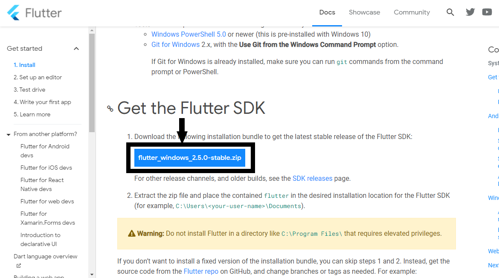
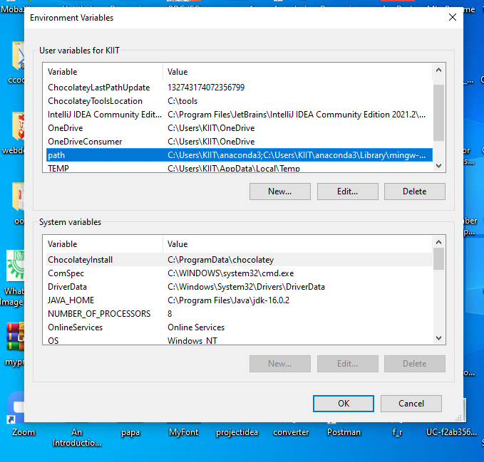
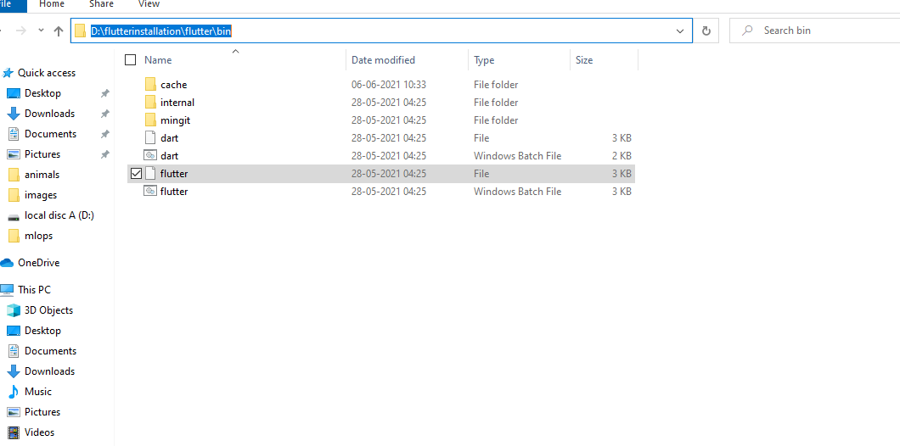
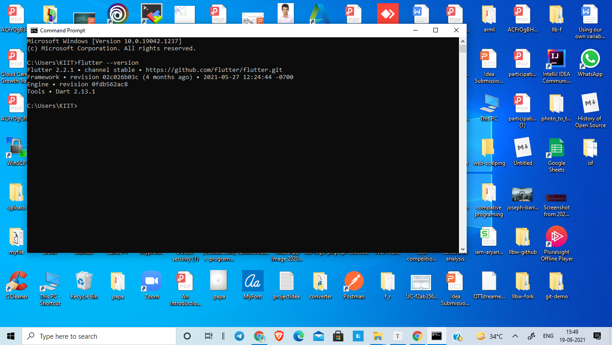

# How to install and setup Flutter

Google's Flutter is an open-source user interface software development kit. From a single codebase, it is possible to create apps for Android, iOS, Linux, Mac, Windows, Google Fuchsia, and the web. Flutter is merely a framework that makes use of the "DART" programming language to deploy code. Dart allows us to construct something for myself and others using a declarative approach.

## System Requirements —

1. Operating system -Windows 7 or later

2. Disk space -400 MB 

   ## Setup instructions for flutter

   ### 1. Download the flutter SDK 

   i) *download Flutter from* https://flutter.dev/docs/get-started/install/windows

   

   -Press the ‘flutter_windows_2.5.0-stable.zip’ button and then we will get a Zip file and flutter recommends to extract in C Drive. 

   

   After installation of flutter go to "Environment Variables" and update your  PATH variable.

   

   In the above picture, just click on "PATH"and then "EDIT"

   

   

   Now go to the location where flutter was extracted and copy the Flutter bin files location.

   

   Now click on New and paste the location of your Flutter bin files.—
   eg.-D:\flutterinstallation\flutter\bin
   
   
   
   Now to make sure that our flutter is running, search for ‘command prompt’. Type in -'flutter --version' and press enter.
   
   
   
   Hence, our Flutter is running successfully.
   
   ## 2.Install Android Studio
   
   **Windows requirements :**
   
   - 3 GB RAM minimum, 8 GB RAM recommended
   - 1 GB RAM for the Android Emulator
   - 2 GB of available disk space minimum, 4 GB recommended (500 MB for IDE plus 1.5 GB for Android SDK and emulator system image).
   
   download the android studio from https://developer.android.com/studio
   
   After downloading Android studio Install it and Keep on clicking next and at last finish.
   
   
   
   

When you launch Android Studio, you'll get a screen that looks like the one below. Click on — Configure >> Settings

Now in Settings, go to **Plugins** and search for **“Flutter”**. Install the first option — Flutter and this will bring up a pop-up window asking if you want to install Dart as well. Select ‘yes' to continue. When the plugin installation is complete, Android Studio may need to be restarted.

We've completed the installation and configuration of our Flutter programming environment. You can now test your first app!
