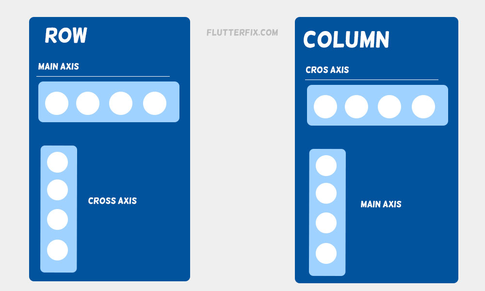
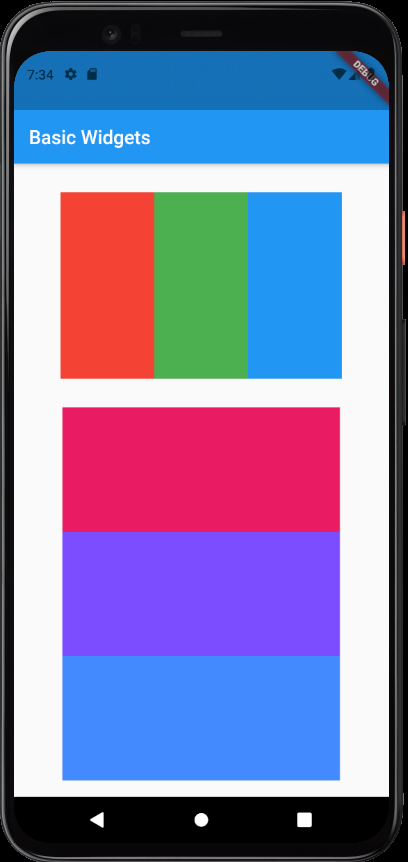
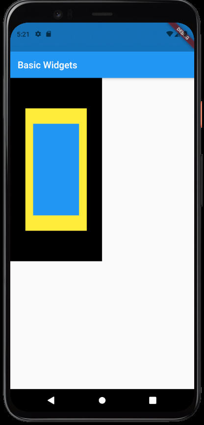

# Basic widgets used in Flutter
Let's take a look at some of the basic widgets used in flutter.
# Text
The text widget in Flutter is used to display a string. 
Some of the basic properties used in the text widget include:
1. style: It expects a TextStyle object, we can control the font size, color , weight etc
2. textAlign: Expects an object of the TextAlign class, it is used to align the text widget.

### Example:
```dart
//This is a Text Widget
Text("This is a text Widget",
    //We have set the color of the text to be blue and set the size of the 
    //font to 20.0 units
    style: TextStyle(color: Colors.blue,fontSize: 20.0),
    //This property aligns the text to the center.
    textAlign: TextAlign.center,
    )
```


# Row, Column
### Row
A row widget, aligns all of its children widgets in a horizontal row. These widgets, must be nested within the row widget's children property.
### Column
A column widget is similar to the row widget, but it aligns the children widgets in a vertical column.

Let us take a look at some of the basic properties available in both Row and column widgets.
1. children: This property expects a list of widgets.
2. mainAxisAlignment: This property expects the MainAxisAlignment enum object. This will determine the alignment of the widgets along the main axis. For the **row** widget, the main axis is along the **horizontal** direction, and for **column** it is along the **vertical** direction.
3. crossAxisAlignment: This property expects the CrossAxisAlignment enum object. This will determine the alignment of the widgets along the cross axis. For the **row** widget, the cross axis is along the **vertical** direction, and for the **column** it is along the **horizontal** direction.

Refer the image below to get an even clear understanding of the main and cross axes.

(Image credit [FlutterFix](https://flutterfix.com/difference-between-the-flutter-crossaxisalignment-and-mainaxisalignment/))

# Stack
The stack widget stacks its children widgets on top of each other and helps in overlapping the widgets. This can be useful in a variety of situations, like overlaying an image on top of another widget.

Some of the basic properties of stack are:
1. children: It expects a list of widgets, like Row and Column widgets.
2. alignment: This property can be used to specify the alignment of the stacked widgets
   
# Container
The Container class in flutter is a handy widget. It combines painting, positioning, and sizing of widgets. The Container class can be used to contain multiple widgets and place them on the screen as we see fit.

Some basic properties used with the container widget are:
1. height: Used to set the height of the container.
2. widht: Used to set the width of the container.
3. decoration: As the name suggests, with this property one can decorate the container
4. child: Expects a widget to be contained within the container.

Let us take a look at an example that combines both container and stack widgets.


# Implementation:
Let us take a look at these widgets in action.

### Example 1: Row and Column widgets with the Container widget
```dart
import 'package:flutter/material.dart';

void main() {
  runApp(MyApp());
}

class MyApp extends StatelessWidget {
  // This widget is the root of your application.
  @override
  Widget build(BuildContext context) {
    return MaterialApp(
      title: 'Flutter Demo',
      theme: ThemeData(
        primarySwatch: Colors.blue,
      ),
      home: MyHomePage(title: 'Flutter Demo Home Page'),
    );
  }
}

class MyHomePage extends StatefulWidget {
  MyHomePage({Key? key, required this.title}) : super(key: key);

  final String title;

  @override
  _MyHomePageState createState() => _MyHomePageState();
}

class _MyHomePageState extends State<MyHomePage> {
  int _counter = 0;

  @override
  Widget build(BuildContext context) {
    return Scaffold(
      appBar: AppBar(title: Text("Basic Widgets"),),
      //Here we have an outer column, that has four widgets inside it. A row and a column
      //and two sized boxes for spacing the other two widgets
      body: Column(
        children: [
          //SizedBox is added to have a space between the row widget and the app bar.
          SizedBox(height: 30,),
          Row(
            //We have used MainAxisAlignment.center, to center the children widgets along the main axis.
            mainAxisAlignment: MainAxisAlignment.center,
            children: [
              //The children of this row widget are three container widgets with height and width set with respect to the screen and different colors.
              Container(
                //Mediaquery is used to set the dimensions with respect to the screen dimensions. 
                // Here the containers have a height and width that is equal to 1/4th the 
                //screen's height and width
                height: MediaQuery.of(context).size.height/4,
                width: MediaQuery.of(context).size.width/4,
                decoration: BoxDecoration(color: Colors.red),
              ),
              Container(
                height: MediaQuery.of(context).size.height/4,
                width: MediaQuery.of(context).size.width/4,
                decoration: BoxDecoration(color: Colors.green),
              ),
              Container(
                height: MediaQuery.of(context).size.height/4,
                width: MediaQuery.of(context).size.width/4,
                decoration: BoxDecoration(color: Colors.blue),
              )
            ],
          ),
          SizedBox(height: 30,),
          //This is the column widget It also has three container widgets as children.
          Column(
            children: [
              Container(
                height: MediaQuery.of(context).size.height/6,
                width: MediaQuery.of(context).size.width/1.35,
                decoration: BoxDecoration(color: Colors.pink),
              ),
              Container(
                height: MediaQuery.of(context).size.height/6,
                width: MediaQuery.of(context).size.width/1.35,
                decoration: BoxDecoration(color: Colors.deepPurpleAccent),
              ),
              Container(
                height: MediaQuery.of(context).size.height/6,
                width: MediaQuery.of(context).size.width/1.35,
                decoration: BoxDecoration(color: Colors.blueAccent),
              )
            ],
          )
        ],
      ),
    );
  }
}
```
The above code results in the following output,

</img>

### Example 2 : Stack widget with the Container widget:

```dart
import 'package:flutter/material.dart';

void main() {
  runApp(MyApp());
}

class MyApp extends StatelessWidget {
  // This widget is the root of your application.
  @override
  Widget build(BuildContext context) {
    return MaterialApp(
      title: 'Flutter Demo',
      theme: ThemeData(
        primarySwatch: Colors.blue,
      ),
      home: MyHomePage(title: 'Flutter Demo Home Page'),
    );
  }
}

class MyHomePage extends StatefulWidget {
  MyHomePage({Key? key, required this.title}) : super(key: key);

  final String title;

  @override
  _MyHomePageState createState() => _MyHomePageState();
}

class _MyHomePageState extends State<MyHomePage> {
  int _counter = 0;

  @override
  Widget build(BuildContext context) {
    return Scaffold(
      appBar: AppBar(title: Text("Basic Widgets"),),
      body: Stack(
        //alignment property is used to align all the elements of the stack to the center of the stack widget.
        alignment: Alignment.center,
        children: [
          //The container widget with specified height, width and color. These widgets are stacked on top of each other.
          Container(
            //Mediaquery is used to set the dimensions with respect to the screen dimensions. Here for the first container the height and width are set to half of the screen's height and width.  
            height: MediaQuery.of(context).size.height/2,
            width: MediaQuery.of(context).size.width/2,
            //We have decorated this container to be black in color.
            decoration: BoxDecoration(color: Colors.black),
          ),
          Container(
            height: MediaQuery.of(context).size.height/3,
            width: MediaQuery.of(context).size.width/3,
            decoration: BoxDecoration(color: Colors.yellow),
          ),
          Container(
            height: MediaQuery.of(context).size.height/4,
            width: MediaQuery.of(context).size.width/4,
            decoration: BoxDecoration(color: Colors.blue),
          )
        ],
      ),
    );
  }
}
```

This code renders the following output:

</img>

# Additional Resources:
To know more about these basic widgets, refer the following resources
1. Use these links to know more about the [Text](https://yashodgayashan.medium.com/flutter-text-widget-14199321155f) widget, [Row and column](https://www.geeksforgeeks.org/row-and-column-widgets-in-flutter-with-example/) widgets
2. To learn more about stack (and indexed stack) refer this [article](https://medium.com/flutter-community/a-deep-dive-into-stack-in-flutter-3264619b3a77)
3. To know more about the container widget, go to this [article](https://api.flutter.dev/flutter/widgets/Container-class.html)