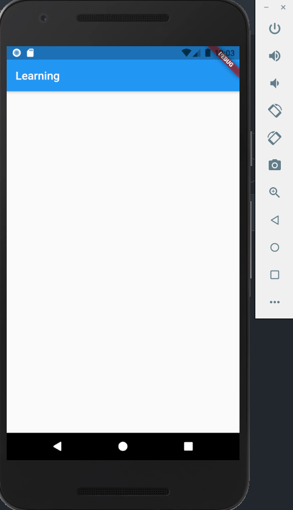
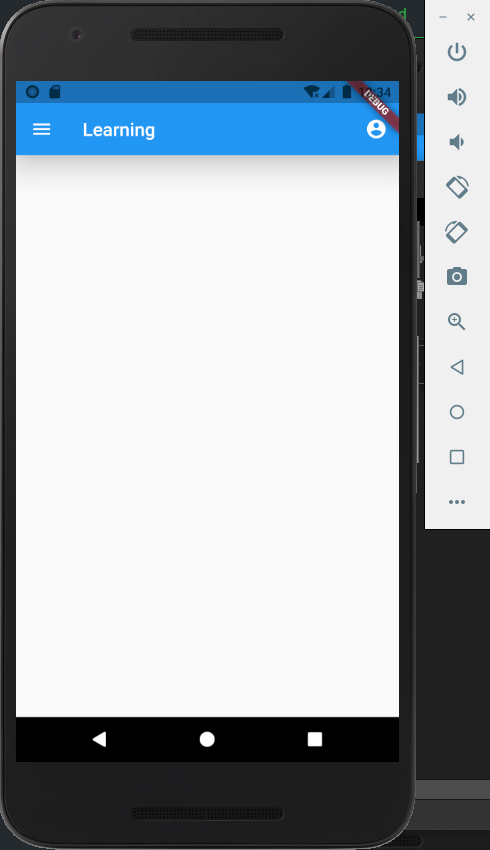

## Appbar widget
#### What is Appbar Widget ?
Appbar is the most important component of any application. We can build our application's topbar beautiful with the help of appbar. Appbar consist of another widgets like TabBar, FlexibleSpaceBar etc. We use appbar inside scaffold widget because appbar need some padding if we wrap it under mediaQuery so it is better to use it inside scaffold. Scaffold widget handle the problem of padding smoothly.
<br>
<br>
## This is how a simple appbar look like:-

<div align="center">
    
     <p> image credit <a href="https://media.geeksforgeeks.org/wp-content/uploads/20210124210755/AppBar-300x185.png">geeksforgeeks   </a><p>
</div>

## AppBar constructor

```dart
AppBar({
    Key? key,
    Widget? leading,
    bool automaticallyImplyLeading,
    Widget? title,
    List<Widget>? actions,
    Widget? flexibleSpace,
    PreferredSizeWidget? bottom,
    double? elevation,
    Color? shadowColor,
    ShapeBorder? shape,
    Color? backgroundColor,
    Color? foregroundColor,
    IconThemeData? iconTheme,
    IconThemeData? actionsIconTheme,
    bool primary,
    bool? centerTitle,
    bool excludeHeaderSemantics,
    double? titleSpacing,
    double toolbarOpacity,
    double bottomOpacity,
    double? toolbarHeight,
    double? leadingWidth,
    TextStyle? toolbarTextStyle,
    TextStyle? titleTextStyle,
    SystemUiOverlayStyle? systemOverlayStyle
})
```
Appbar have some important properties:
  <ul>
  <li> leading - content inside leading will display before title of appbar</li>
  <li> title - It will display the title of appbar </li>
  <li> actions - It will display after title </li>
  </ul>

## Implementation of title property
```dart
import 'package:flutter/material.dart';

void main() {
  runApp(MyApp());
}

class MyApp extends StatelessWidget {
  // This widget is the root of your application.
  @override
  Widget build(BuildContext context) {
    return MaterialApp(                   
      home: MyHomePage(),               // home (first page of app) of this app is MyHomePage
    );
  }
}
class MyHomePage extends StatelessWidget {
  @override
  Widget build(BuildContext context) {
    return Scaffold(
      appBar: AppBar(
        title: Text(    // title prperty
        "Learning"      // this text will be shown on topbar of app
        ),            
      ),
    );
  }
}

```
## Output

 
 ## Explanation
 Here title property is used to display the given word on Appbar. Title uses text widget to display the text.


  
## Implementation of another properties
```dart
import 'package:flutter/material.dart';

void main() {
  runApp(MyApp());
}

class MyApp extends StatelessWidget {
  // This widget is the root of your application.
  @override
  Widget build(BuildContext context) {
    return MaterialApp(
      home: MyHomePage(),
    );
  }
}

class MyHomePage extends StatelessWidget {
  @override
  Widget build(BuildContext context) {
    return Scaffold(
      appBar: AppBar(
        title: Text("Learning"),           //title has some text which will display on topbar
        actions: <Widget>[                 //actions property which will take multiple widgets as children
          IconButton(
            icon: Icon(Icons.account_circle),      
            tooltip: 'Your account',
            onPressed: () {},
          ),
        ],
        backgroundColor: Colors.blue,         //backgroundColor is blue so the color of appbar will be blue
        leading: IconButton(                  // leading is iconButton so icon will be display before title 
          icon: Icon(Icons.menu),
          tooltip: 'Menu',
          onPressed: () {},                  
        ),
      ),
    );
  }
}
```
## Output

 
 ## Explanation
 Here first property we use is title which display the title of the appbar for example we have written 'Learning' here so in output app is displaying learning on topbar.
 second property used here is action widget. In action widget iconButton is used to display account_circle icon after the title. Tooltip is also provided which shows text when user hover over that icon.
 Third property used here is backgroundColor which gives the colour to appbar. Fourth property used here is leading. In leading iconButton is used to display menu icon before the title of appbar. 
 
 ###### Reference taken from https://www.geeksforgeeks.org/flutter-appbar-widget/ and https://api.flutter.dev/flutter/material/AppBar-class.html


