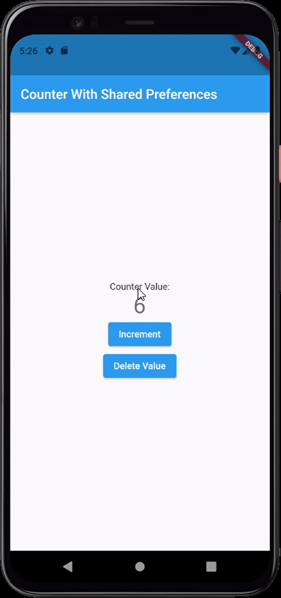

# Shared Preferences
### What is Shared Preferences?
The [SharedPreferences](https://developer.android.com/reference/android/content/SharedPreferences) API in android, is a data storage solution that helps us save primitive data as key-value pairs in a file in device storage. Using this API, one can store, fetch, update or delete the stored data.

iOS has a similar storage option called [NSUserDefaults](https://developer.apple.com/documentation/foundation/nsuserdefaults).

Flutter being platform independent, does not support shared preferences out of the box. To use these storage options, we add a plugin called [shared_preferences](https://pub.dev/packages/shared_preferences), which gives access to the platform specific storage (NSUserDefaults for iOS and SharedPreferences for android).

## Usage:
To get started with the shared_preferences plugin, add the following lines in the pubspec.yaml file of your project.

```yaml
dependencies:
  flutter:
    sdk: flutter
  shared_preferences: "<newest version>"
```

Or simply run this command from the terminal of your IDE:
```
flutter pub add shared_preferences
```
which would automatically add the depedency and update your pubspec.yaml file

## Implementation
Now let us look at a basic counter application, that uses the shared_preferences plugin.
```dart
import 'package:flutter/material.dart';
//Importing the plugin
import 'package:shared_preferences/shared_preferences.dart';
void main() => runApp(const MyApp());

class MyApp extends StatelessWidget {
  const MyApp({Key? key}) : super(key: key);

  @override
  Widget build(BuildContext context) {
    return const MaterialApp(
      title: 'Counter With Shared Preferences',
      home: MyHomePage(title: 'Counter With Shared Preferences'),
    );
  }
}

class MyHomePage extends StatefulWidget {
  const MyHomePage({Key? key, required this.title}) : super(key: key);

  final String title;

  @override
  _MyHomePageState createState() => _MyHomePageState();
}

class _MyHomePageState extends State<MyHomePage> {
  int _counter = 0;

  @override
  void initState() {
    super.initState();
    _loadCounter();
  }

  //Function to load counter value on start
  void _loadCounter() async {
    final preferences = await SharedPreferences.getInstance();
    setState(() {
      //Gets the 'counter' value from the device storage and assigns it to
      //_counter which gets displayed on the screen.
      _counter = (preferences.getInt('counter') ?? 0);
    });
  }

  //Function to increment the counter after click
  void _incrementCounter() async {
    final preferences = await SharedPreferences.getInstance();
    setState(() {
      _counter = (preferences.getInt('counter') ?? 0) + 1;
      preferences.setInt('counter', _counter);
    });
  }
  
  //Function to set the _counter value and the 'counter' value from device storage to 0.
  void _deleteCounterValue() async{
    final preferences = await SharedPreferences.getInstance();

    setState(() {
       preferences.setInt('counter', 0);
      _counter = preferences.getInt('counter')!;
    });

  }

  //Similarly one can also update the shared_preferences values.
  
  @override
  Widget build(BuildContext context) {
    return Scaffold(
      appBar: AppBar(
        title: Text(widget.title),
      ),
      body: Center(
        child: Column(
          mainAxisAlignment: MainAxisAlignment.center,
          children: [
            const Text(
              'Counter Value:',
            ),
            Text(
              '$_counter',
              style: Theme.of(context).textTheme.headline4,
            ),

            //Button to increment the counter value

            ElevatedButton(
              onPressed: _incrementCounter,
              child: Text("Increment"),
            ),

            //Button to delete the counter value

            ElevatedButton(
                onPressed: _deleteCounterValue,
                child: Text("Delete Value")
            ),
          ],
        ),
      ),
    );
  }
}
```

The code results in the following application 



As you can observe, even when the app is closed, the previous counter value persists when the app is launched again. The value was retrieved from the device storage. This is due to the shared_preferences plugin that we used.