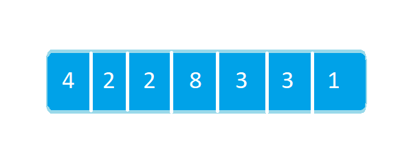
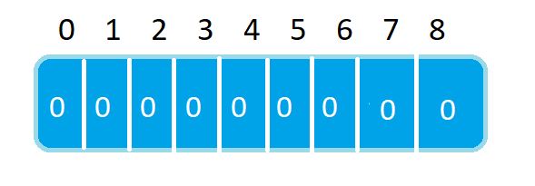
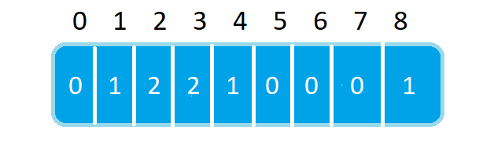
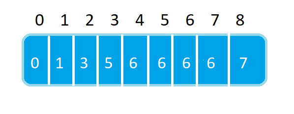
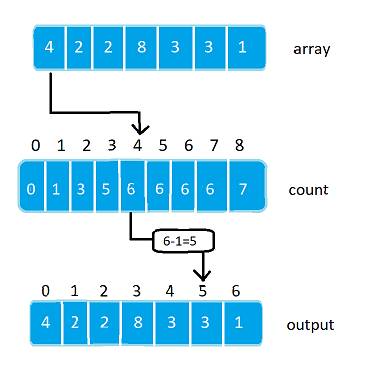

# Counting Sort
**Counting sort** is a sorting algorithm which counts the occurrences of elements and find their index in the array by doing some arithmetic operation.

## Working
Let Given Array be :


**Step 1 :**  Find the element having maximum value in array . That is 8 in given array.


**Step 2 :** Initialize an array of length `max+1` with all elements as 0. This array is used for storing the count of the elements in the array. So , the count array will be :



**Step 3 :** Store the count of each element at their respective index in `count` array

For example: if the count of element 3 is 2 then, 2 is stored in the 3rd position of count array. If element "5" is not present in the array, then 0 is stored in 5th position.



**Step 4 :** Store cumulative sum of the elements of the count array. It helps in placing the elements into the correct index of the sorted array.



**Step 5 :** Find the index of each element of the original array in the count array. This gives the cumulative count. Place the element at the index calculated as shown in figure below.



**Step 6 :** After placing each element at its correct position, decrease its count by one.


#### Code:

```c++
// Counting sort in C++ 

#include <iostream>
using namespace std;

void countSort(int array[], int size) {
 
  int output[10];
  
  int max = array[0];

  // Find the largest element of the array
  for (int i = 1; i < size; i++) {
    if (array[i] > max)
      max = array[i];
  }
    //Declare count array with size (max+1)
   int count[max+1];

  // Initialize count array with all zeros.
  for (int i = 0; i <= max; ++i) {
    count[i] = 0;
  }

  // Store the count of each element
  for (int i = 0; i < size; i++) {
    count[array[i]]++;
  }

  // Store the cummulative count of each array
  for (int i = 1; i <= max; i++) {
    count[i] += count[i - 1];
  }

  // Find the index of each element of the original array in count array, and
  // place the elements in output array
  for (int i = size - 1; i >= 0; i--) {
    output[count[array[i]] - 1] = array[i];
    count[array[i]]--;
  }

  // Copy the sorted elements into original array
  for (int i = 0; i < size; i++) {
    array[i] = output[i];
  }
}

// Function to print an array
void printArray(int array[], int size) {
  for (int i = 0; i < size; i++)
    cout << array[i] << " ";
  cout << endl;
}

// Driver code
int main() {
  //Initialize given array
  int array[] = {4, 2, 2, 8, 3, 3, 1};
  int n = sizeof(array) / sizeof(array[0]);
    
  //Printing array before sorting
  printArray(array, n);
    
  //Calling countSort function to sort array
  countSort(array, n);
    
  //Printing array after sorting
  printArray(array, n);
}
```

​           

#### Output : 

```c++
4 2 2 8 3 3 1
1 2 2 3 3 4 8
```


## Time Complexity

Let, N=Number of elements in given array

​		K=maximum value present in given array.

Time Complexity = **O(N+K)**

In all cases time complexity will be **O(N+K)** as the range of for loops does not changes.


## Space Complexity

Let, N=Number of elements in given array

​		K=maximum value present in given array.

Space Complexity = **O(N+K)**

As we are making two extra arrays ,Count of size (max+1) and output of size N the space complexity becomes  **O(N+K) **. 

## Pros and Cons

### Pros :

1. Counting sort`s time complexity is very less as compared to comparison based sorting algorithms when dealing with small elements.
2. It is a stable algorithm.

### Cons :

1. When dealing with large numbers like if array contains a number which is N^3 where N is number of elements in given array, Time complexity becomes o(N^3) which is worst.
2. It is not an adaptable algorithm because its time complexity is same in all cases.
