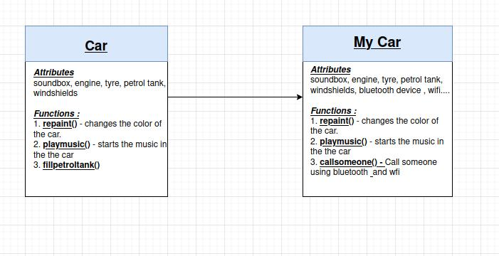

# Introduction to OOPs

**Object Oriented Programming** or (**OOP**) is a programming paradigm or methodology which relies on the concept of **object** and **class**. The concepts in OOPs help programmers to write codes into simple, reusable and understandable pieces. This can be understood with the help of an example - Suppose you are building a larger application with your Text Editor and it has the following features:

1. Has options for Bold, Italics, and Underline

2. Has options for changing the alignment, font family, and font color.

3. Has options for undo and redo.

These are the basic features that a Text Editor should have. So suppose you start building this application from scratch. It wouldn't be a good practice that you write all the functions that perform those above-mentioned features in a single file, this would bring up several complexities in the development of software of a larger scale like _debugging_ the code would be very confusing since it would take a lot of time which piece of code could be causing that error.

Let's try a different approach for a program - Try writing the functions which will perform the above-mentioned features in different files and then compile them in a single file. This would help programmers in several numbers of ways. Your code would be **modular**, **simple** to understand, and above all, it would be **reusable**. You could use those functions at any other point in a different application that might have the same feature or a certain upgrade in the same functionality.

In the introduction you came across two words **class** and **object**. So let us try to understand those in much more depth.

## Object 

Any entity that has a state and behavior is known as an object. It can be defined as an instance of a class that contains some logical functions and takes up some space in memory.

## Class

Collection of objects can be said to as a _class_. It is a logical entity. It can also be said to be a blueprint that can be used to create more specific and concrete objects.

Those above are programming world definitions.

Let us understand with a real-world example.

**Car** can be considered as a real-world equivalent to **class** which has some properties which are to be operated on by functions or methods -

1. **repaint the car** -  change the color of the car

2. **play music** - plays music/radio from the soundbox in the car

3. **fill up petrol tank** - fill the petrol tank to run the car

and many more.

Some common properties that every car might contain - soundbox, tires, engine, petrol tank, windshields, wipers, and many more.

Now suppose I want to create a car that has all the above features as a base and I could modify them or add more features to that car. This car of mine can be considered as an **object** derived from the **class Car**. You also would have heard about different car models which are just objects of class Car with new features and some modifying the old ones.
 

    

 
There are several languages that implement this programming approach - _JAVA, C++, C, Simula_

Let's dive deep into the concept of OOP:

Some of the concepts provided by OOPs are:

1. Object
2. Class
3. Inheritance
4. Abstraction
5. Polymorphism
6. Encapsulation
 

    

        
    

 

## Inheritance

When one _object acquires all the properties of the parent class_, it is known as **inheritance**. It provides code reusability.

In the example of Car and myCar explained by the flowchart in fig. 1, we could see that myCar acquires all the properties of the main class Car with some addition to the existing features. This is also a kind of inheritance (**single-level**). In creating myCar I didn't need to create it from scratch I just had to work on the existing basic Car model and modify it. This is an example of reusability.

## Polymorphism

_If one task is performed in different ways_, it is known as **polymorphism**. 

Example: To communicate with people we might use different languages but at the core we still are trying to share the same thoughts, drawing a shape be it oval, circle, square, or rectangle, different animals make the sound in different ways.

In JAVA, we use **method overloading** and **method overriding** to achieve polymorphism.

 

    

 

 

    

 

## Abstraction

_Hiding internal details and showing functionality_ is known as **abstraction**. 

 

    

 

In the above image, you can see that a man is requesting money from the ATM, but he is unable to see what process or algorithm run behind that enables the ATM to give the exact required amount of cash. This is an example of abstraction.

In JAVA we achieve abstraction through **abstract classes** and **interface**

## Encapsulation
_Binding (or wrapping) data code and data together in a single unit_ are known as **encapsulation**.

For example, whenever you take a medicine in the form of a capsule, its outer covering holds the content of medicine together inside it (binding in a single unit), also in programming world-class encapsulates all the attributes and functions together.

 

    

        
    

 

## Reference links

1. [JavatPoint](https://www.javatpoint.com/java-oops-concepts)