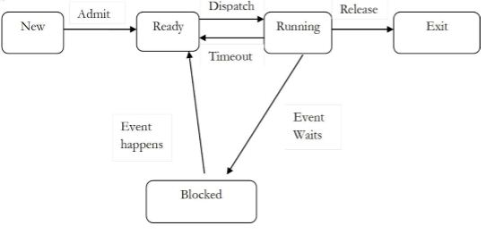
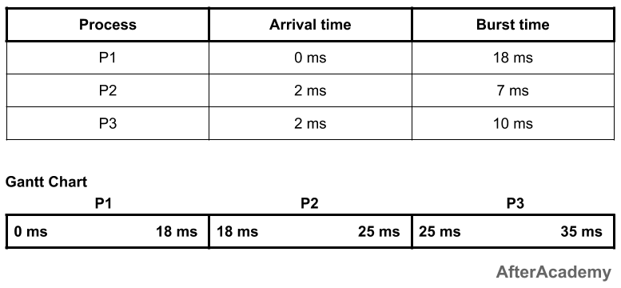
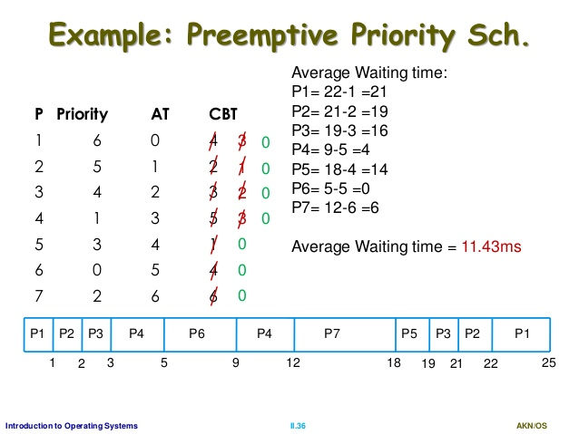

# What is Preemptive Scheduling in Operating System?
## 1. Let's see what is scheduling and why it is required?
* In earlier days computer used to run single program at time, but now a days computers run multitasking, multiprogramming, time sharing Operating system. For this we need process management which requires many tasks like creation, **scheduling**, termination of process and a dead lock.
* So scheduling is used to keep CPU busy all the time and to deliver minimum response time for all programs.

## 2. Let's take a look at process states, which we require to understand scheduling.

1. **New**: Newly created process. 

2. **Ready**: After creation of process, it moves to ready state.

3. **Running**: Currenly running process in CPU. (Only one process at a time can be under execution in a single processor)

4. **Waiting (or block)**: When process requests I/O access.

5. **Exit(or terminated)**: The process completed it's execution.

## 3. How scheduling works?
* It determines which process is in the ready state, and should be moved to the running state to deliver minimum response time for all programs is known as Process sheduling.

## 4. What is Preemptive Scheduling?
* Operating system decides to favour another process, pre-empting means killing the currently executing process called as Preemptive Scheduling.
* Conditions for preemptive scheduling
  1. When a process switches from the running state to the ready state.
  2. When a process switches from the waiting state to the ready state.
* In Preemptive scheduling, multiple processes can run. One process can be preempted to run another.
* Preemptive scheduling needs specific platform like Windows 95, MAC etc.

## 5. Algorithms in Preemptive Scheduling.
**1. Round Robin Scheduling Algorithm (RR)**
   * The Round Robin Scheduling Algorithm is specially used for time sharing systems. In Round Robin Algorithm **preemption** is used to switch from one process to another process.
   * In this each process is assigned for fix time slot in cyclic way.
   * Each process gets a small unit of CPU time (time quantum q) or (time slice), usually 10-100 milliseconds. In this time slice process performs its execution. When time slice get elapsed, the process is preempted and added to the end of the ready queue.
   * Then scheduler picks new job and assigns it to CPU and same process takes place again.
   * For implementing Round Robin, the processes are kept in FIFO (First in First Out).
   The new processes are added to last position of the ready queue.
   * If quantum time of processor is greater than process burst time(i.e execution time) then, process itself releases CPU, otherwise interrupt interrupt's CPU. Then CPU stops execution and process is shifted to tail of ready process queue. After this, CPU scheduler selects next job for execution.
   * Average waiting time in case of Round Robin algorithm is generally longer.
   * Advantage: The average waiting time is minimal(negligible).
   * Disadvantage: It is more overhead of context switching.
   * Eg. 

   

   ---------------------------------------------
| Process | Waiting Time | Turnaround Time  |
---------------------------------------------
|   P1    |     0ms      |      18ms        |
|   P2    |     16ms     |      23ms        |
|   P3    |     23ms     |      33ms        |
---------------------------------------------
Total waiting time: (0 + 16 + 23) = 39ms
Average waiting time: (39/3) = 13ms

Total turnaround time: (18 + 23 + 33) = 74ms
Average turnaround time: (74/3) = 24.66ms

eg reference: https://afteracademy.com/blog/process-scheduling-algorithms-in-the-operating-system

**2. Shortest Remaining Time First Algorithm (SRTF)**
 * Shortest Remaining Time First Algorithm (SRTF) is the preemptive form of Shortest Job First scheduling algorithm (SJF).
 * In Shortest Job First scheduling algorithm(SJF) process which have the shortest burst time are selected first.
 * If two processes have the same burst time then FCFS is used to break the tie. SJF is non-preptive scheduling algorithm.
 * But in Shortest Remaining Time First Algorithm (SRTF), jobs are put into ready queue as they come.
 * A process with shortest burst time begins execution.
 * Then if a process having shorter burst time than currently executing process arrives then, it removes currenlty executing process i.e it **preempts** currently excuting process and shorter job gets allocated to CPU cycle.
 * Shortest Remaining Time First Algorithm (SRTF) is very useful in the time-sharing environment of an operating system.
 * The scheduling algorithm SRTF has got higher overhead than SJF shortest time first.
 * The SRTF algorithm needs to track elasped time of the currenlty running process and also it should handle occassional preemption in proper manner.
 * The major point in Shortest Remaining Time First Algorithm (SRTF) is arrival of small processes will run immidiately. But longer job may have longer waiting time. 
 * Eg.

  
  
  Above eg reference: https://www.geeksforgeeks.org/introduction-of-shortest-remaining-time-first-srtf-algorithm/

**3. Priority Sheduling Algorithm (Preemptive Version):**
 * Priority Sheduling Algorithm is a method of scheduling processes that is based on priority. 
 * In this algorithm, the schedular selects the tasks to work as per the priority.
 * The processes with higher priority should be carried out first, whereas jobs with equal priorities are carried out on a round-robin or FCFS basis.
 * In Priority scheduling with preemptive vesrion algorithm, if process with higher priority arrives then it stops i.e preempts current execution of process and executes process with higher priority.
 * In this priority depends upon memory requirements, time requirements etc.
 * A priority number(Integer) is associated with each process.
 * Lesser the number, higher the priority.
 * Problem: **Starvation** - low priority processes may never execute.
 * Solution: **Aging** - as time progresses increase the priority of process.

 * eg.
 

 Above eg reference: https://cppsecrets.com/users/1108979711510497121461151049710464115111109971051219746101100117/Python-Priority-Scheduling-Preemeptive-Algorithm-with-Different-Arrival-Time.php

