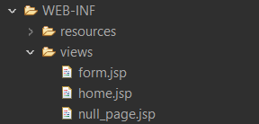

# View Resolver

For rendering models in browsers, Spring provides a way of working with views without binding the implementation to a specific technology, via the view resolvers. The `ViewResolver` maps the view names to actual views.

## How does Resolvers work in Spring MVC ?

Resolvers are responsible for returning correct views to the client, both in the Spring MVC application as well as on REST APIs. Take a look at example using `InternalResourceViewResolver` .

### FormController.java

```java
package com.gwoc;

@Controller
public class FormController 
{
    @RequestMapping("/form")
	public String displayForm() 
    {
		return "form";
	}
   
}
```

For example, if a user tries to access `/form` URL and FormController returns "form" then `DispatcherServlet` will consult `InternalResourceViewResolver` and it will use prefix and suffix to find the actual physical view which is integral to a web application.



If `prefix` is "/WEB-INF/views/" and `suffix` is ".jsp" then "form" will be resolved to "/WEB-INF/views/form.jsp" by InternalResourceViewResolver.


## How to setup InternalResourceViewResolver in Spring MVC

Follow below steps to configure ViewResolver in your Spring MVC Application. 

<br>

### Configuring ViewResolver using Java Configuration

```java
@Bean 
public ViewResolver viewResolver() 
{ 
    InternalResourceViewResolver vResolver = new InternalResourceViewResolver(); 
    vResolver.setPrefix("/WEB-INF/views/"); 
    vResolver.setSuffix(".jsp"); 
    return vResolver; 
}
```
<br>

### Configuring ViewResolver using XML Configuration

```xml
<bean id="vResolver"
    class="org.springframework.web.servlet.view.InternalResourceViewResolver"
    prefix="/WEB-INF/views/" suffix=".jsp" /> 
```

`Note : `suffix will change according to the type of view you want to render. For example, if it is JSON, then suffix will be `"/json"`, and if it is xml, then suffix will be `"/xml"`, and so on.  

<br>

## Demo

<br>

### Configure `Dispatcher Servlet` in web.xml ( /WEB-INF/web.xml )
<br>

## web.xml

```xml
<!DOCTYPE web-app PUBLIC
 "-//Sun Microsystems, Inc.//DTD Web Application 2.3//EN"
 "http://java.sun.com/dtd/web-app_2_3.dtd" >

<web-app>
  <display-name>Archetype Created Web Application</display-name>
  
  <!-- Configure Dispatcher Servlet -->
  <servlet>
  		<servlet-name>spring</servlet-name>
  		<servlet-class>org.springframework.web.servlet.DispatcherServlet</servlet-class>		
  </servlet>
  
  <servlet-mapping>
  		<servlet-name>spring</servlet-name>
  		<url-pattern>/</url-pattern>
  </servlet-mapping>
  
</web-app>

```

### Create `Spring Configuration` File
<br>

## spring-servlet.xml
```xml
<?xml version="1.0" encoding="UTF-8"?>

<beans xmlns="http://www.springframework.org/schema/beans"
	xmlns:xsi="http://www.w3.org/2001/XMLSchema-instance"
	xmlns:context="http://www.springframework.org/schema/context"
	xmlns:p="http://www.springframework.org/schema/p"
	xsi:schemaLocation="http://www.springframework.org/schema/beans
    http://www.springframework.org/schema/beans/spring-beans.xsd
    http://www.springframework.org/schema/context
    http://www.springframework.org/schema/context/spring-context.xsd">


</beans>
```

### Configure `View Resolver`
<br>

## spring-servlet.xml
```xml
<?xml version="1.0" encoding="UTF-8"?>

<beans xmlns="http://www.springframework.org/schema/beans"
	xmlns:xsi="http://www.w3.org/2001/XMLSchema-instance"
	xmlns:context="http://www.springframework.org/schema/context"
	xmlns:p="http://www.springframework.org/schema/p"
	xsi:schemaLocation="http://www.springframework.org/schema/beans
    http://www.springframework.org/schema/beans/spring-beans.xsd
    http://www.springframework.org/schema/context
    http://www.springframework.org/schema/context/spring-context.xsd">

    <bean
		class="org.springframework.web.servlet.view.InternalResourceViewResolver"
		name="viewResolver">

		<property name="prefix" value="/WEB-INF/views/" />
		<property name="suffix" value=".jsp" />

	</bean>


</beans>
```


### Create a `Controller`
<br>

## TestController.java
```java
package com.gwoc;

@Controller
public class TestController 
{
    @RequestMapping("/home")
	public String homePage() 
    {
		return "home";
	}
   
}

```

### Add `views` directory in WEB_INF directory and add `home.jsp` file in views directory
<br>

## home.jsp

```html
<!doctype html>
<html lang="en">
    <head>
        <!-- Required meta tags -->
        <meta charset="utf-8">
        <meta name="viewport"
            content="width=device-width, initial-scale=1, shrink-to-fit=no">

        <title>Home Page</title>
    </head>

    <body>
        <h1>Welcome</h1>
    </body>
</html>
```
<br>

Lastly, call `/home` after running the application and you will see the `home.jsp` being rendered.


