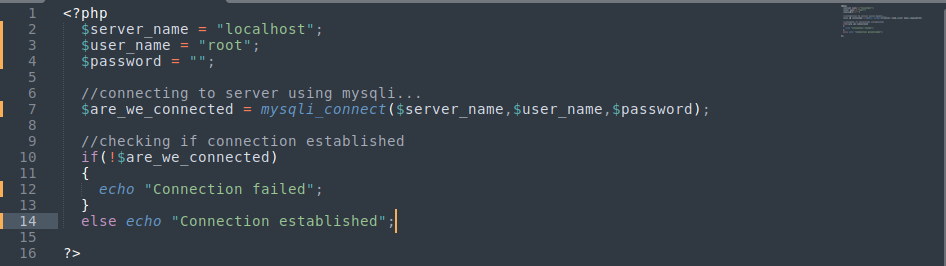
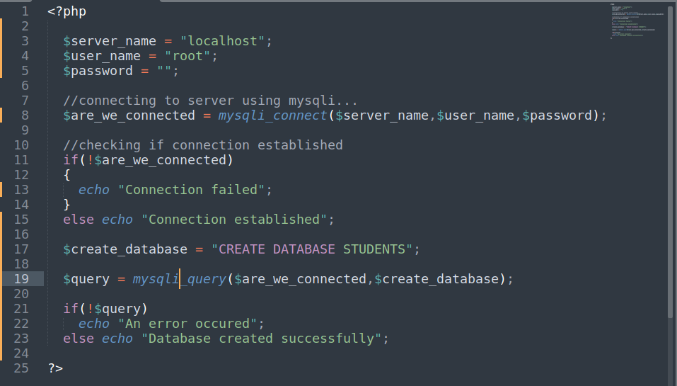
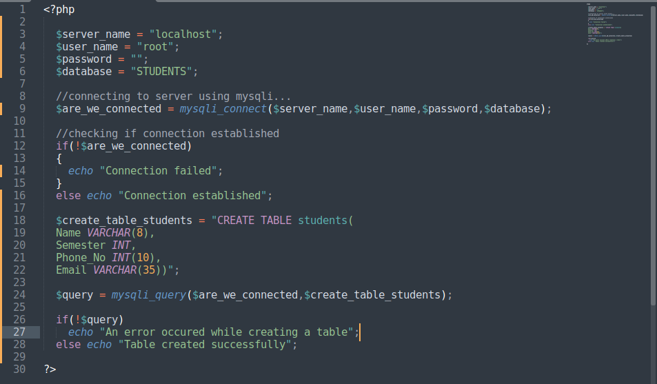
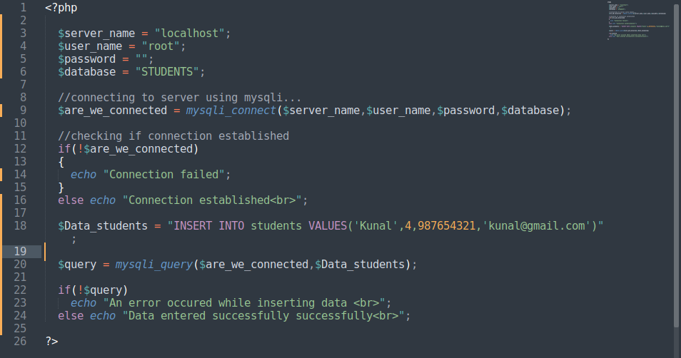
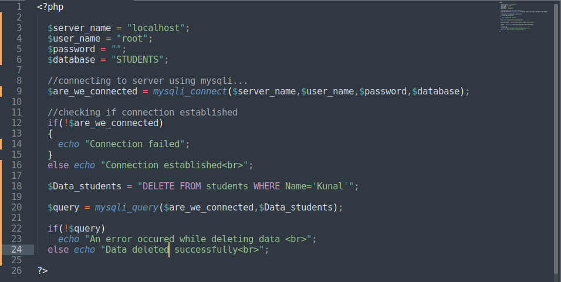
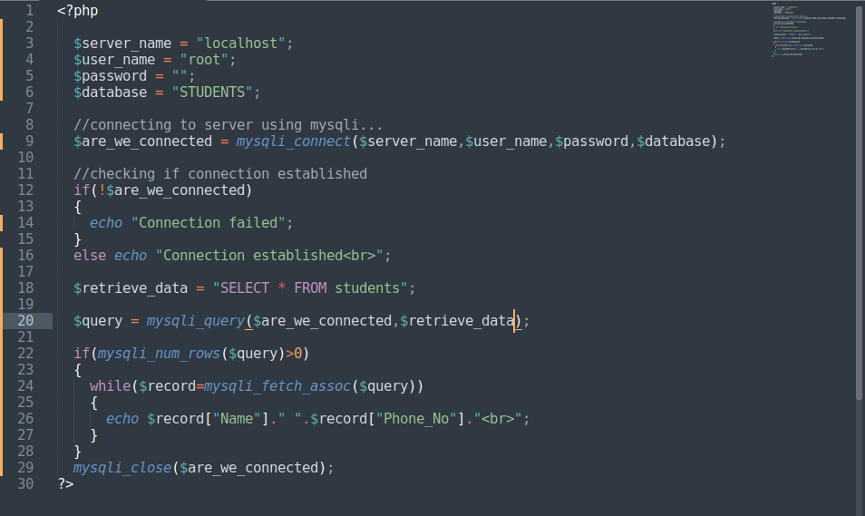

# **MYSQLI Extention**

In this document we are going to learn how to we can use MYSQLI extention in PHP to access and manipulate database.

As its name "MYSQLI" suggest that it can only can be used with MYSQL database. If you want to use another database then there is another method which PHP provide called PDO. In this document we are gonna discuss about MYSQLI Extention only.

### Connecting to Database

The very first work to be done before creating or accessing a existing database is to connecting with the server.Please make sure before testing php, your wamp or xampp or anyother server you are using is on. We are going to do this using mysqli_connect() function. It takes three parameter server name, username and password. This function returns true if connection is established or false if any error occured.

> 

### Creating a Databases

Now, we know how to connect with server so we can proceed ahead. PHP provide us a function called mysql_query() which allow us to run any sql query, It takes two parameter, variable which store value returned by mysqli_connect() and a string which has the sql query. To create a database sql query is "CREATE DATABASE STUDENTS". This query will create a database named STUDENTS. mysqli_query() function return true if query runs successfully or it returns false.

> 

Using mysqli_query() function we can run any sql query we want. It takes two parameter as explained above.

Now remaining document will only can contain code about creating table and insertion and deletion because everything is same only sql query changes.

When we gonna connect to a specific database of server, we give the database name as the 4th parameter of mysqli_connect() function to access the database.

### Creating a Table
> 

### Insertion in Table

> 

### Deletion in Table

> 

### Retrieving Data from Table

There are two new function we are going to learn which will help us to retrieve data.

mysqli_num_rows() function checks if there are more rows in variable.

mysqli_fetch_assoc() function it pull the data from variable given as parameter and return it.

Just have a look on the code you will have more clarity.

> 

After accessing data from database we also have to close our connection which was made earlier. We can do this using mysqli_close() function as i did it in above code.