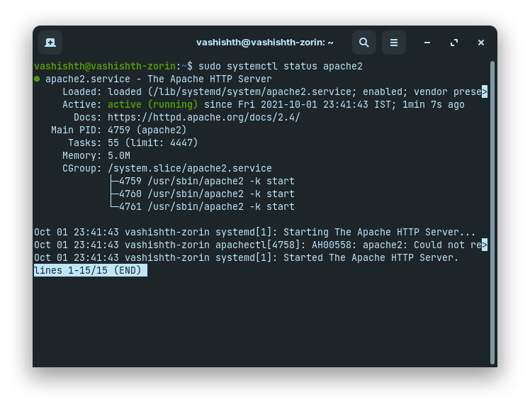
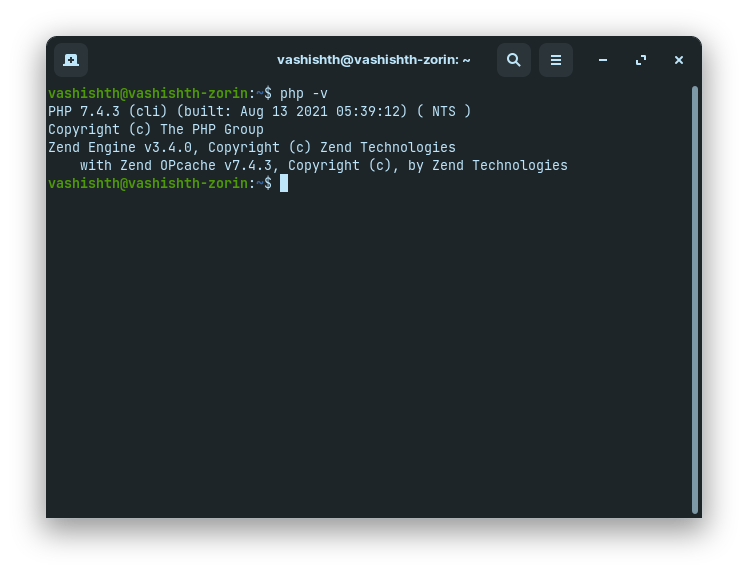
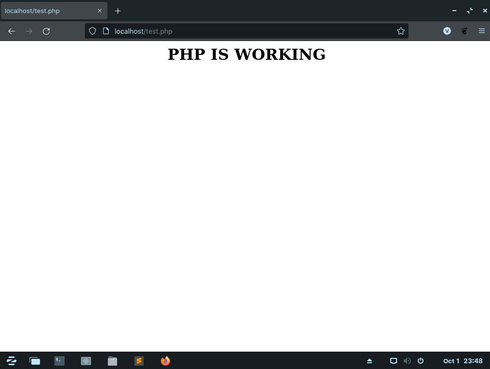

# Installing PHP On Linux(Ubuntu)

## We will install PHP by using apache2 module called libapache1-mod-PHP
 - There are also other ways(i.e using [nginx](https://www.nginx.com/)) to install PHP. But it is the easiest way to install PHP on Linux
 - Another Benefit is we will also have [apache](https://www.apache.org/) server to run our PHP code

## Follow the steps below mentioned for installing PHP in your Linux machine

- Run this command to update your repositories.

```bash
sudo apt update
```

- Run this command to install apache2 server.

```bash
sudo apt install apache2
``` 

- After installing apache2 server your apache2 service will automatically be started. To see if it is working or not, run the following command. And you will see similar to this following output

```bash
sudo systemctl status apache2
```


- After this update your repositories again.

```bash
sudo apt update
```

- Run this command to install PHP.

```bash
sudo apt install php libapache2-mod-php
```

- Now After this PHP will be installed in your machine. To see if it is installed or not, run the following command. And you will see the following command if PHP will be successfully installed in your machine.

```bash
php -v
```


- Now for testing your PHP code, go to `/var/www/html/` and create `test.php` file and put the following code into this file and save it.
```php
<?php
	echo "<h1><center>PHP IS WORKING</center></h1>";
?>
```
- Now open your browser and type `http://localhost/test.php` URL. You will see the following output.

