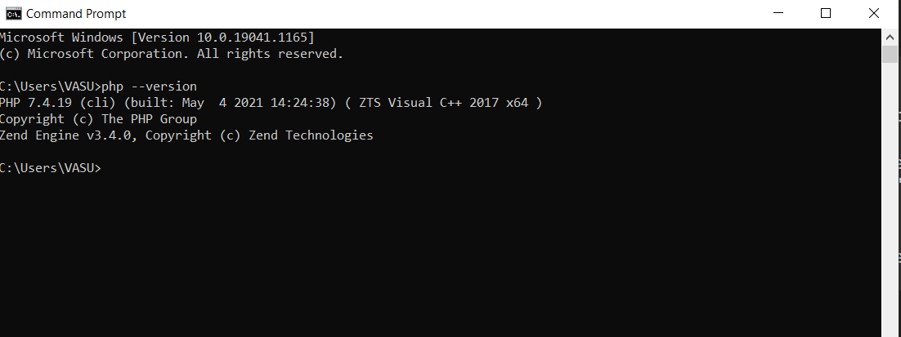
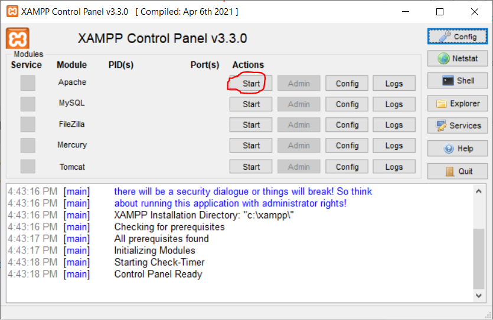
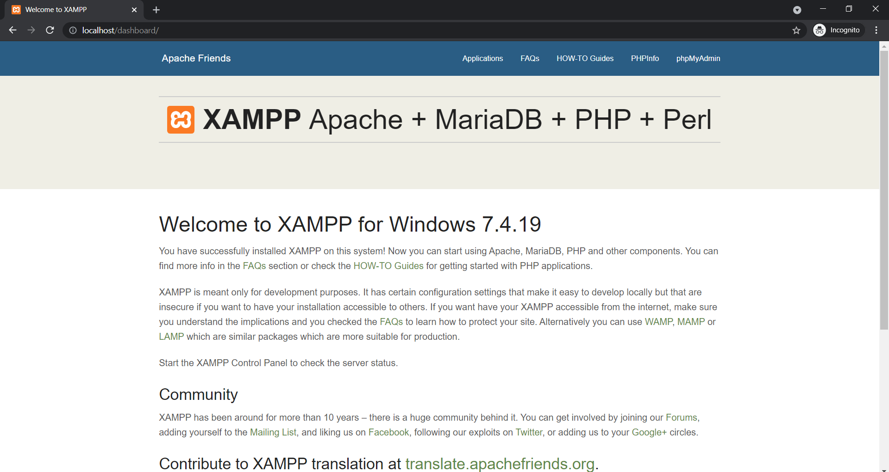

# Installing PHP On Windows

## We will go in easiest way for installing PHP in Windows

- We will use all-in-one packages which contains Apache, PHP, Mysql and many other dependencies in a single installation. for this we will use [XAMPP](http://www.apachefriends.org/xampp.html).
- There are also some other tools available which are really good like [WampServer](http://www.wampserver.com/en/) and [Web.Developer](http://www.devside.net/server/webdeveloper).
- We can also use [Docker](https://www.docker.com/) for the same.

### Follow the steps below mentioned for installing PHP

1. Download XAMPP.exe [link](http://www.apachefriends.org/xampp.html)
2. Double-click the downloaded file to launch the XAMPP installer.
3. "Setup" window will appear on the screen. Then, click on the "Next" button.
4. Select all components to install and click on the "Next" button.
5. Uncheck the "Learn more about Bitnami for XAMPP" option and click on the "Next" button.
6. "Ready to Install" window will appear on the screen, then click on the "Next" button.
7. Click on the "Finish" button.
8. Now, set up environment path variable. Add this path -> `C:\xampp\php` .
9. Now open your command prompt and type ` php --version ` you will see the information about php and it's version. 

### Test your PHP code

1. Open xampp from explorer menu and start apache server.

2. Start Apache Server
3. Now open your favourite browser and type ` localhost ` in the searchbar.
4. if you see this following output then Congratulations !! you have successfully installed PHP on your machine.

