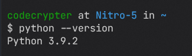
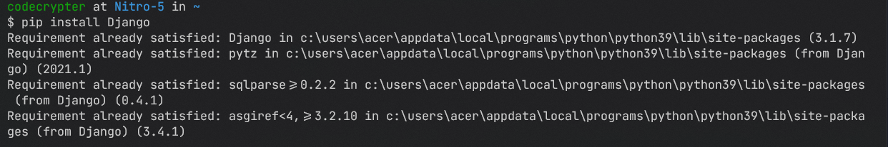

# Installing Django In Local Machine

Django is an Open Source project which is released uder [BSD licesnse](https://github.com/django/django/blob/main/LICENSE). Django can work with both Python 2.x and 3.x version but We will recommed you to use Python 3.5 or higher.

To install Django make sure you have Python installed on your system. To check that open up `command  prompt` or `powershell` on windows or `bash` on linux or `terminal` on macOS and execute the following command.

```console
foo@bar~$ python --version
```

or

```console
foo@bar~$ python3 --version
```

if you have python installed on your system then the output should look like these.


If you do not have python installed on system, windows users can download it from [here](https://www.python.org/downloads/windows) and macOS users can download it from [here](https://www.python.org/downloads/macos).
To download python on linux you can either download it from [here](https://www.python.org/downloads/linux) or you can download it using bash by following these commands

```console
foo@bar~$ sudo apt-get update
foo@bar~$ sudo apt-get install python3.9
```

Once you have python installed you can download latest version of Django using `pip`.

```console
foo@bar~$ pip install Django

```

NOTE - If you have Antivirus installed on your system, please consider to deactiate it for few minutes to speed up the installing process.

You can also download a specific version of Django using `==`

```console
foo@bar~$ pip install Django==3.2.7
```

After executing above commands your `terminal` should look this

your output can be a little different as I have Django installed on my system.

If you see no error then congratulation you have successfully installed Django on your system.
