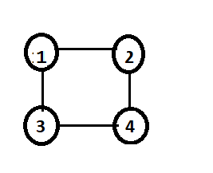
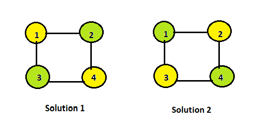

# m-Coloring Problem  
## Problem statement  
Given an unidirected graph and a number m , determine if the graph can be colored with at most **m** colors such that no two adjacent vertices of the graph are colored with the same color.

  
Number of vertices (n) = 4  
Minimum number of color m=2 , then we get 2 solutions  
Let color1 = yellow and color2 = green

  

## Algorithm  

### Input :  
1. A 2D array G[1 : n, 1 : n] where n is the number of vertices in graph and G is adjancy matrix representation of the graph . A value G[i,j] is 1 if there is a direct edge from i to j , otherwise G[i,j] is 0.
2. An integer m which is the maximum number of colors used.

### Output :  
An array x[1:n] that should have numbers frpm 1 to m . x[k] should represent the color assigned to the kth vertix .

## Steps:  
Step 1: Generate a next color
```C++
repeat{
    x[k]=(x[k]+1)%(m+1);
    ................
}until(false)
```  
Step 2: If no color is available then backtrack i.e uncolor last colored vertex and return.
```C++
repeat{
    x[k]=(x[k]+1)%(m+1);
    if(x[k]=0) then return //No new color possible
    ................
}until(false)
```  
Step 3: Otherwise confirm whether it is valid to color the vertex with current color by checking whether any of its adjacent vertices are colored with the same color
```C++
repeat{
    x[k]=(x[k]+1)%(m+1);
    if(x[k]=0) then return //No new color possible  
    	for(j=1 ; j<=k-1 ; ++j){
			if(graph[k][j]==1 and x[j]==x[k]) //colour adjacent to it have same colour
                break;
		}
    ................
}until(false)
```  
Step 4: If yes then colorit or else try with another color . goto step 1
```C++
repeat{
    x[k]=(x[k]+1)%(m+1);
    if(x[k]=0) then return //No new color possible  
    	for(j=1 ; j<=k-1 ; ++j){
			if(graph[k][j]==1 and x[j]==x[k]) //colour adjacent to it have same colour
                break;
		}
    if(j==k) return;//new colour found
        //otherwise try to find another color
}until(false)
```  
Step 5: After each coloring check if all vertices are colored or not. If yes then end the program by returning true, else continue.  
Step 6: Now select any one of the unclored adjacent vertices of the current colored vertex and repeat the whole process.

### Time complexity :  
 The number of internal nodes in the state space tree is $\sum_{i=0}^{n-1} m_i$ = (m<sup>n</sup>-1)/(m-1) .At each internal node , O(mn) time is spent by NextValue function. Hence the total time is O(mn x (m<sup>n</sup>-1)/(m-1)) = O(nm<sup>n</sup>).
