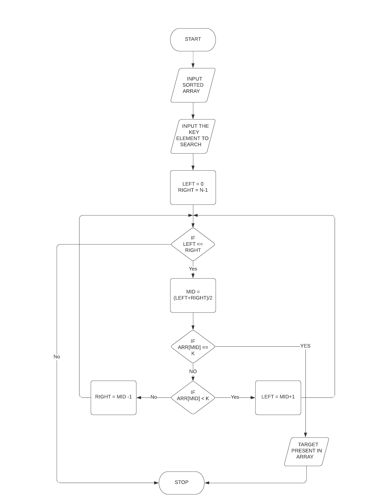
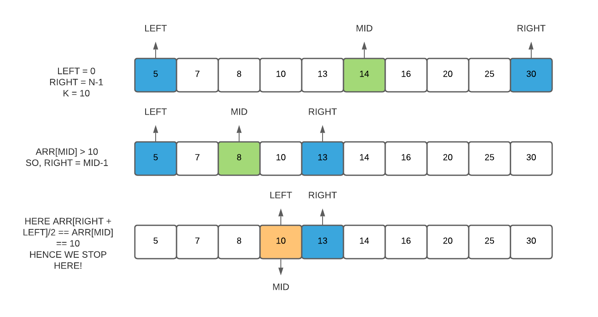

# Binary Search Video 
- Binary search is an algorithm to find a element in an array. In this algorithm we splits the array everytime we loop over into half from the previous size.

# Flow Chart 

# Example Array

# [Click here to watch!](https://drive.google.com/file/d/1w5CdObHlBt0WxNIrkS8AJZp8bXZPra3n/view?usp=sharing)