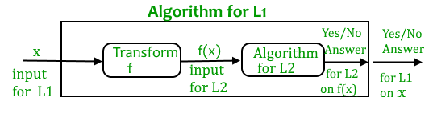

# NP Completeness
NP completeness is Computational Complexity Theory. NP Complete problem are set of decision problem. These soution can be varified in *polynomial time.* It is sovle in polynomial time on *non-deterministic* Turing Machine. If problem **P** is **NP** is *NP-Complete* if other problem in **NP** can be transformed into **P** in *polynomial time.* This topic is for researcher. 

<table>
  <tr>
    <th>Polynomial Time</th>
    <th>Eponetial Time (NP)</th>
  </tr>
  <tr>
    <td>Linear Search -O(n) </td>
    <td>O/I Knap Sock -O(2n)</td>
  </tr>
  <tr>
    <td>Binary Search- O(log(n))</td>
    <td>Travling SO- O(2n)</td>
  </tr><tr>
    <td>Insertion sort- O(n2)</td>
    <td>Sum of Subset- O(2n) </td>
  </tr><tr>
    <td>Merge Sort- O(n log n)</td>
    <td>Graph Coloring- O(2n)</td>
  </tr><tr>
    <td>Matrix Maltiplication- O(n3)</td>
    <td>Hamintoliyan Cycle- O(2n)</td>
  </tr>
</table>

-----------------------------------------
## NP Hard 
**L** is *NP-Hard* if for all **L ∈ NP** and **L ≤PL** is *polynomial time* NP problem in solvable in *polynomial time.* NP problem solvable in polynomial time( *Lucky algorithm* ).
## NP Complete
**L** is **N** complete if **L ∈ NP** and **L** is *NP-Hard* if any NP-Complete problem is sovable in *Polynomial Time*, Then every *NP-Complete* is also solvable ***Polynomial Time.***
--------------------------------------------
## Consequences of solution
### **P=NP**
>- **P=NP** could have stunning practical cansequence if the proff leads to efficient methods for solving some improtant problem in **NP**
>- The potential consequenses , both positive or negative arise since various *NP-complete* problems are fundamental in many fields.
>- Proof is not lead to practical algorithms for *NP Complete* problem.

## **P≠NP**
>- **P≠NP** would pradical Computational benefite of a proof that **P=NP.** 
>-  It can't be sove sove many probleme efficienly.
>- **P≠NP** still leave open thee average-case-complesity f the problem in **NP.*

## Reduction formulla 

-------------------
## References:
- [wikipedia]( https://en.wikipedia.org/wiki/NP-completeness#:~:text=In%20computational%20complexity%20theory%2C%20a,by%20trying%20all%20possible%20solutions.)
- [geeksforgeeks](https://www.geeksforgeeks.org/np-completeness-set-1/)
- [MIT OpenCourseWare](https://www.youtube.com/watch?v=moPtwq_cVH8&t=1755s)

