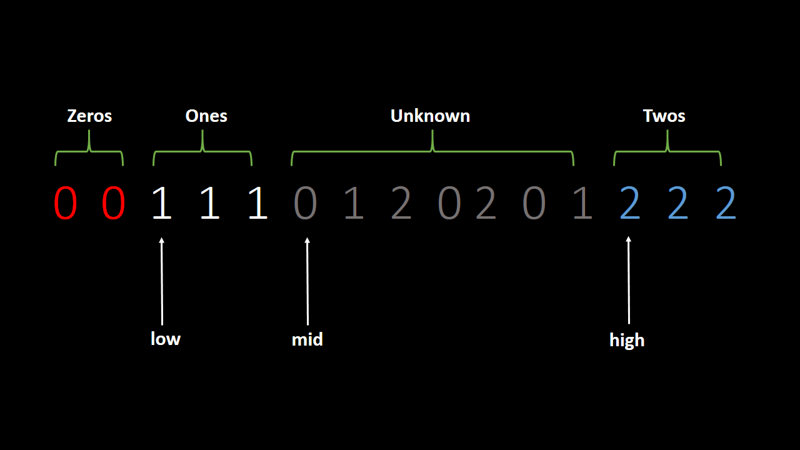

# DNF Sort Algorithm

- DNF is stand for Dutch National Flag Sort Algorithm.
- DNF is the only alogrithm which sort array of `0s` , `1s` & `2s` element only hence it is also called `0, 1, 2` Sort.
- We always denoting `0s` with `RED` color, `1s` with `WHITE` color and `2s` with `BLUE` color. All the `unknowns` with `GREY` color. 
- This sorting algorithm name `DNF` is based on the colors of National Flag of Netherlands and the word `Dutch` is the widely spoken language in Netherlands.

Let's see the DNF Sort Algorithm :

Suppose arr[15] = { 0 , 0 , 1 , 1 , 1 , 0 , 1 , 2 , 0 , 2 , 0 , 1 , 2 , 2 , 2 }

<p align="center">

</p>

```
Check value of arr[mid] -
    1. if arr[mid] = 0, swap arr[low] with arr[mid], low++ and mid++
    2. if arr[mid] = 1, mid++
    3. if arr[mid] = 2, swap arr[mid] with arr[high], high--
```

Let's see the example :

arr[10] = { 1 , 1 , 0 , 1 , 2 , 2 , 1 , 0 , 2 , 1}

`STEP 1: `
<p align="center">

</p>

`STEP 2: `
<p align="center">

</p>

`STEP 3: `
<p align="center">

</p>

`STEP 4: `
<p align="center">

</p>

`STEP 5: `
<p align="center">

</p>

`STEP 6: `
<p align="center">

</p>

`STEP 7: `
<p align="center">

</p>

`STEP 8: `
<p align="center">

</p>

`Input : ` <br>
Enter the size of array :<br>
10<br>
Enter elements of array (0s,1s and 2s) :<br>
1 1 0 1 2 2 1 0 2 1

`Output : ` <br>
Sorted Array : 
0 0 1 1 1 1 1 2 2 2

## Time Complexity of DNF Sort Algorithm :
```
while(mid<=high){
            if(arr[mid]==0){
                swap(arr[low], arr[mid]);
                low++;
                mid++;
            }
            else if(arr[mid]==1){
                mid++;
            }else{
                swap(arr[mid], arr[high]);
                high--;
            }
        }


Time Complexity : O(N)

Reason : In each iteration, either mid gets incremented (mid++) or high gets decremented(high--).

Space Complexity : O(1)
```
