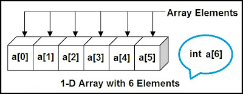
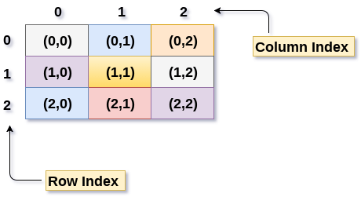
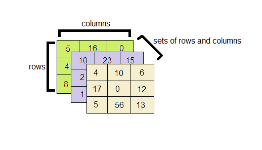

# Arrays in C++
An array is a collection of elements of the same type placed in contiguous memory locations that can be individually referenced by using an index to a unique identifier.They can be used to store collection of primitive data types such as int, float, double, char, etc of any particular type. To add to it, an array in C/C++ can store derived data types such as the structures, pointers etc.
<br>

<br><br>

## Declaration of an Array
To declare an array in C++, you need to define :
<li>The data type of elements in the array</li>
<li>The name of the array</li>
<li>The size of the array</li>
<br/>

**Syntax:** 
<br/>
 
```
 Data_type Array_Name [size];
```


## Types of Array declarations
**Array declaration by specifying size** 
<br/>

```
int a[5];
```
**Array declaration by initializing elements** 
<br/>

```
int arr[] = {1, 2, 3, 4};
```
**Array declaration by specifying size and initializing elements** 
<br/>

```
int arr[6] = {1, 2, 3, 4, 5, 6};
```

## Why do we need an array?
When there is a need to use many variables of the same type, arrays are used. Arrays are commonly used in computer programs to organize data so that a related set of values can be easily sorted or searched. 

## Advantages of array
<li>Memory can be allocated dynamically in an array. This advantage of an array helps to save the memory of the system.</li>
<li>Arrays are easy to use as many algorithms like searching and sorting techniques, finding maximum and minimum values, reversing can be easily implemented using arrays.</li>
<li>The time complexity to access any element of an array is O(1), i.e, it takes a constant amount of time to access an element.</li>
<li>Arrays use indexes to identify their elements. These indexes starting from ‘zero’ and ending at ‘length of array – 1’ can be used to access all elements of an array.</li>
<li>Along with simple arrays, we also have 2- dimensional arrays, which are used to store elements of a matrix of any dimensions.</li>
<li>Being one of the most basic data structures, arrays can be used to implement other data structures like linked lists, stacks, queues, graphs, trees, etc.</li>
<li>Arrays can be used to implement many CPU Scheduling techniques.</li>
<br>

## Disadvantages of array
<li>The size of an array is fixed. Once the memory is allocated to an array, it cannot be increased or decreased. This prevents us from storing extra data in case we want to. These arrays of fixed size are called static arrays.</li>
<li>Allocating less memory than the required to an array leads to loss of data.</li>
<li>A single array cannot store values of different data types, i.e, an array is homogenous in nature.</li>
<li>The deletion and insertion operations in arrays are very difficult to implement as they store data in contiguous memory locations. To overcome this problem, linked lists are implemented which provide random access of elements.</li>
<br>

## Accessing Array Elements
<li>Array elements are accessed by using an integer index. Array index starts with 0 and goes till size of array minus 1.</li>
<br>

## Types of Arrays 
There are three types of array in C++
<li>One-dimensional array</li>
<li>Two-dimensional array</li>
<li>Multidimensional array</li>
<br>

**One-dimensional array**

In this type of array, it stores elements in a single dimension. And, in this array, a single specification is required to describe elements of the array.
<br>

<br><br>

**Syntax:** 
<br/>
 
```
 int main()
 {
     int array[6] = {1, 2, 3, 4, 5, 6};
     for(int i=0; i<6; i++)
     {
         cout<<array[i]<<" ";
     }
     return 0;
 }
```

**Output:** 
<br/>
 
```
 1 2 3 4 5 6
```

**Two-dimensional array**

In this type of array, two indexes describe each element, the first index represents a row, and the second index represents a column. As you can see, the elements are arranged row-wise and column-wise; in a two-dimensional array, there are i number of rows and j number of columns. The above figure is a representation of a 3 x 3 matrix, which means there are three rows and three columns in the array.
<br>

<br><br>

**Syntax:** 
<br/>
 
```
 int main()
 {
   int array[3][3] = {{1, 2, 3}, {4, 5, 6}, {7, 8, 9}};
     for(int i=0; i<3; i++)
     {
         for(int j=0; j<3; j++)
         {
              cout<<array[i][j]<<" ";
         }
         cout<<endl;
     }
     return 0;
 }
```
In this example, you are printing a two-dimensional array of three rows and three columns; you need to use two for loops. The first loop, i.e., i loop, runs for the row from 0 to 3, and the second loop, i.e., j loop, runs for the column from 0 to 3.
<br>

**Output:** 
<br/>
 
```
 1 2 3 
 4 5 6
 7 8 9
```

**Multi-dimensional array**

The multidimensional array is also known as rectangular arrays in C++. It can be two dimensional or three dimensional. The data is stored in tabular form (row ∗ column) which is also known as matrix.
<br>

<br><br>

**Syntax:** 
<br/>
 
```
 int main()
 {
     int marks[3][3][3]=
    {               
                {
                    {56,78,56},
                    {54,34,32},
                    {43,26,92},
                    },
                {   {48,94,62},
                    {41,39,66},
                    {68,40,90},
                    },
                {
                    {20,67,84},
                    {52,51,72},
                    {60,53,59},}
    };
     for(i=0; i<3; i++)
     { 
       for(j=0; j<3; j++)
       {
         for(k=0; k<3; k++)
         {
           cout<<array[i][j][k]<<" ";
         }
         cout<<"\n";
       }     
       cout<<"\n";
     }
     return 0;
 }
```

**Output:** 
<br/>
 
```
56,78,56
54,34,32
43,26,92

48,94,62
41,39,66
68,40,90
      
20,67,84
52,51,72
60,53,59
```

