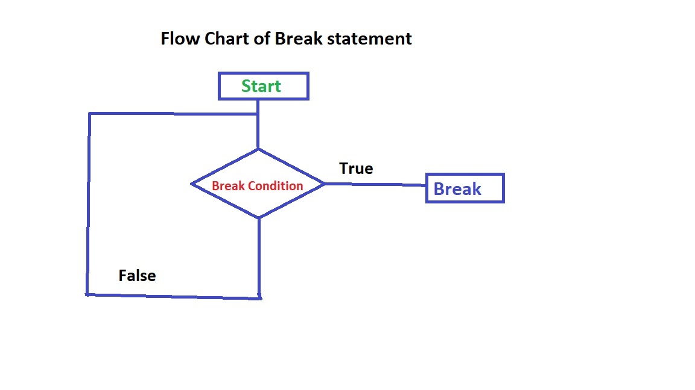

# Break and Continue statement in C/C++
## Break statement in C/C++
- Break is a loop control statement .
- Break statement is use for the loop .
- Break statement is encountered from within loop .
- Break statement use for some how required specific point for the terminate that block .
```
#include<bits/stdc++.h>
int main(){
    int i;
    for(i=0;i<10;++i){
       
        if(i==7)
            break;
        printf("i is : %d \n",i );
    }
return 0;
}
```
## *Flow chart break statement in C/C++*



---------------------------------------------------------------

## Continue statement in C/C++
- Continue is loop control statement .
- Continue is  intead of teminating the loop .
- Continue statment will be use for skip token which we want and next same as continue exicut.
``` 
#include<bits/stdc++.h>
int main(){
    int i;
    for(i=0;i<10;++i){
       
        if(i==7)
            continue ;
        printf("i is : %d \n",i );
    }
return 0;
}
```
## *Flow chart Continue statement in C/C++*
