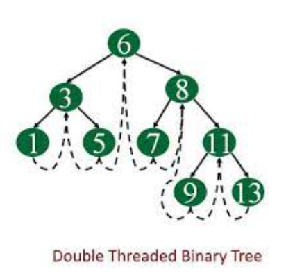
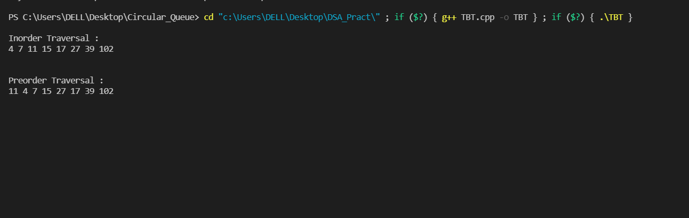

# **What is threaded binary tree ?**

Threaded binary tree is a binary tree in which the null pointers of leaf node of the binary tree is pointing to inorder predecessor or inorder successor.Threaded binary tree structure makes the inorder and preorder traversal of the tree faster without using any additional data structure(e.g auxilary stack) or memory to do the traversal.

<br /><br />


## **Double Threaded Binary Search Tree**
---

<br />

Double threaded binary search tree is a binary search tree in which every node has left NULL pointer points to its inorder predecessor and the right NULL pointer points to the inorder successor. The threads are useful for fast accessing the ancestors of a node.

Double Threaded Binary Search Tree is one of the most used types of Advanced data structures used in many real-time applications like places where there are insertion and traversal of all elements of the search tree. 

<br />

<p align= "center">

</p>


<br /><br />


## **Advantages of using double threaded binary tree-**
---

<br />

Although adding right and left threads increases complexity, the double-threaded tree has the advantages of both single-threaded trees and binary search tree.

1. Fast successor and predecessor access.

2. No auxiliary stack or recursion approach for in-order, pre-order, and reverse in-order traversals.

3. Since no auxiliary stack or recursion is required, memory consumption is reduced.

4. Utilize wasted space. Since the empty left and right attribute of a node does not store anything, we can use the empty left and right attributes as threads.

<br /><br />


## **Algorithm:**
---

<br />

- In this tree, there are five fields namely, data fields, left, right pointers, leftThread, and rightThread where leftThread and rightThread are boolean value stored to denote the right pointer points to an inorder successor or a new child node. Similarly, the left pointer points to an inorder predecessor or a new child node.

- Base condition for the creation of the Double Threaded binary search tree is that the root node exists or not, If it doesn’t exist then create a new node and store it.

- Otherwise, compare the data of the current node to the new Data to be inserted, If the new data is less than the current data then traverse to the left child node. Otherwise, traverse to the right child node.

- If the left child or right child doesn’t exist then insert the node to its left and point its left and right child to the inorder predecessor and successor respectively.

<br /><br />


## **Implementation of double threaded binary search tree for inorder and preorder traversal-**

<br />

```
#include<bits/stdc++.h>
using namespace std;

class Node{
public:
    int data;
    Node* left;
    Node* right;
    int leftThread;   
    int rightThread; 
    Node(int val){
        this->data = val;
    }
};


class DoubleThreadedBinaryTree{
private:
    Node*root;
public:
    DoubleThreadedBinaryTree(){
        
        root=new Node(INT_MAX);
        root->left=root->right=root;
        root->leftThread=0;
        root->rightThread=1;
    }


    void insert(int data){
        Node* new_node=new Node(data);
        if(root->left==root&&root->right==root){
            //EmptyTree
            new_node->left=root;
            root->left=new_node;
            new_node->leftThread=0;
            new_node->rightThread=0;
            root->leftThread=1;
            new_node->right=root;
            return;
        }
        else{
            Node*current=root->left;
            while(true){
                if(current->data>data){
                    if(current->leftThread==0){
                    //thisisthelastNode
                    new_node->left=current->left;
                    current->left=new_node;
                    new_node->leftThread=current->leftThread;
                    new_node->rightThread=0;
                    current->leftThread=1;
                    new_node->right=current;
                    break;
                    }
                    else{
                        current=current->left;
                    }
                }
                else{
                    if(current->rightThread==0){
                        //thisisthelastNode
                        new_node->right=current->right;
                        current->right=new_node;
                        new_node->rightThread=current->rightThread;
                        new_node->leftThread=0;
                        current->rightThread=1;
                        new_node->left=current;
                        break;
                    }
                    else{
                        current=current->right;
                    }
                }
            }
        }
    }

    Node*findNextInorder(Node*current){
        if(current->rightThread==0){
            return current->right;
        }
        current=current->right;
        while(current->leftThread!=0)
        {
            current=current->left;
        }
        return current;
    }


    void inorder(){
        Node*current=root->left;
        while(current->leftThread==1){
            current=current->left;
        }
        cout<<"\nInorder Traversal :"<<"\n";
        while(current!=root){
            cout<<current->data<<" ";
            current=findNextInorder(current);
        }
        cout<<"\n\n";
    }


    void preorder(){
        Node*current=root->left;
        cout<<"\nPreorder Traversal :"<<"\n";
        while(current!=root){
            cout<<current->data<<" ";
            if(current->left!=root&&current->leftThread!=0)
                current=current->left;
            else if(current->rightThread==1){
                current=current->right;
            }
            else{
                while(current->right!=root&&current->rightThread==0)
                {
                    current=current->right;
                }
                if(current->right==root)
                    break;
                else
                {
                    current=current->right;
                }
            }
        }
        cout<<"\n\n";
    }
};


int main(){
    DoubleThreadedBinaryTree dtbt;
    dtbt.insert(10);
    dtbt.insert(3);
    dtbt.insert(15);
    dtbt.insert(6);
    dtbt.insert(27);
    dtbt.insert(17);
    dtbt.insert(36);
    dtbt.insert(118);
    dtbt.inorder();
    dtbt.preorder();
   ;
    return 0;
}

```
<br />

## **Output:**
---

<br />

<p align= "center">
     
</p>


<br /><br/>


## **Application of double threaded binary search tree:**
---

<br/>

The main idea behind double threaded binary trees is to make inorder traversal of the binary tree faster and do it without using any external extra space, so sometimes in small systems where hardware is limited we use threaded binary tree for better efficiency of the software in a limited hardware space.

<br /><br />


## **Summary:**
---

<br />

The double-threaded tree offers both single-threaded binary trees’ benefits, but its implementation is even more complex than single-threaded binary trees. Besides, there is no significant improvement in run-time performance. However, in some cases, such as the space complexity is concerned, and the specific traversals (e.g., in-order traversal) are critical, the double-threaded binary tree could be the best option.

<br /><br /><br /><br />


---


*Thanks for reading !!*

**Contributed by : Palak Tiwari**


