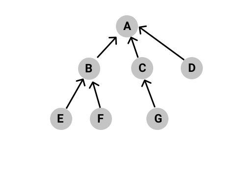

# Topological Sorting in Graph

Topological Sorting is an ordering of the nodes in a directed graph where for each directed edge from node A to node B,node A appears before node B in the ordering.

1. Topological Sorting is not unique in nature.
2. Not every graph has a Topological Sort.For example,a cyclic graph has no topological sorting.
3. Only Directed Acyclic Graph i.e. DAG has a valid topological sort.

### Indegree:Number of inward directed edges on a vertex in a directed graph.

## Algorithm:

While all the nodes are not visited

- Nodes with zero indegree can be added to the output array
- All the nodes which are adjacent to terminal nodes, gets their indegree subtracted.

## Sample Test Case:

Topological Sort: E F G D B C A
