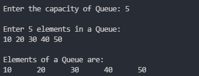

# Queue:

- Queue is a standard data structure which works on FIFO principle.
- FIFO stands for First In First Out.
- Which states that the element which is inserted first will be the first to remove.

### Advantages:
- It can handle multiple data types and they are both flexible and fast.
- Queues can be of potentially infinite length compared with the use of fixed-length arrays.

### Disadvantages:
- A major disadvantage of a simple Queue is that a new element can only be inserted when all of the elements are deleted from the queue.

### Operations:
- **createQueue() :**<br>
    This function takes one argument as 'capacity' and allocate the memory to the Queue of size capacity.
- **isEmpty() :**<br>
    This function takes one arguments, as pointer to the Queue and return true is the Queue is empty, else it will return false.
- **isFull() :**<br>
    This function takes one arguments, as pointer to the Queue and return true is the Queue is full, else it will return false.
- **enQueue() :**<br>
    This function takes two arguments, first one is the pointer to the Queue and second one is the data and inserts the data in a Queue.
- **deQueue() :**<br>
    This function takes one arguments, as pointer to the Queue remove the element from the Queue.

### Program Code:
```c
// Including header files.
#include<stdio.h>  // For printf() and scanf()
#include<stdlib.h> // For malloc()

// Using bool data-type using enum.
enum bool{false, true};

// Structure of Queue Data Structure.
struct Queue{
	int rear;
	int front;
	int capacity;
	int *arr;
};
// Using "struct Queue" as "Queue".
struct Queue typedef Queue;

// createQueue() function for allocating memory to the Queue.
Queue* createQueue(int capacity){
	Queue* Q = malloc(sizeof(Queue));
	if(Q == NULL){
		printf("Memory Overflows");
		return NULL;
	}
	Q->capacity = capacity;
	Q->arr = malloc(sizeof(int)*capacity);
	if(Q->arr == NULL){
		printf("Memory Overflows");
		return NULL;
	}
	Q->front = Q->rear = -1;
	
	return Q;
}

// isEmpty() fucntion will return true,
// if the Queue is empty, else it will return false.
enum bool isEmpty(Queue *Q){
	return (Q->rear == -1) && (Q->front == -1);
}

// isFull() fucntion will return true,
// if the Queue is full, else it will return false.
enum bool isFull(Queue *Q){
	return (Q->front == (Q->rear+1)%Q->capacity); 
}

// enQueue() function to insert an element in a Queue,
// if Queue is full it will give Overflow.
enum bool enQueue(Queue *Q, int data){
	if(isFull(Q)){
		printf("Queue is overflow\n");
		return false;
	}
	if(isEmpty(Q)){
		Q->front++;
	}
	Q->rear = (Q->rear+1)%Q->capacity;
	Q->arr[Q->rear] = data;
	
	return true;
}

// deQueue() function to remove an element from a Queue,
// if Queue is empty it will give Underflow.
int deQueue(Queue *Q){
	if(isEmpty(Q)){
		printf("Queue is undeflow\n");
		return -1;
	}

	int elem = Q->arr[Q->front];
	if(Q->rear == Q->front)
		Q->rear = Q->front = -1;
	else
		Q->front = (Q->front+1)%Q->capacity;
	
	return elem;
}

// main function or the driver function.
int main(){
	// Variable for taking input of capacity from the user.
	int capacity = 0;
	printf("\nEnter the capacity of Queue: ");
	scanf("%d", &capacity);

	// Creating Queue of size Capacity.
	Queue *Q = createQueue(capacity);

	// Taking input from the user and,
	// storing them in a Queue.
	printf("\nEnter %d elements in a Queue:\n", capacity);
	while(!isFull(Q)){
		int data = 0;
		scanf("%d", &data);
		enQueue(Q, data);
	}	
	
	// Printing all elements out of from the Queue.
	printf("\nElements of a Queue are:\n");
	while(!isEmpty(Q)){
		printf("%d\t", deQueue(Q));
	}
	
	return 0;
	// End of main function.
}
```
### Running Output:

