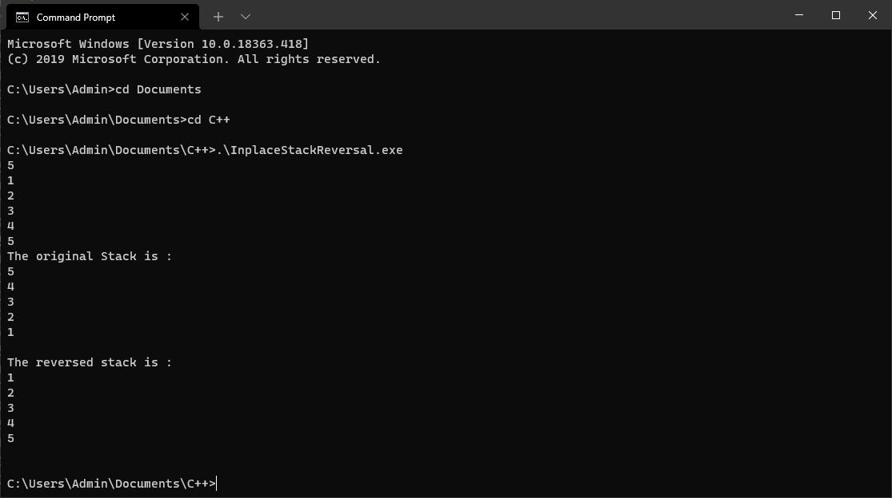

## **IN PLACE REVERSAL OF A STACK** 

### We will be reversing the stack without creating another stack, and for this purpose, we will be using the heap memory that is present during the program run. 

<br>

### **Approach :**
### We will create a **recursive function** reverseStack(), which will take input a stack by reference(because we want the changes to be reflected in the original stack), and another function **insertAtBottom()** which is again going to be a recursive function and it will insert the element at the bottom of the stack once the stack gets emptied.

<br>

```
Example : suppose we have the stack : 
		Original Stack              Output Stack 
			|4|							|1|
			|3|							|2|
			|2|							|3|
			|1|							|4|
```
<br>

### **Algorithm :** we will pop out the element at the top of the stack and make a call on the function insertAtBottom, now what insert at bottom does is : it will check if the stack is empty or not, if the stack is empty() then it will push the popped out element into the stack otherwise it will fetch the topmost element of the current stack and store it, then we will pop this element from the stack and make a recursive call on the function insertAtBottom on the remaining stack.

<br>

```
first call on reverseStack() : 

|4| --> TopMost element popped and stored in the call stack 
	|3|							
	|2|							
	|1|		

Second call on reverseStack() : 
|3|	--> TopMost element again popped and stored in the call stack 						
	|2|							
	|1|			

Third call on reverseStack() : 
|2| --> TopMost element again popped and stored in the call stack 							
	|1|			

Fourth call on reverseStack() : 
|1| --> TopMost element again popped and stored in the call stack 
	| | 
```

### **Base Case :** Fifth call on reverseStack() : Now we can see that the stack is empty, this means we have extracted all the elements of the stack can start inserting them at the bottom starting from the TopMost element of the original stack, so we will return from this point and call on the function insertAtBottom()

<br>

### **insertAtBottom()** function will check if the stack is empty or not, if the stack is empty, it will push the element into the stack otherwise it will make a recursive call on the function insertAtBottom() with the TopMost element of the current stack as arguement.

The order of insertion of the elements is going to be :

```
First call : 
New Stack       Call Stack 
	|4|				|3|
					|2|
					|1|

Second call : 
New Stack       Call Stack 
	|3|				|2|
	|4|				|1|

Third Call : 
New Stack       Call Stack 
	|2|				|1|
	|3|
	|4|

Fourth Call : 
New Stack       Call Stack (Empty)
	|1|				| |
	|2|
	|3|
	|4|

Fifth Call : return 
```

<br>

