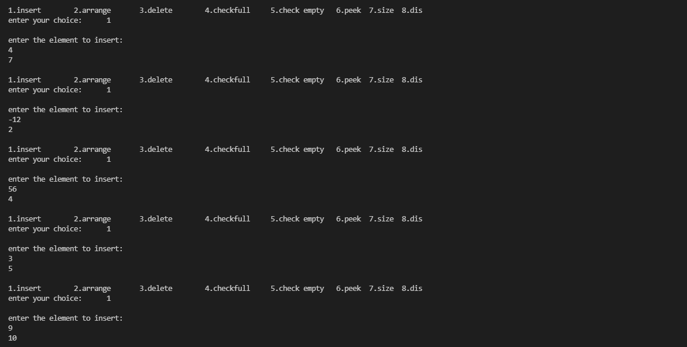
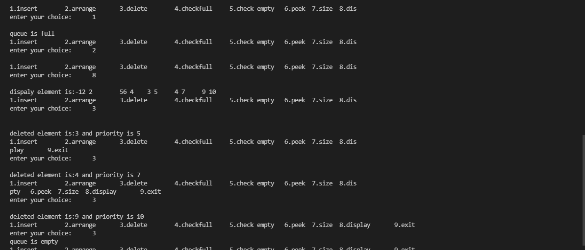

# Priority Queue 
Priority Queue is more specialized data structure than Queue. Like ordinary queue, priority queue has same method but with a major difference. In Priority queue items are ordered by key value so that item with the lowest value of key is at front and item with the highest value of key is at rear or vice versa. So we're assigned priority to item based on its key value. Lower the value, higher the priority. Following are the principal methods of a Priority Queue.
### Basic Operations
 - **insert / enqueue** − add an item to the rear of the queue.

 - **deletion / dequeue** − remove an item from the front of the queue.
 ## Priority Queue Representation

 We're going to implement Queue using array in this article. There is few more operations supported by queue which are following.

**Peek** − get the element at front of the queue.

**Display** - To display all element

**isFull** − check if queue is full.

**isEmpty** − check if queue is empty.
## Insert / Enqueue Operation
Whenever an element is inserted into queue, priority queue inserts the item according to its order. Here we're assuming that data with high value has low priority.

## Deletion / Dequeue Operation
Whenever an element is to be removed from queue, queue get the element using item count. Once element is removed. Item count is reduced by one.

## Demo Program
    #include<stdio.h>
    #define max 5 	/* insert maximum 5 items */
    int PQ[2][max];
    int F=-1;
    int R=-1;
    int item,priority;
    void insertion();
    void arrange();
    void deletion();
    int isfull();
    int isempty();
    int size_PQ();
    void display();
    void peek();
    int main()
    {
    	int ch,x,y;
    	do{
    	printf("\n1.insert\t2.arrange\t3.delete\t4.checkfull\t5.check empty\t6.peek\t7.size\t8.display\t9.exit\n");
    	printf("enter your choice:\t");
    	scanf("%d",&ch);
     		switch(ch){
            		case 1:insertion();
            		break;
            		case 2:arrange();
            		break;
            		case 3:deletion();
            		break;
            		case 4:x=isfull();
            		if(x==1)
	           		printf("\nqueue is full");
	           		else
	           		printf("\nnot full");
            		break;
            		case 5:x=isempty();
            		if(x==1)
	           		printf("\nqueue is empty");
	           		else
	           		printf("\nnot empty");
	           		break;
            		case 6: peek();
            		break;
            		case 7:y=size_PQ();
                    		printf("%d",y);
            		break;
            		case 8:display();
            		}
    	}while(ch!=9);
    }
# Function to insert an element into the queue
    void insertion()
    {
        if(isfull()==1){
        // As queue is full, elements will not be inserted
        printf("\nqueue is full");
        }
        else
        {
	// if queue is empty, insert the data
        printf("\nenter the element to insert:\n");
        scanf("%d %d",&item,&priority);
        if(R==-1)
        {
            F=R=0;
        }
        else{
           R=R+1;
        }
        // insert the data 
        PQ[0][R]=item;
        PQ[1][R]=priority;
        }
    }
# Function to arrange an element in the queue
    void arrange()
    {
        int i,j;
#### Swap and continue if condition is not False
        if(size_PQ()>1)
        {
            for(int i=F;i<=R;i++)
            {
                for(j=i+1;j<=R;j++)
                {
                    if(PQ[1][i]>PQ[1][j])
                    {
                        int temp=PQ[1][j];
                        PQ[1][j]=PQ[1][i];
                        PQ[1][i]=temp;
                        int swap=PQ[0][j];
                        PQ[0][j]=PQ[0][i];
                        PQ[0][i]=swap;
                    }
                }
            }
        }
    }
# Function to delete an element from the queue
    void deletion(){
        int a,b;
	// As queue is empty, elements will be deleted
        if(isempty()==1){
        printf("queue is empty");
        }
        else
        {    
	// remove one item
        a=PQ[0][F];
        b=PQ[1][F];
        printf("\ndeleted element is:%d and priority is %d",a,b);
        if(F==R){
            F=R=-1;
        }
        else{
            F++;
        }
        }
    }
# Function to check queue is full or not 
    int isfull(){
        if(R==max-1){
            return 1;
        }
        else{
            return 0;
        }
    }
# Function to check queue is empty or not 
    int isempty(){
        if(F==-1 && R==-1){
            return 1;
        }
        else{
            return 0;
        }
    }
# Function to get the element at front of the queue
    void peek(){
        if(!isempty())
        {
            printf("front element is:%d",PQ[F]);
        }
    }
    int size_PQ(){
        int size=R-F+1;
            return size;
    }
 # Function to display all element
    void display()
    {
        printf("\ndispaly element is:");
        for(int i=F;i<=R;i++)
        printf("%d %d\t",PQ[0][i],PQ[1][i]);
    }

*If we compile and run the above program then it would produce following result −*

**Contributor**: [Shalini Kumari](https://github.com/Raghavshalu)
