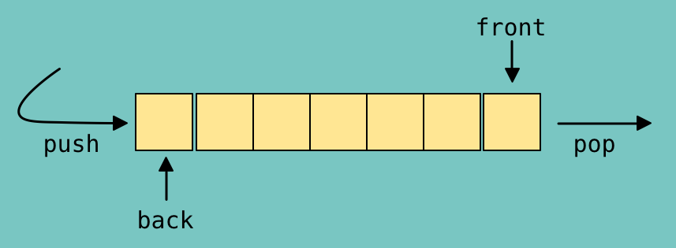



## What is Queue?
**Queue** is a sequence which follows First In First Out (FIFO) manner. We can see Queue in our life like a queue of customers outside a shop in which the customer who came first get his order first.


Queue as a data structure stores element from rear(back) and deletes it from front. It can be implemented using Arrays or Linked List.




## Queues in C++ STL
Standard Template Library (STL) in C++ contains the implementation of commonly known data structures such as arrays, lists, queues, stacks, etc.

We can use Queue in our code by including queue library.

    #include <queue>


**Advantages of Queues :**

 


 - In Queues, data does not remain in the data structure for as long as with stacks.
 - In Queues, data is store in ordered manner.

**Disadvantages of Queues :**

 -  In Queues, data inserted after a particular data cant be deleted before that data.
 - In Queues, Random access of elements is impossible.

**Functions supported by queue are :**

 1.**push(element) -** adds the element at the end of the queue.<br/>
 2. **pop( ) -** deletes the first element of the queue.<br/>
 3. **empty( ) -** Returns whether the queue is empty.<br/>
4. **size( ) -** Returns the size of the queue.<br/>
5. **front( ) -** returns a reference to the first element of the queue.<br/>
6. **back( ) -** returns a reference to the last element of the queue.<br/>

### Code :
```c
//Demonstration of queue in stl

#include<iostream>

//including queue library
#include<queue>

using namespace std;

//function to print elements of Queue
void displayQueue(queue<int> q){
    cout<<"Elements in Queue : ";
    while(!q.empty()){
        cout<<q.front()<<" ";
        q.pop();
    }
    cout<<endl;
}

int main(){
    //Declaring queue of name Queue
    queue<int> Queue;
    
    //Pushing in Queue
    Queue.push(1);
    Queue.push(7);
    Queue.push(3);
    Queue.push(5);
    Queue.push(9);
    
    //Printing size of Queue
    cout<<"Size of Queue is : "<<Queue.size()<<endl;

    //Printing Elements of Queue
    displayQueue(Queue);
    
    //Printing front element of Queue
    cout<<"element at front : "<<Queue.front()<<endl;
    
    //Printing back element of Queue
    cout<<"element at back  : "<<Queue.back()<<endl;

    //Popping elements and printing Queue 
    Queue.pop();
    cout<<"Element is popped"<<endl;
    displayQueue(Queue);
    Queue.pop();
    cout<<"Element is popped"<<endl;
    displayQueue(Queue);
    Queue.pop();
    cout<<"Element is popped"<<endl;
    displayQueue(Queue);
    Queue.pop();
    cout<<"Element is popped"<<endl;
    displayQueue(Queue);
    Queue.pop();
    cout<<"Element is popped"<<endl;
    displayQueue(Queue);

    //Printing Queue is empty if it is empty else printing queue is not empty
    if(Queue.empty()==true){
        cout<<"Queue is empty";
    }
    else{
        cout<<"Queue is not empty";
    }
}
```
### Output :
```c
Size of Queue is : 5
Elements in Queue : 1 7 3 5 9
element at front : 1
element at back  : 9
Element is popped
Elements in Queue : 7 3 5 9
Element is popped
Elements in Queue : 3 5 9
Element is popped
Elements in Queue : 5 9
Element is popped
Elements in Queue : 9
Element is popped
Elements in Queue :
Queue is empty
```
