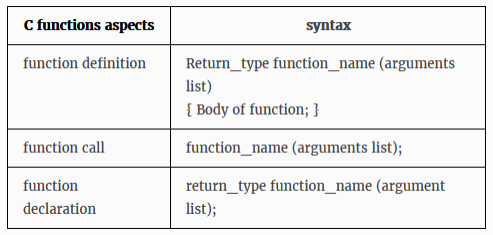
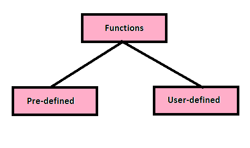

# Function and it's Types :
## 1. Function -
- Basic building blocks of a program.
- a block of code which has some name for identification.
- Any program is a collection of functions.
- Function needs to defined once and can be called several times in a program.
- A C program must have atleast one function.  i.e main()
- Function name must be unique in a program.
## 2. Three Aspects of Function -
 

## 3. Types of Function -
1. **Pre-defined function** 
- Known as Library function
- declared in the header files
- already defined in the system libraries
- eg. scanf(), printf(), getch() etc.

 

2. **User-defined function** 
- written by user to perform certain task
- defined to reduce complexity of a big problem
- can be called by main program whenever required.
- eg. main() ,sum() etc
## 4. Ways to define a function -
1. Takes nothing , Returns nothing **(TNRN)**
2. Takes something , Returns nothing **(TSRN)**
3. Takes nothing , Returns something **(TNRS)**
4. Takes something , Returns something **(TSRS)**

