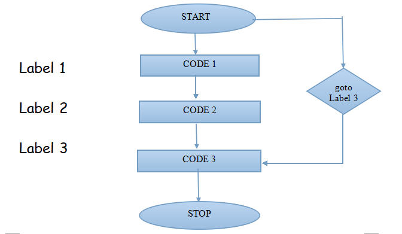
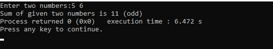

# **goto** CONTROL INSTRUCTION
- goto is a keyword.
- goto statement is also known as jump statement.
- It is used for unconditional jump from one part of the program to another part. 
- It works only within the very same function body.
## How goto statement works?
- goto works by transferring the program control to a location in the program mentioned by a user-defined identifier *‘label’*.
- It can move control in forward as well as backward in the program.
- There’s no need of declaring them as variables.
## Flowchart
<br>
## Syntax
```c
  //Forward goto usage
          goto label;
          .
          .
          .
          label:
             .
             .
 ```
<br> OR <br>

```c
//Backward goto usage
          label:
              .
              .
          goto label;
```
## Program to illustrate the use of goto statements
<br>
- ## Input for this program 
 <br>
- ## Output for this program
<br>
## Disadvantages
- It is not preferable to use as it makes the program complex and tangled. 
- It minimizes the efficiency of the program.
- In modern programming ,it is a bad programming practice.
- It’s **better to use break and continue statements instead of goto statements**.

          
