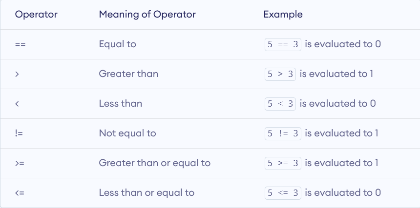
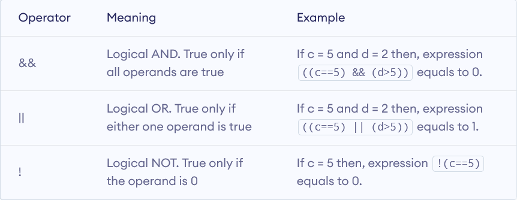
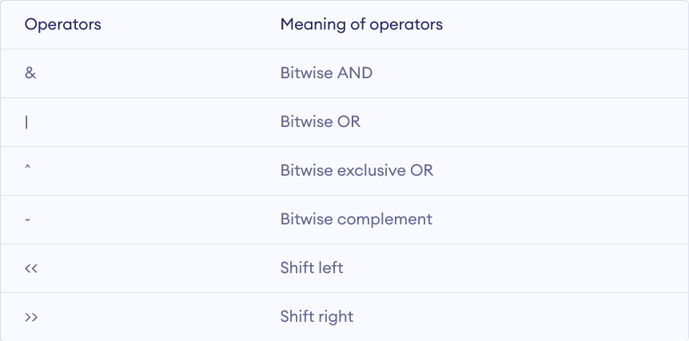

# Operators in C Language

Operators are the building blocks of any programming language. As a result, without the employment of operators, the functionality of the C programming language is incomplete. Operators can be defined as symbols that allow us to conduct precise mathematical and logical operations on operands.
To put it another way, an operator controls the operands.

Take a look at the following example: 

```
a = b + c;
```
In this case, the operator known as the addition operator is '+', and the operands are 'a' and 'b'. The addition operator instructs the compiler to add both operands 'a' and 'b'.  

**Types of Operators**
* Arithmetic Operators
* Conditional/Ternary Operators
* Increment and Decrement Operators
* Relational Operators
* Logical Operators
* Bitwise Operators
* Assignment Operators
  

## Arithmentic Operators
It's a operator which conducts mathematical operations on numerical quantities such as addition, subtraction, multiplication, and division (constants and variables). 


For eg,
```
// C Program to demonstrate use of arithmetic operators
#include <stdio.h>
int main()
{
    int a = 9,
        b = 4, 
        c;
    
    c = a+b;
    printf("a + b = %d \n",c);
    c = a-b;
    printf("a - b = %d \n",c);
    c = a*b;
    printf("a * b = %d \n",c);
    c = a/b;
    printf("a / b = %d \n",c);
    c = a%b;
    printf("Remainder when a divided by b = %d \n",c);
    
    return 0;
}
```

**Output**
```
a + b = 13 
a - b = 5 
a * b = 36 
a / b = 2 
Remainder when a divided by b = 1 
```
As you might guess, the operators ``+``, ``-`` and ``*`` compute addition, subtraction, and multiplication, respectively

``9/4 = 2.25`` in standard math. In the programme, however, the output is ``2``.

This is due to the fact that both variables ``a`` and ``b`` are integers. As a result, the output is also an integer.
The compiler ignores the word after the decimal point and displays response ``2`` rather than ``2.25``.

The remainder is computed using the modulo operator percent. The remainder is ``1`` when ``a=9`` is divided by ``b=4``.Only integers can be used with the percent operator.

Assume that ``a = 5.0``, ``b = 2.0``, ``c = 5``, and ``d = 2``. 

For eg,
```
// Either one of the operands is a floating-point number
a / b = 2.5  
a / d = 2.5  
c / b = 2.5  

// Both operands are integers
c / d = 2
```
<hr>

## Conditional Operators
The conditional operator has the following syntax: 
```
(Expression1? Expression2: Expression3)
``` 
Expression1 is the condition to be assessed in this case.
If the condition (Expression1) is True, we will execute and return the result of Expression2, otherwise we will execute and return the result of Expression3. If the condition (Expression1) is False, we will execute and return the result of Expression3.
We can utilise conditional operators instead of if...else sentences. 

For eg,
```
// C Program to demonstrate use of conditional/ternary operators
#include <stdio.h>
using namespace std;
  
int main()
{
   int test = 0;
   cout << "First  character " << '1' << endl;
   cout << "Second character " << (test ? 3 : '1') << endl;
  
   return 0;
}
```

**Output**
```
First  character 1
Second character 49
```
<hr>

## Increment and Decrement Operators

To alter the value of an operand (constant or variable) by 1, C programming offers two operators: increment ``++`` and decrement ``--``.

Increment ``++`` raises the value by one, and decrement ``--`` lowers the value by one. These two operators are unary, which means they only work on a single operand. 

For eg,
```
// C Program to demonstrate use of increment and decrement operators
#include <stdio.h>
int main()
{
    int a = 5, b = 10;
    float c = 5.5, d = 10.5;

    printf("++a = %d \n", ++a);
    printf("--b = %d \n", --b);
    printf("++c = %f \n", ++c);
    printf("--d = %f \n", --d);

    return 0;
}
```
**Output**
```
++a = 6
--b = 9
++c = 6.5000
--d = 9.5000
```

The operators ``++`` and ``--`` are used as prefixes here. These two operators, like ``a++`` and ``a--``, can also be used as postfixes. 

* When you use the ``++`` operator as a prefix, such as: ``++a``, the value of ``a`` is incremented by one and then returned.

* If you use the ``++`` operator as a postfix, such as ``a++``, the original value of ``a`` is returned first, followed by a one-digit increase of var.
  
For eg,
```
// C Program to demonstrate use of increment and decrement postfix and prefix operators
#include <stdio.h>
int main() {
   int a = 5, b = 5;

   // 5 is displayed
   // Then, var1 is increased to 6.
   printf("%d\n", a++);

   // var2 is increased to 6 
   // Then, it is displayed.
   printf("%d\n", ++b);

   return 0;
```

**Output**
```
5
6
```
<hr>

## Relational Operators
This is used to compare the values of two operands.
For example, determining whether one operand is equal to the other operand, whether one operand is greater than the other operand, and so on.

It examines the connection between two operands. If the relationship is true, it returns ``1``; if the relationship is false, it returns ``0``. 



For eg,
```
// C Program to demonstrate use of relational operators
#include <stdio.h>
int main()
{
    int a = 5, b = 5, c = 10;

    printf("%d == %d is %d \n", a, b, a == b);
    printf("%d == %d is %d \n", a, c, a == c);
    printf("%d > %d is %d \n", a, b, a > b);
    printf("%d > %d is %d \n", a, c, a > c);
    printf("%d < %d is %d \n", a, b, a < b);
    printf("%d < %d is %d \n", a, c, a < c);
    printf("%d != %d is %d \n", a, b, a != b);
    printf("%d != %d is %d \n", a, c, a != c);
    printf("%d >= %d is %d \n", a, b, a >= b);
    printf("%d >= %d is %d \n", a, c, a >= c);
    printf("%d <= %d is %d \n", a, b, a <= b);
    printf("%d <= %d is %d \n", a, c, a <= c);

    return 0;
}
```

**Output**
```
5 == 5 is 1
5 == 10 is 0
5 > 5 is 0
5 > 10 is 0
5 < 5 is 0
5 < 10 is 1
5 != 5 is 0
5 != 10 is 1
5 >= 5 is 1
5 >= 10 is 0
5 <= 5 is 1
5 <= 10 is 1 
```
<hr>

## Logical Operators
A logical operator expression returns either 0 or 1, depending on whether the expression is true or false. 



For eg,
```
// C Program to demonstrate use of Logical Operators

#include <stdio.h>
int main()
{
    int a = 5, b = 5, c = 10, result;

    result = (a == b) && (c > b);
    printf("(a == b) && (c > b) is %d \n", result);

    result = (a == b) && (c < b);
    printf("(a == b) && (c < b) is %d \n", result);

    result = (a == b) || (c < b);
    printf("(a == b) || (c < b) is %d \n", result);

    result = (a != b) || (c < b);
    printf("(a != b) || (c < b) is %d \n", result);

    result = !(a != b);
    printf("!(a != b) is %d \n", result);

    result = !(a == b);
    printf("!(a == b) is %d \n", result);

    return 0;
}
```

**Output**
```
(a == b) && (c > b) is 1 
(a == b) && (c < b) is 0 
(a == b) || (c < b) is 1 
(a != b) || (c < b) is 0 
!(a != b) is 1 
!(a == b) is 0 
```
* ``(a == b) && (c > 5)`` evaluates to 1 because both operands ``(a == b)`` and ``(c > b)`` is 1 (true).
* ``(a == b) && (c < b)`` evaluates to 0 because operand ``(c < b)`` is 0 (false).
* (a == b) || (c < b) evaluates to 1 because ``(a = b)`` is 1 (true).
* ``(a != b) || (c < b)`` evaluates to 0 because both operand ``(a != b)`` and ``(c < b)`` are 0 (false).
* ``!(a != b)`` evaluates to 1 because operand ``(a != b)`` is 0 (false). Hence, ``!(a != b)`` is 1 (true).
* ``!(a == b)`` evaluates to 0 because ``(a == b)`` is 1 (true). Hence, ``!(a == b)`` is 0 (false).
<hr>

## Bitwise Operators
The Bitwise operators are used to perform operations on the operands at the bit level.
The operators are first transformed to bit-level, and then the operands are calculated. For speedier processing, mathematical operations such as addition, subtraction, multiplication, and so on can be performed at the bit level. In C, for example, the bitwise AND operator, denoted as &, accepts two numbers as operands and performs AND on each bit of the two numbers.
AND returns 1 only if both bits are 1. 



* In C, the ``& (bitwise AND)`` operator accepts two operands and performs AND on each bit of the two values. AND returns 1 only if both bits are 1.  
* In C, the ``| (bitwise OR)`` operator accepts two operands and performs OR on each bit of the two values. If any of the two bits is 1, the result of OR is 1.
*  In C, the ``^ (bitwise exclusive OR)`` function accepts two numbers as operands and performs XOR on each bit of the two numbers. If the two bits are different, the result of XOR is 1. 
*  In C, the ``~ (bitwise Complement)`` function accepts a single number and inverts all of its bits. 
*  In C, the ``<< (shift left)`` function takes two numbers, left shifts the bits of the first operand, and the second operand determines the number of places to shift. 
*  In C, the ``>> (shift right)`` operator takes two numbers, right shifts the bits of the first operand, and the number of places to shift is determined by the second operand. 

For eg,
```
// C Program to demonstrate use of bitwise operators
#include <stdio.h>
int main()
{
    // a = 5(00000101), b = 9(00001001)
    unsigned char a = 5, b = 9;
 
    // The result is 00000001
    printf("a = %d, b = %d\n", a, b);
    printf("a & b = %d\n", a & b);
 
    // The result is 00001101
    printf("a | b = %d\n", a | b);
 
    // The result is 00001100
    printf("a ^ b = %d\n", a ^ b);
 
    // The result is 11111010
    printf("~a = %d\n", a = ~a);
 
    // The result is 00010010
    printf("b << 1 = %d\n", b << 1);
 
    // The result is 00000100
    printf("b >> 1 = %d\n", b >> 1);
 
    return 0;
}
```

**Output**
```
a = 5, b = 9
a & b = 1
a | b = 13
a ^ b = 12
~a = 250
b << 1 = 18
b >> 1 = 4
```
<hr>

## Assignment Operators
To assign a value to a variable, assignment operators are employed. The assignment operator's left operand is a variable, while the assignment operator's right operand is a value. Otherwise, the compiler will throw an error if the value on the right side is not of the same data-type as the variable on the left side. 


For eg,
```
// C Program to demonstrate use of assignment operators
#include <stdio.h>
int main()
{
    int a = 5, c;

    c = a;      // c is 5
    printf("c = %d\n", c);
    c += a;     // c is 10 
    printf("c = %d\n", c);
    c -= a;     // c is 5
    printf("c = %d\n", c);
    c *= a;     // c is 25
    printf("c = %d\n", c);
    c /= a;     // c is 5
    printf("c = %d\n", c);
    c %= a;     // c = 0
    printf("c = %d\n", c);

    return 0;
}
```

**Output**
```
c = 5 
c = 10 
c = 5 
c = 25 
c = 5 
c = 0
```
<hr>

## Other Operators
 * **Comma Operator**
  <br>
The ``comma operator`` (represented by the token ``,``) is a binary operator that evaluates its first operand and discards the result before evaluating the second operand and returning the result (and type). The comma operator takes precedence over all other C operators. 

Deceleration
```
int a, b = 1, c;
```

* **sizeof Operator**
<br>
``sizeof`` is a commonly used function in the C/C++ computer language. It is a unary operator that can be used to compute the size of its operand at compile time. The sizeof result is of unsigned integral type, which is commonly expressed by size t.
The sizeof operator is used to compute the variable's size. 

Deceleration
```
#include <stdio.h>
int main()
{
    int a;
    float b;
    double c;
    char d;
    printf("Size of int=%lu bytes\n",sizeof(a));
    printf("Size of float=%lu bytes\n",sizeof(b));
    printf("Size of double=%lu bytes\n",sizeof(c));
    printf("Size of char=%lu byte\n",sizeof(d));

    return 0;
}
```

**Output**
```
Size of int = 4 bytes
Size of float = 4 bytes
Size of double = 8 bytes
Size of char = 1 byte
```
<hr>