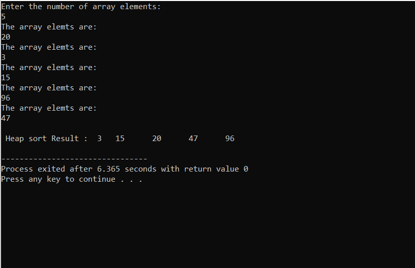

# Heap Sort
Heap Sort is a sorting technique based on Binary Heap Data structure.

<br>

## Heap sort in C/C++-
<br>

```c

#include<stdio.h>

void Heapsort (int [], int);

int main()
{
	int i,j,low,high;
	int temp;
	int n,a[100];
	printf("Enter the number of array elements:\n");
	scanf("%d",&n);
	for(i=0;i<n;i++)
	{
	printf("The array elemts are:\n");
	scanf("%d",&a[i]);
}
    Heapsort(a, n);
    printf("\n Heap sort Result : ");
    for(i = 0; i < n; i++)  {
        printf(" %d \t", a[i]);
    }
    printf("\n");
    return 0;
}
void swap(int *x, int *y) {
    int Temp;
    Temp = *x;
    *x = *y;
    *y = Temp;
}
void heapify(int a[],int n,int i)
{
	int max;
	max=i;
	int leftchild=2*i+1;
	int rightchild=2*i+2;
	if((leftchild<n)&&(a[leftchild]>a[max]))
	max=leftchild;
	if((rightchild<n) &&(a[rightchild]>a[max]))
	max=rightchild;
	if(max!=i)
	{
		swap(&a[i],&a[max]);
		heapify(a,n,max);
	}
}

void Heapsort(int a[], int n)
 {
 	int i;
 	for(i=n/2-1;i>=0;i--)
 	heapify(a,n,i);
 	
 	for(i=n-1;i>=0;i--)
 	{
 		swap(&a[0],&a[i]);
 		heapify(a,i,0);
	 }
 }

```
## Output-
<br>
