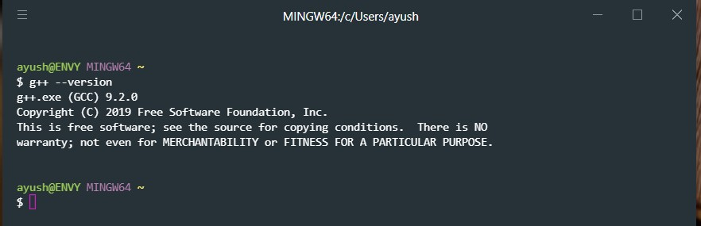

# Installation of C++ on different OS

 
## C++ for Windows

- [x] C++ Compiler

	Let's get started with downloading and installing the C++ Compiler! 
- [MinGW](https://nuwen.net/mingw.html), this is the third party page for downloading the MinGW compiler it consist of self extracting archive for mingw.
- Now click over **mingw-17.1-without-git.exe** which you will see in the referded page.
 - Extract the **mingw** to your preferded directory
  - [x] Environment Path Setup
 -  Add path to the environment variable under 
 *User Variable for Tech Decode* section select *Path* and add the path you copied.
			
      `Ex:- your_directory:\MinGW\bin`

- Check MinGW is working by writing
		`g++ --version` no error is generated then it's perfectly installed.
		
	
- [x] Download and setup VS Code

  **Note:- You can use your own preferded code editor.**
  
  - Download [VS Code](https://code.visualstudio.com/)
  - Install the needed extensions in the VS Code
  	1. Code Runner
      [(.run overview)](https://github.com/formulahendry/vscode-code-runner)
	  2. C/C++ (Debugger)
      [(C/C++ overview)](https://code.visualstudio.com/docs/languages/cpp)
---
## C++ for Mac

