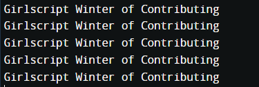
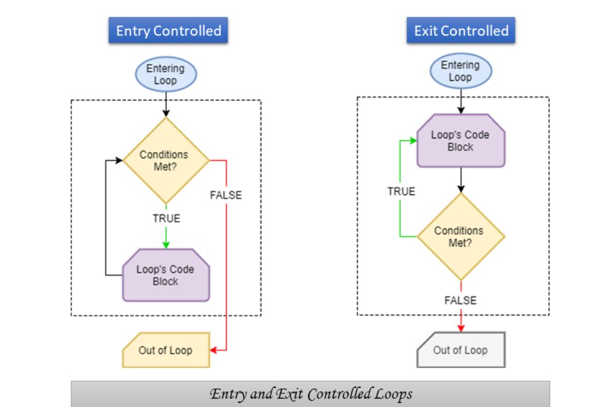
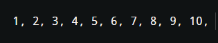
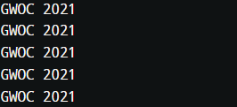
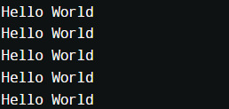

<h1 align="center">Looping Control Structures/Statements</h1>
<br>
<!----------------------------------------------INTRODUCTION------------------------------------------------------>

# **Introduction :**

In programming, sometimes we may need to use some part of our code for more than once. For example, let's say we want to print a statement for 5 times. This can be done in two ways:

- Iterative method:- By repeating the print statement for 5 times:
```jsx
#include <stdio.h>
  
int main()
{
    printf("Girlscript Winter of Contributing \n");
    printf("Girlscript Winter of Contributing \n");
    printf("Girlscript Winter of Contributing \n");
    printf("Girlscript Winter of Contributing \n");
    printf("Girlscript Winter of Contributing \n");

    return 0;
}
```
- Instead of repeating the same code multiple times, we can use loops. In loop, the statement will be written only once and will be excecuted multiple number of times. For example:-
```jsx
#include <stdio.h>

int main()
{   
    int i;
    for(i=1;i<=5;i++)
    {
     printf( "Girlscript Winter of Contributing \n");
    }
    
    return 0;
}
```
### ***Output :***

<p>&nbsp;</p>


<!----------------------------------------------TYPES------------------------------------------------------>
# **Types of Loops :**


<p>&nbsp;</p>

## Based on the when the test condition is checked, there are two types of loops:
### **a) Entry Controlled Loops** :- Test Condition is checked before excecuting the body of loop. It is further divide into two types:<br>&nbsp;&nbsp;&nbsp;&nbsp;1) For Loop <br>&nbsp;&nbsp;&nbsp;&nbsp;2) While Loop
### **a) Exit Controlled Loops** :- Test Condition is checked after exceuting the body of loop. It is of only one  type: <br>&nbsp;&nbsp;&nbsp;&nbsp;1) do-while loop
<p>&nbsp;</p>

<p>&nbsp;</p

<!----------------------------------------------FOR LOOP------------------------------------------------------>
# **For Loop :**
## ***Syntax:***
```jsx
for (initial value; condition; incrementation or decrementation ) 
{
  statements;
}
```
### ***Example :***
```jsx
//program to print the first 10 natural number

#include<stdio.h>
int main()
{
	int num;
	for(num=1;num<=10;num++)
	{
		printf("%d, ",num);		
	}
	return 0;
}
```
### ***Output :***

<p>&nbsp;</p>


<!----------------------------------------------WHILE LOOP------------------------------------------------------>
# **While Loop :**
## ***Syntax:***
```jsx
initialization;
while (condition)
{
   // statements
 
  updation;
}
```
### ***Example :***
```jsx
//program to print the statement "GWOC 2021" 5 times

#include<stdio.h>
int main()
{
  it num =1;
	while(num<=5)
  {
    printf("GWOC 2021\n");
  }

}
```
### ***Output :***

<p>&nbsp;</p>

<!----------------------------------------------DO WHILE LOOP------------------------------------------------------>
# **do-While Loop :**
## ***Syntax:***
```jsx
initialization;
do
{
   // statements

   updation;
} while (condition);
```
### ***Example :***
```jsx
//program to print the "Hello World" statement 5 times

#include<stdio.h>
int main()
{
	int num=1;	
	do	
	{
		printf("Hello World");
		num++;		
	}while(num<=5);
	return 0;
}
```
### ***Output :***

<p>&nbsp;</p>


### **Reference:**
- <a href="https://www.geeksforgeeks.org/">GeeksForGeeks</a>

### **Credits:**
- <a href="https://www.geeksforgeeks.org/">GeeksForGeeks</a>
- <a href="https://onlineclassnotes.com/what-are-entry-controlled-and-exit/">Online Class Notes</a>


