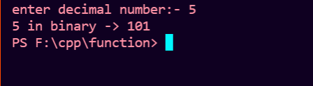
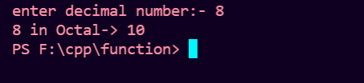
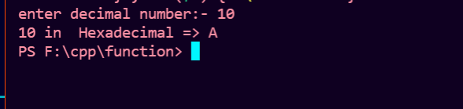

# Programs to convert from decimal to any other base in cpp.
## Decimal To Binary 
```cpp
#include <bits/stdc++.h>
using namespace std;
// Decimal to Binary conversion function
int decimalToBinary(int n)
{
    int ans = 0;         // initialize answer by 0 
    int rem = 1;         // initialize reminder by 1;
    int i = 1;           // placevalue of answer
    // loop until number not equal to 0
    while (n != 0)
    {
        rem = n%2;      //store the reminder 
        n /= 2;         // divide num by base(2), store the Quotient
        ans = ans + rem * i ;  // store the answer 
        i *= 10;  // increment placevalue 
    }
    return ans ;

}
int main()
{
    //Take input as decimal number 
    int num;
    cout << "enter decimal number:- ";
    cin >> num;
    cout<< decimalToBinary(num);   // function call
}
```
## OUTPUT:- 



## Decimal To Octal
```cpp
#include <bits/stdc++.h>
using namespace std;

// Decimal to octal conversion function
int decimalToOctal(int n)
{
    int ans = 0;          // initialize answer by 0 
    int rem = 1;          // initialize reminder by 1;
    int i = 1;            // placevalue of answer
    
 // loop until number not equal to 0
    while (n != 0)
    {
        rem = n%8;          // divide num by base(8), store the reminder 
        n /= 8;             // store the Quotient
        ans = ans + rem * i ;       // store the answer 
        i *= 10;                     // increment placevalue 
    }
    return ans ;

}
int main()
{

    int num;
  
    //Take input as decimal number 
    cout << "enter decimal number:- ";
    cin >> num;
    cout<< decimalToOctal(num);         //function call
}
```
## OUTPUT:- 


## Decimal To HexaDecimal
```cpp
#include <bits/stdc++.h>
using namespace std;

// decimalTOHexadecimal function defination 
void decimalToHexadecimal(int n)
{
    int i = 1;
    char ans[100];        //character array for answer
    int rem = 1;          //initialize reminder by 1
    
    //loop until number not eual to 0
     while (n != 0)
    {
        rem = n % 16;     //divide num by base(16), store reminder
        // if reminder less than 10, 48 is added to it according to ASCII value
        //else 55 is added
        if (rem < 10)      
            ans[i++] = rem + 48;
        else
            ans[i++] = rem + 55;
        n = n / 16;         //store the Quotient
    }
    cout << "\nHexadecimal => ";
    for (int j = i-1; j > 0; j--)       //print the answer(array) in reverse order
        cout << ans[j];
}
int main()
{
    //Take input as decimal number 
    int num;
    cout << "enter decimal number:- ";
    cin >> num;
    decimalToHexadecimal(num);      //function call
}
```
## OUTPUT:- 


<h1 align="center"><i> keep learning keep exploring </i> </h1>
