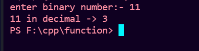
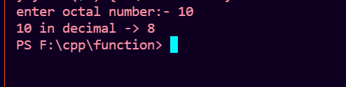
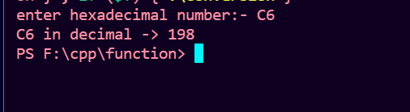

# Program to convert from any other base to Decimal in cpp.
## Binary to Decimal 
```cpp
#include <bits/stdc++.h>
using namespace std;
//Function definition
int binaryToDecimal (int n)
{
    int decimal = 0;    //initailize answer by 0
    int x = 1;          // set power 
//loop till number is not equal to 0
    while (n>0)
    {
        int lastdigit = n%10;       //get lastdigit
        decimal += x * lastdigit;   //multiply lastdigit with base(2)^x
        x = x *2;   incrementing base by power
        n /= 10;   //remove lastdigit from number
    }
    return decimal;
}
int main()
{
    //take input as binary number 
    int num;
    cout << "enter Binary number:- ";
    cin >> num;

    cout<<binaryToDecimal(num);     //function call
}
```
## OUTPUT:- 


## Octal to Decimal 
```cpp

#include <bits/stdc++.h>
using namespace std;
//function definition
int octalToDecimal(int n)
{
    int decimal = 0;  //initailize answer by 0
    int x = 1;     //set power
    
    //loop till num is not equal to 0
    while (n > 0)
    {
        int lastdigit = n%10;       //get lastdigit of number
        decimal += x * lastdigit;      //multiply lastdigit with base(8)^x
        x *= 8;      incrementing base by power
        n/= 10;     //remove lastdigit
    }
    return decimal;
}
int main()
{
    //take input as Octal number 
    int num;
    cout << "enter octal number:- ";
    cin >> num;

    cout<<octalToDecimal(num);        function call
}
```
## OUTPUT:- 


## HexaDecimal to Decimal 
```cpp

#include <bits/stdc++.h>
using namespace std;

//function definition
int hexaToDecimal(string n)
{
    int sum = 0;   //initailize answer(sum) by 0
    int x = 1;         //set power
    int s = n.size();   //get size of string(hexadecimal number)
    
   // Extracting characters as digits from last character
    for (int i = s - 1; i >= 0; i--)
    {
        //if character lies in '0'-'9', converting it to int 0-9
        if (n[i] >= '0' && n[i] <= '9')
        {
            sum += x * (n[i] - '0');    //add in answer,multiply digit with base(8)^x
        }
        
        //if character lies in 'A'-'F' , converting it to int 10 - 15
        else if (n[i] >= 'A' && n[i] <= 'F')
        {
            sum += x * (n[i] - 'A' + 10);   //add in answer,multiply digit with base(8)^x
        }
        x = x * 16;     incrementing base by power
    }
    return sum;
}
int main()
{
    //take input as hexadecimal number
    int num;
    cout << "enter hexaDecimal number:- ";
    cin >> num;

    cout<< hexaToDecimal(num);      //function call
}
```
## OUTPUT:- 

