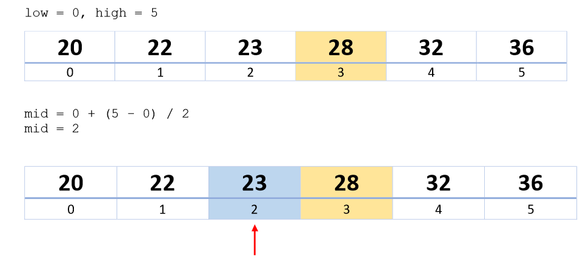
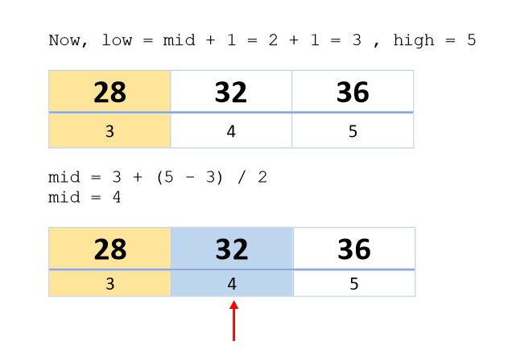
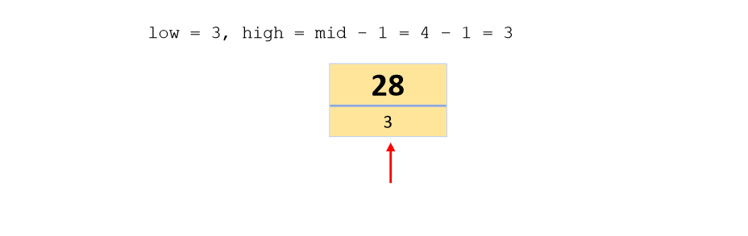

### Index
- [Binary Search](#binary-search)
    - [How it works:](#how-it-works)
          - [Formula to calculate mid:](#formula-to-calculate-mid)
    - [Pseudocode:](#pseudocode)
    - [Binary search code in C++](#binary-search-code-in-c)
        - [Iterative method:](#iterative-method)
        - [Recurssive method:](#recurssive-method)
      - [Space complexity of binary search algorithm](#space-complexity-of-binary-search-algorithm)
      - [Time complexity of binary search algorithm](#time-complexity-of-binary-search-algorithm)
  - [Practice problems on Binary search](#practice-problems-on-binary-search)

# Binary Search
Binary search is an efficient algorithm for searching an element from a sorted list of elements. It works by repeatedly dividing in half the portion of the list that could contain the element, and narrow down the possible locations to just one. 


--- 
### How it works:
For binary search to work the given list or array must be sorted.
Let us see how it works with an example.
The given sorted array is: 20,	22,	23,	26,	28,	32,	36.
And we need to find the index or location of element 28 in the given array.

###### Formula to calculate mid:
```
mid = low + (high - low) / 2
```
<p align="center">
  
</p>

Value at index 2 is 23, which is not equal to our target. As 23 is smaller than the target 28. And as the given array is sorted we know that we will find 28 in the upper portion of the array.

<p align="center">
  
</p>

Value at index 4 is 32, which is not equal to our target. As 32 is greater than the target 28. And as the given array is sorted we know that we will find 28 in the lower portion of the array.

<p align="center">
  
</p>
Here low = high, hence mid = low + 0 = 3.

Value at index 3 is 28 which is equal to our target value.

We found our target value at index 3.

Binary search reduces the number of comparisons by dividing the searchable elements in half.

---

### Pseudocode:
```
Procedure binary_search
   A ← sorted array
   n ← size of array
   x ← value to be searched

   Set low = 0
   Set high = n-1

   while x not found
      if high < low 
         EXIT: x does not exists.
   
      set mid = low + ( high - low ) / 2
      
      if A[mid] < x
         set low = mid + 1
         
      if A[mid] > x
         set high = mid - 1 

      if A[mid] = x 
         EXIT: x found at location midPoint
   end while
   
end procedure
```
---
### Binary search code in C++

##### Iterative method:
```c++
int binarySearch(int low, int high, int key)
{
   while (low <= high)         
   {
     int mid = low + (high - low) / 2;
     //check whether the key is in the upper portion 
     //or the lower portion
     if (a[mid] < key)     
     {
         //if key is greater than the element, 
         //then look in the upper portion
         low = mid + 1;  
     }
     else if (a[mid] > key)
     {
         //if key is smaller than the element, 
         //then look in the lower portion
         high = mid - 1;
     }
     //if the element at mid is the key return mid 
     else
     {
         return mid;
     }
   }
   //when low > high, key not found in the array
   return -1;   
}   
```

##### Recurssive method:
```c++
int binarySearch(int arr[], int low, int high, int x)
{
    if (high >= low) {
        int mid = low + (high - low) / 2;
  
        // If the element is present at the middle
        // itself
        if (arr[mid] == x)
            return mid;
  
        // If element is smaller than mid, then
        // it can only be present in left subarray
        if (arr[mid] > x)
            return binarySearch(arr, low, mid - 1, x);
  
        // Else the element can only be present
        // in right subarray
        return binarySearch(arr, mid + 1, high, x);
    }
  
    // We reach here when element is not
    // present in array
    return -1;
}
```
---
#### Space complexity of binary search algorithm

**O(1)** in case of iterative implementation. In the case of recursive implementation, **O(Logn)** recursion call stack space.

---
#### Time complexity of binary search algorithm
The time complexity of binary search is:-
```
Best Case - O(1) i.e. constant
Average Case - O(logn)
Worst Case - O(logn)
```
---
## Practice problems on Binary search

1. ##### Find the smallest missing element from a sorted array.
   Example:
   Input:  nums[] = [0, 1, 2, 3, 9, 11, 15]
   Output: The smallest missing element is 4
    \
    **Solution:**

    ```c++
    #include <iostream>
    
    using namespace std;
    // Function to find the smallest missing element in a sorted
    // array of distinct non-negative integers
    int findSmallestMissing(int nums[], int low, int high)
    {
        // base condition
        if (low > high) {
            return low;
        }
    
        int mid = low + (high - low) / 2;
    
        // if the mid-index matches with its value, then the mismatch
        // lies on the right half
        if (nums[mid] == mid) {
            return findSmallestMissing(nums, mid + 1, high);
        }
        else {
            // mismatch lies on the left half
            return findSmallestMissing(nums, low, mid - 1);
        }
    }
    
    int main()
    {
        int nums[] = { 0, 1, 2, 3, 4, 5, 6 };
        int n = sizeof(nums) / sizeof(nums[0]);
    
        int low = 0, high = n - 1;

        cout<<"The smallest missing element is"<<findSmallestMissing(nums, low, high))<<endl;
    
        return 0;
    }
    ```
    Output:
    ```
    The smallest missing element is 7
    ```

1. ##### Find a pair with the given sum in an array.
   Example:
   Input:
    arr = [8, 7, 2, 5, 3, 1]
    target = 10
    
    Output:
    
    Pair found (8, 2)
    or
    Pair found (7, 3)
    \
    **Solution:**
    ```c++
    #include <iostream>
    #include <algorithm>
    using namespace std;
    
    // Function to find a pair in an array with a given sum using sorting
    void findPair(int arr[], int n, int target)
    {
        // sort the array in ascending order
        sort(arr, arr + n);
    
        // maintain two indices pointing to endpoints of the array
        int low = 0;
        int high = n - 1;
    
        // reduce the search space `arr[low…high]` at each iteration of the loop
    
        // loop till the search space is exhausted
        while (low < high)
        {
            // sum found
            if (arr[low] + arr[high] == target)
            {
                cout << "Pair found (" << arr[low] << ", " << arr[high] << ")" << endl;
                return;
            }
    
            // increment `low` index if the total is less than the desired sum;
            // decrement `high` index if the total is more than the desired sum
            (arr[low] + arr[high] < target)? low++: high--;
        }
    
        // we reach here if the pair is not found
        cout << "Pair not found";
    }
    
    int main()
    {
        int arr[] = { 8, 7, 2, 5, 3, 1 };
        int target = 10;
    
        int n = sizeof(arr)/sizeof(arr[0]);
    
        findPair(arr, n, target);
    
        return 0;
    }

    ```
    Output:
    ```
    Pair found (2, 8)
    ```

1. ##### Find maximum length subarray having a given sum.
   Example:
   Input:
   A[] = { 5, 6, -5, 5, 3, 5, 3, -2, 0 }
    target = 8
    
    
    Subarrays with sum 8 are
    
    { -5, 5, 3, 5 }
    { 3, 5 }
    { 5, 3 }
    
    Output:
    The longest subarray is { -5, 5, 3, 5 } having length 4

    **Solution:**
    ```c++
    #include <iostream>
    
    using namespace std;
 
    // Naive function to find the maximum length subarray with sum `S` present
    // in a given array
    void findMaxLenSubarray(int arr[], int n, int S)
    {
        // `len` stores the maximum length of subarray with sum `S`
        int len = 0;
    
        // stores ending index of the maximum length subarray having sum `S`
        int ending_index = -1;
    
        // consider all subarrays starting from `i`
        for (int i = 0; i < n; i++)
        {
            int target = 0;
    
            // consider all subarrays ending at `j`
            for (int j = i; j < n; j++)
            {
                // sum of elements in the current subarray
                target += arr[j];
    
                // if we have found a subarray with sum `S`
                if (target == S)
                {
                    // update length and ending index of max length subarray
                    if (len < j - i + 1)
                    {
                        len = j - i + 1;
                        ending_index = j;
                    }
                }
            }
        }
    
        // print the subarray
        cout<<ending_index - len + 1<<" " <<ending_index<<endl;
       
    }
    
    int main()
    {
        int arr[] = { 5, 6, -5, 5, 3, 5, 3, -2, 0 };
        int target = 8;
    
        int n = sizeof(arr)/sizeof(arr[0]);
    
        findMaxLenSubarray(arr, n, target);
    
        return 0;
    }

    ```


---
