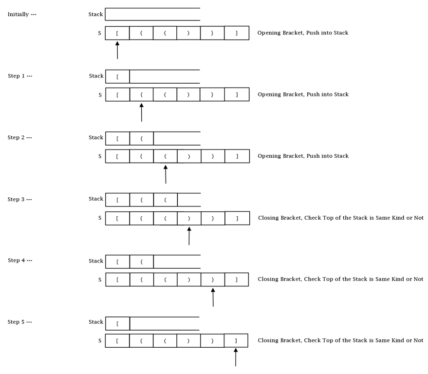

<h1 align = "center"><strong>Valid Brackets Using Stack</strong></h1>

<h2><strong>Brackets which we all most commonly use or encounter are of 3 main types :-</strong></h2>
<ul>
    <li>Round brackets, open brackets or parentheses: ( )</li>
    <li>Square brackets, closed brackets or box brackets: [ ]</li>
    <li>curly brackets, squiggly brackets, swirly brackets, braces, or chicken lips: { }</li>
</ul>
<br>
<h2><strong>Let's Understand the approach first :-</strong></h2>
<p>
<h3>We have to determine whether the given input of Brackets are valid or not.</h3>
<ul>
<br>
<li>To check this we first use stack data structure, which works on a principle of <strong>LIFO (Last in first out) .</strong></li><br>

<li>We start iterating over the input string given to us , and in the if clause (statement) whenever we encounter a open bracket i.e. <strong> ( , [ , { </strong> we push that bracket in the stack data structure which we have used.</li>
<br>

<li>And, on the other hand in the else clause (condition).</li>
<br>
<ul>
    <li>We first always check that our stack should not be empty , because if the stack is empty that implies that the first character we encountered in the string is a close bracket. and if we get this condition we just simply need to return back from the function and no need to check further ,<strong> hence the given input of strings are not Valid Brackets.</strong></li><br>
    <li>Or, else we pop the value out of the stack and compare it with the character we have encountered with i.e. it's valid combination with the closed brackets. Valid Combinations are as follows :-</li><br>
    <ul>
        <li>Valid Combination for : <strong>(</strong> -> <strong>)</strong></li>
        <li>Valid Combination for : <strong>[</strong> -> <strong>]</strong></li>
        <li>Valid Combination for : <strong>{</strong> -> <strong>}</strong></li>
    </ul>
    <br>
    <li>If we encounter any, other combinations we just simply return back from the function and no need to check further ,<strong> hence the given input of strings are not Valid Brackets.</strong></li><br>
    <li>At last if we came out of the loop , we just need to check one condition whether our stack data structure is empty or not.</li><br>
    <ul> 
        <li>If it is not empty than it means all of the Brackets are not matched and are not poped out completely. and,<strong> hence the given input of strings are not Valid Brackets.</strong> </li>
        <li>Else, if the stack is empty than it means all of the brackets are matched properly and poped out completely. and,<strong> hence at last we can say that the given input of strings are Valid Brackets.</strong> </li>
    </ul>

</ul>
</ul>
</p>
<br>



<br>
<h2><strong>Let us see some examples to understand better:-</strong></h2>
<ul>
    <li><strong>"( ) { [ ] }" -> Valid Brackets</strong></li>
    <li><strong>") ( ) { }" -> Invalid Brackets</strong></li>
    <li><strong>"{ } ( ) [ ]" -> Valid Brackets</strong></li>
    <li><strong>"[ { ( ) } ]" -> Valid Brackets</strong></li>
    <li><strong>"[ } ( ) ]" -> Invalid Brackets</strong></li>
</ul>
<hr>
<br>
<h2><strong>Code implementation in JAVA:-</strong></h2>
<br>

```
import java.util.*;

public class Solution {
    public static void main(String[] args) {
        Scanner sc = new Scanner(System.in);
        String s = sc.next();
        boolean ans = isValid(s);

        if(ans == true) {
            System.out.println("Valid Brackets");
        }

        else {
            System.out.println("Invalid Brackets");
        }
    }

    public static boolean isValid(String s) {
        int n = s.length();
        Stack<Character> stack = new Stack<Character>();

        char c;

        for(int i = 0 ; i<n ; i++) {
            if(s.charAt(i) == '(' || s.charAt(i) == '[' || s.charAt(i) == '{') {
                stack.push(s.charAt(i));
            }
            else {
                if(stack.empty()) {
                    return false;
                }

                c = stack.pop();
                if(c == '(') {
                    if(s.charAt(i) != ')') {
                        return false;
                    }
                }

                else if(c == '[') {
                    if(s.charAt(i) != ']') {
                        return false;
                    }
                }

                if(c == '{') {
                    if(s.charAt(i) != '}') {
                        return false;
                    }
                }
            }
        }

        if(stack.empty()) {
            return true;
        }
        return false;
    }
}
```

<h2><strong>Input and Output :-</strong></h2>
<br>

```
Input :- [{()}]
Output :- Valid Brackets


Input :- [{))}]
Output :- Invalid Brackets
```
