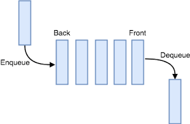

# Introduction

A queue is a FIFO (First In First Out). A queue, however, dequeues (removes) an element from the top of the queue, ​but it enqueues (inserts) an element at the bottom. Queue is used in solving problems having sequential processing.

 

source: studytonight

