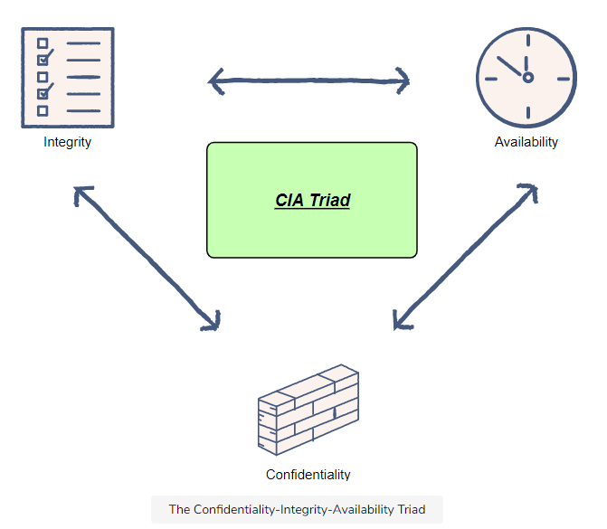
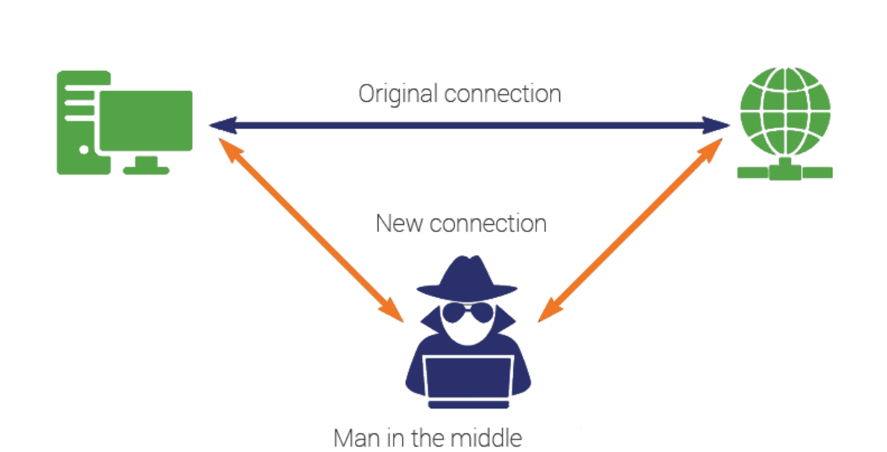
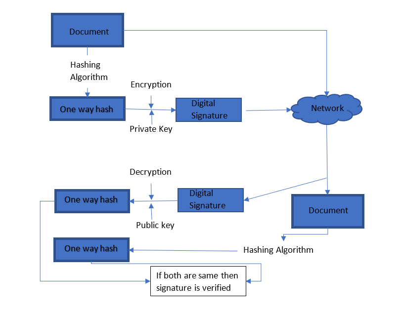

# CIA
**Confidentiality, Integrity and Availability** (the CIA triad) is a security model which guides information
security policies within organizations. The three components in the Confidentiality-Integrity and
Availability (CIA) triad are equally important, however, depending on the system, some parts may be
more critical than others.

### Why is the CIA Triad Important?

The CIA triad is an important security concept because the majority of security mechanisms, controls
and safeguards are designed to ensure one or more of these principles.
It means that vulnerabilities, cyber threats, cyber attacks have the ability to compromise one or
more of the CIA Triad principles.

## Data Confidentiality:

Confidentiality is concerned with ensuring unauthorized parties and processes cannot access
personal information, sensitive data or any other information which is not shareable with any non-
concerned person.
For example, Banking systems allows customers to access the data related to their account only.

### Common threats against confidentiality are: 

- **Eavesdropping attacks** – It occurs when an unauthorized person or organization intercepts, deletes, or modifies data that is transmitted between two devices.
- **Encryption cracking** - Data confidentiality decreases when someone (with no authority) guesses the key and decrypts the data, then he can modify the data according to his personal needs.
- **Malicious insiders** - For example, A person from the organization (who is not supposed to access the data), modifies it or uses the data for his own benefits. This case reduces the concept of Data confidentiality. 
- **Man-in-the-middle attacks** - It occurs when a person sitting in the middle of the network and has the access to the data in transit and both sender and the receiver are unaware of the middle man. 
  

### Confidentiality can be insured through:

- **Access control list (ACL)** - List can contain the details of authorized users who can access the information.
- **Strong passwords** - Password protected documents restricts the unauthorized user to access the information.
- **Biometric authentication** – It requires human intervention to access the data.
- **Encryption** – It supports enhanced confidentiality, since it protects the information from leakage. Strong encryption method (like AES 256) will be a plus point.
- **Two factor authentication**

## Data Integrity:

Integrity is concerned with ensuring data is not tampered (in its storage, process and transit state) and can be trusted. Data should be consistent, accurate, authentic and trustworthy over its lifecycle.

For example, banks and their customers need to be able to trust that bank balances are accurate and cannot be tampered with.

Any unexpected hardware failure and human error or any unintended changes to the data is failure of Data Integrity.

### Data integrity risks:

Number of factors can affect the integrity of the data for example, stored in a database).•

- **Human error** - When individuals enter information incorrectly, duplicate or delete data, while not following the appropriate protocols, or make mistakes during the implementation of procedures (meant to safeguard information), data integrity is put in risk .
- **Bugs and viruses** - Spyware, malware, and viruses are pieces of software that can invade a computer and alter, delete, or steal data.
- **Compromised hardware** - Compromised hardware may render data incorrectly or incompletely, limit or eliminate access to data, or make information hard to use.
- **Transfer errors** - When data can’t successfully transfer from one location in a database to another, a transfer error has occurred. Transfer errors happen when a piece of data is present in the destination table, but not in the source table in a relational database.

### Countermeasures designed to protect data integrity:

- **Hashing** - The calculated hash value (before transit of the data) is sent along with the message. At the recipient side, the received data is hashed using the same process and the outcome value is compared with the received hash value. If both are identical, it confirms data integrity.
- **Digital Signatures and Certificates**
- **Intrusion Detection System (IDS)** - An intrusion detection system (IDS) is an active process or device that analyses system and network activity for unauthorized entry and/or malicious activity
- **Authentication** – Only authentic person can alter the data.
- **Auditing** – In case of Data breach and attack, organization can track the edited, infected or altered data.
- **File permission and Access control**
- **Version Control**

### Digital Signature ensuring data Integrity:

- Message digest is computed by applying hash function on the message and then message digest is encrypted using private key of sender to form the digital signature.
- Digital signature is then transmitted with the message.
- Receiver decrypts the digital signature using the public key of sender. The receiver now has the message digest.
- The receiver can compute the message digest from the message (actual message is sent with the digital signature).
- The message digest computed by receiver and the message digest (got by decryption on digital signature) need to be same for ensuring integrity.

## Data Availability:

For any information system to be useful, it must be available when needed. Data should be available to authorized users whenever they require it. This means keeping systems, networks, and devices up and running. This can be ensured by maintaining, repairing and replacing hardware where necessary and by keeping systems up-to-date.

For example, one can log into his account whenever he wants, and he may even be able to contact customer support at any time of the day or night.

### There are mainly two threats to the availability of the system:

- **Denial of Service** – It specifies to actions that freezes the computing services in a way that the authorized user is unable to use the system when needed.
- **Loss of data processing capabilities** – It can be caused either by Natural disaster or Human actions.
- **Malicious code** - Malicious code can block the incoming requests for the data made be genuine users, resulting the unavailability of the data.
- **Insufficient bandwidth** – When bandwidth is Insufficient system/server is incapable to handle the huge number of requests, results in non-availability of the data to the authentic users.

### Security aspects of Availability:

- **Physical aspect** – 
  1. Access controls to prevent unauthorized people to come in contact with the computing devices.
  2. Environmental control (HVAC): Humidity, Ventilation, Air Condition
- **Technical aspect** – 
  1. Fault tolerant mechanism
  2. Data should be distributed in multiple computing devices not in only one single device.