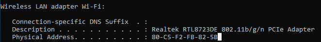
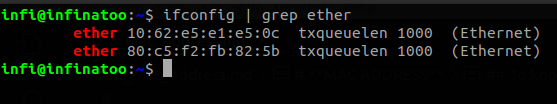

# **MAC ADDRESS**

All communication requires a way to identify the source and destination. The source and destination in human communication are represented by names. When your name is called, you listen to the message and respond. Other people in the room may hear the message, but they ignore it because it is not addressed to them.

On a local network, a similar method exists for identifying source and destination hosts regardless of where the host is placed on the network. Each host NIC (Network Interface Card) (connected to an Ethernet network) is assigned a physical address by its manufacturer, which serves to identify the host on the network. This address is known as the **Media Access Control (MAC) Address**.

A MAC address indicates the individual identity of a specific host, but it does not indicate where on the network the host is located.

## To know the MAC address (in Windows):
1. Open *cmd* (command prompt) by pressing *windows + r*.
2. type *cmd* in the **run window** then press *enter*.
3. While in cmd type *ipconfig/all* 
   
   
4. There you will find **“Physical Address”** of 48 bits for example FF-FF-FF-FF-FF-F
   
   
   

## To know the MAC address (in Linux):
1. Open the terminal in Linux(Ubuntu) by pressing *ctrl + alt + t*
2. Type *ifconfig | grep ether* .

   

Two addresses are shown here in this case: 
- First is for the wired adapter (comes under **eno1**).
- Second is for Wireless Network interface (NIC) (comes under **wlo1**).
   

## **MAC Address Table:**

Switches use the table to store the mac addresses of all the hosts and the ports with which they are connected to the switch (local network).

If the destination MAC address is not in the table and when the switch does not know where the destination host is located on the network, then it uses a process called **Flooding**. In this process switch broadcasts the message to all the connected hosts (except the sender), only the host with the same MAC address (as of destination MAC address in the message) will respond to the sender.

Switch builds the MAC Address table by examining the packets that are sent between the hosts (for their source and destination MAC addresses).

When the new hosts responses to the flooded messages or sends a message then the switch immediately learns its MAC address and the port to which it is connected. 

Table is dynamically updated each time when a new host connects to the network.

## **Broadcast messages:**

When there is a need for a host to send same message to all the other hosts (on the same network)in the timely manner, sender sends the message to a unique MAC address which is recognized by all hosts on the network.

The broadcast MAC address (48-bit address) in hexadecimal notation is *FFFF.FFFF.FFFF*. Each F in the hexadecimal notation represents the four 1s in the binary notation.

## **When destination MAC is unknown!**

When source does not know the destination MAC address, it sends ARP message (ARP messages rely on broadcast).

- The sending host sends a frame addressed to a broadcast MAC address. Frame contains the message along with the IPv4 address of the intended destination host.
- Each host on the network receives the broadcast frame and compares the IPv4 address (inside the frame) with its configured IPv4 address. The host with the matching IPv4 address sends its MAC address back to the sender.
- The sender receives the message and stores the MAC address and IPv4 address information in a table called an ARP table.

When the host (sender) has the MAC address of the destination host in its ARP table, it can send messages directly to the destination without doing an ARP request.

Hosts can use IPv4 protocol called **Address Resolution Protocol (ARP)** to discover the MAC address of any host on the same local network. IPv6 uses a similar method known as **Neighbour Discovery**.

## **When the destination is on the remote network!**

When a host needs to send a message to a remote network, it must use the router. 

The host includes the IP address of the destination host. However, when it encapsulates the packet into a frame, it uses the MAC address of the router (as the destination for the frame). In this way, the router will receive and accept the frame based on the MAC address.

### **The source host determines the MAC address of the router:**

A host is given the IPv4 address of the router through the default gateway address (configured in its TCP/IP settings).

*The default gateway address is the address of the router interface connected to the same local network as the source host.* 

All hosts on the local network use the default gateway address to send messages to the router. When the host knows the default gateway IPv4 address, it can use ARP to determine the MAC address. The MAC address of the router is then placed in the frame (destined for another network).

*It is important that the correct default gateway be configured on each host on the local network. If no default gateway is configured in the host TCP/IP settings, or if the wrong default gateway is specified, messages addressed to hosts on remote networks cannot be delivered.
