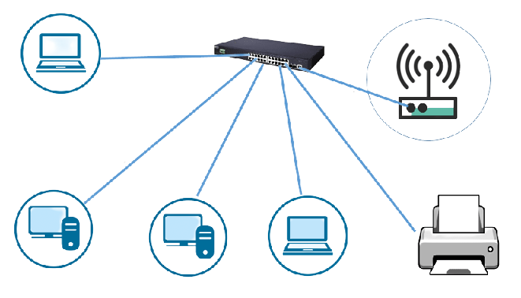

Network refers to the set of gadgets (nodes) associated with communication links. A node can be a computer, printer, or any other device competent in sending and accepting information created by other gadgets on the network.
Well, a network comprises of three types, namely, LAN, MAN and MAN. Here we will discuss LAN in detail.
  

<h1 align="center"> Local Area Network </h1>
 
As the name suggests, a Local area network (LAN) is the computer network that interfaces computers inside the constrained region such as schools, colleges, and homes. They are privately owned networks which provides a useful way of sharing resources between end users.

As we can see above, the assets such as printers, file servers, scanners, and the internet are effortlessly sharable among other associated computers in a network.

LANs are limited in size, a local network can contain anyplace from one or two gadgets up to a thousand devices. A few gadgets like printers, scanners, and other servers remain for all time with the LAN, whereas versatile gadgets like computers, tablets, and phones may connect and detach from the network at different times.
  
<h1 align="center"> Advantages of LAN</h1>
 
<ul>
<li><h3><b>Physical resource sharing</h3></b></li>

Sharing of assets such as hard disk drives, DVD drives, and Printers are made simple in the Local Area Network. For a case, all the assets can be associated with one single computer with a network so that at whatever point there's a need for assets, it can be shared with the associated computers.
 
 
<li><h3><b>Software sharing</h3></b></li>

A single computer in a LAN network with licensed software can share this software among other clients. There's no ought to buy individual licenses for every computer within the network. All connections can work beneath one single license.
 
 
<li><h3><b>Convenient Communication</h3></b></li>

Utilizing LAN, clients can helpfully trade messages and information. Since the information is on the server, it can be accessed anytime by the LAN clients. Each single LAN client can do this with others on the network. Subsequently, this spares parts of time and guarantees that messages get conveyed to the proper individuals.
 
 
<li><h3><b>Centralized Data</h3></b></li>
As said, we can found prior information of the clients at the centralized server. We can utilize any workstation in a specific network to access this data. In addition, clients can get to their own set of information by logging into their particular accounts.
 
 
<li><h3><b> Improved Security</h3></b></li>

Since information is put away on a local server, we can ensure it to be secure. On the off chance, when the server updates the news, all the LAN clients can get to them. In expansion, they could deny or permit clients in a specific network to ensure extra security estimations.
 
 
<li><h3><b>Internet Sharing</h3></b></li>

LAN can share internet connections among all the LAN clients. One single computer with an internet connection offers the internet with all the associated computers. Workplaces and Net cafes are the best examples of this sort of foundation.
 
 
<li><h3><b>Computer Identification</h3></b></li>

For the reason of identification, each computer on the LAN has a MAC address. This address is always utilized when sending and getting information. In modern computers, these data are put away inside the network adapter connected to the motherboard.

</ul>
  
<h1 align="center"> Disadvantages of LAN</h1>
 
<ul>
<li><h3><b>Initial Implementation Cost</h3></b></li>

Indeed, even though LAN spares lots of cash in resource sharing, the introductory fetched included in setting up the network is very high. Typically basically due to the necessity of special software that's required to create a server. In expansion, purchasing hardware equipment such as routers, centers, switches, and cables is needed for the primary time setup.
 
 

<li><h3><b>Security Glitches</h3></b></li>

Since it is or may be simple to gain access to programs and other sorts of information, security concerns are a huge issue in LAN. The sole duty to halt unauthorized access is within the hands of LAN administrators. The LAN administrator needs to ensure centralized information's security by executing a redressed set of rules and security approaches on the server.
 
 
<li><h3><b>Policy Infringement</h3></b></li>

As the central server stores all the data of the connected computers, unauthorized clients, if they gained access to that server, can see all the browsing history and downloads of all the connected computers. Particularly the LAN administrator has the authority to check the individual information of every LAN client. Subsequently, this will lead to Policy infringement.
 
 

<li><h3><b>Maintenance</h3></b></li>

LAN frequently faces equipment issues and system failure. Consequently, it requires a special administrator to see after these issues. The administrator ought to be well learned within the field of networking and directed at their full-time work.
 
 

<li><h3><b>Server Crashes</h3></b></li>

The central server which is present on the LAN architecture oversees all the connected computers. If in case the server experiences any faults, all the connected computers are affected as well. For illustration, if the records on the server get corrupted, no more information on the joined computers can be open.
 
 
<li><h3><b>Malware Spreading</h3></b></li>

The appearance of a virus in a LAN-based foundation is profoundly unsafe. On the off chance that one of the joined computers is affected by a virus, it can effectively spread to the remaining computers present on the network.
 
 
<li><h3><b>Area Coverage</h3></b></li>
LAN, as a rule, is made to cover up a limited distance (up to 10km). It usually works in small regions such as workplaces, banks, and schools since expanding its cabling framework is more complex than a particular run.
  

