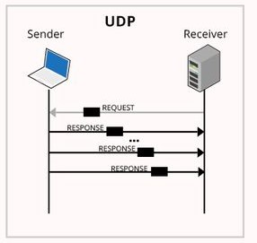

# 
User Datagram Protocol (UDP)

# **What is UDP?**

- **UDP** stands for **User** **Datagram Protocol (UDP)**
- The User Datagram Protocol (UDP) is one of the middle participants of the Internet protocol suite.
- UDP is a part of the Internet Protocol suite, referred to as UDP/IP suite.
- UDP is basically an unreliable and connectionless protocol. So, there is no need to establish a connection before transferring any data. 
- With UDP, computer applications can send messages from one host machine to another over an IP network without any time delay.

# **UDP Header Structure:**

- The size of the UDP header is  **8-bytes** & it is fixed .

- **The first 8 Bytes** contains all the necessary **header information**, and the **remaining part consists of the data that needs  to be transferred.**
- The port number fields are 16 bits long in UDP, **therefore the range for port numbers is from 0 to 65535** ; port number **0 is reserved**. it help us to **distinguish different user requests or processes.**
- **Source Port:**  it is a 2 Byte long field used to identify the port number of the data source.
- **Destination Port:**  It is also a 2 Byte long field used for the identification of the port from which the destination packet is coming.
- **Length:**  It is a 16-bits long field, which includes the header as well as the data
- **Checksum:**  It is a 2 Bytes long field which contain the 16-bit one’s complement of the one’s complement sum of the UDP header.

# **Benefits of using UDP over TCP**
- Despite being the dominant transport layer protocol used with most Internet services and providing assured delivery, reliability, and many more features, the **Transmission Control Protocol (TCP)** is costly, & all these services cost an additional overhead as well as  latency.
- Therefore,  For real-time services like computer gaming, voice or video communication, live conferences, which need high bandwidth, we need UDP as it is very **cost-efficient & fast.**
- Since high performance is expected in this type of high-end task, UDP permits packets to be dropped in real-time instead of processing the delayed packages.
- As in UDP, there is no error checking, so it also **saves bandwidth.** 
- User Datagram Protocol (UDP) is **very efficient** in terms of both **latency and bandwidth**

# **Applications of UDP:**

- Used for simple request-response communication when the size of data is considerably less or negligible. 
- In UDP the concern about flow and error control is less compared to TCP.
- A suitable protocol for multicasting
- They were typically used for real-time applications that can not tolerate uneven interuptions/delays between sections of a received message.

