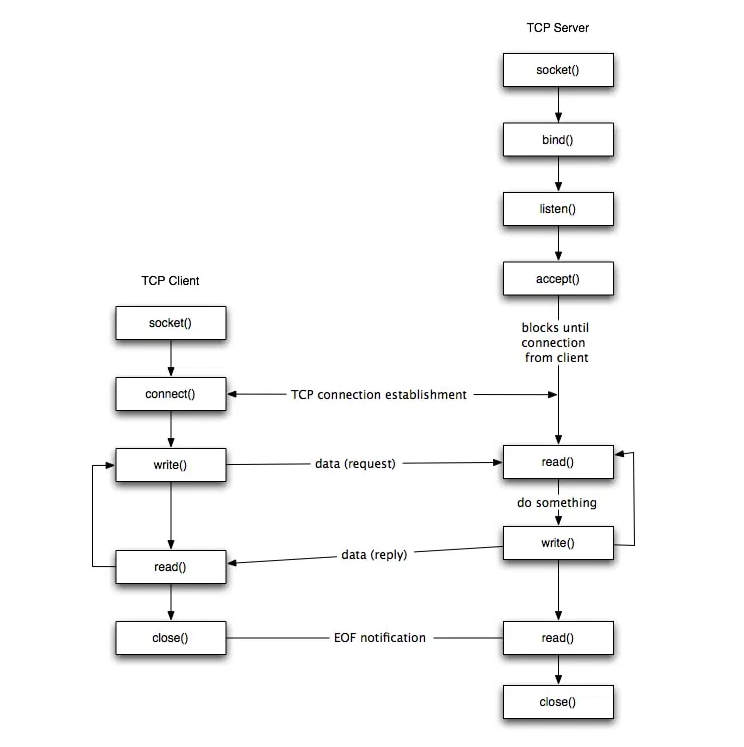
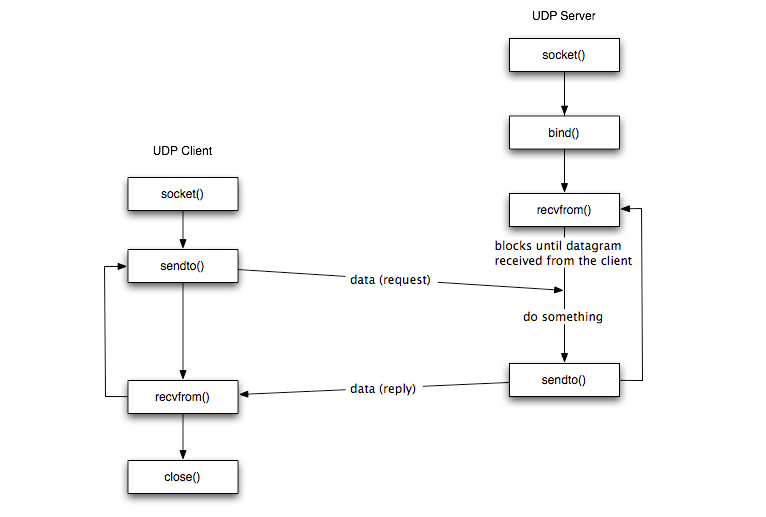

# Socket Programming

 

Socket programs are used to communicate between various processes running on different systems. It is mostly used to create a client-server environment. For example, the client program sends a file name to the server and the server sends the contents of the file back to the client. 

 

## Socket:

- It is just a file descriptor. We can perform the read/write over this file descriptor. It creates the end point to receive and send the information over the network.  

- The other end point also opens the file descriptor and connects to the earlier socket to read and write (or send and receive). This end called the client.

 

Socket-based software usually runs on two separate computers on the network, but sockets can also be used to communicate locally (inter process) on a single computer. Sockets are bidirectional, meaning that either side of the connection is capable of both sending and receiving data. 
  

## Socket Communication:

Two main Communication Protocols can be used for Socket Programing: 

- **Stream sockets (SOCK_STREAM):**  

    - Connection Oriented, uses TCP/IP.  

    - IP is responsible for data routing and not for data integrity. 

    - Ensures the data sent to be error free and complete and in the same order as it was sent. 

    - For example, TELNET uses the Stream Socket.  

- **Datagram sockets (SOCK_DGRAM):**  

    - Connection less Sockets. 

    - Uses UDP. 

    - Not reliable (Packet may/may not reach but if reached, will be error free). 

    - Uses IP for routing. 

    - For example, tftp( trivial file transfer protocol) uses UDP. 

 

## TCP Client-Sever Implementation:

  

## UDP Client-Server Implementation: 

