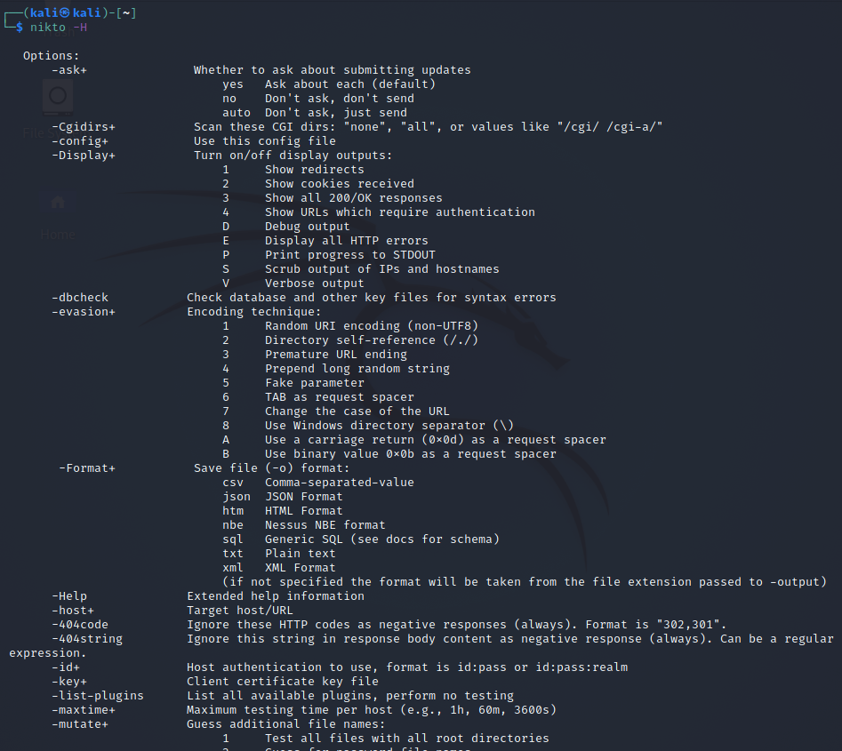
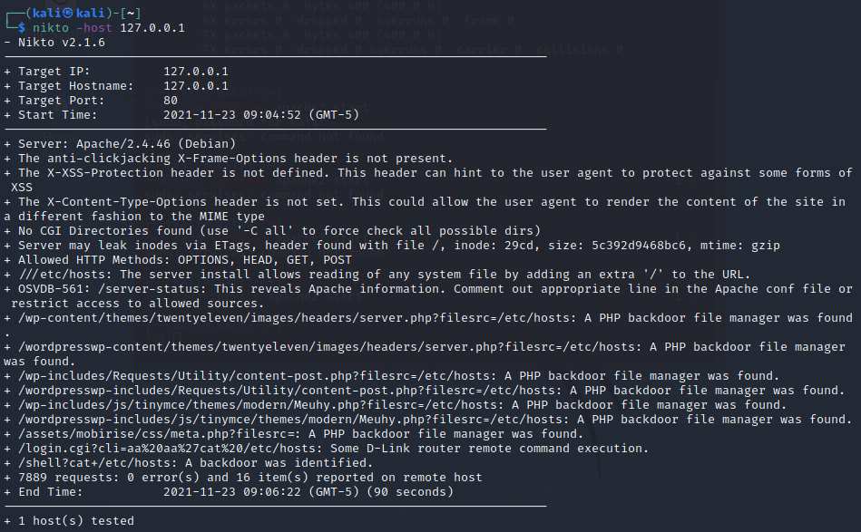
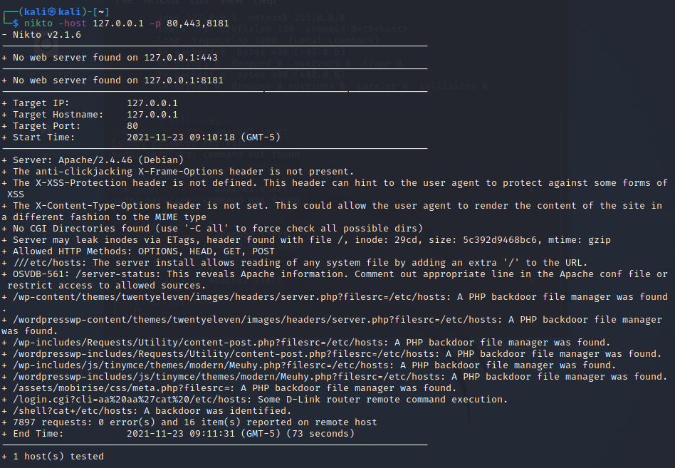
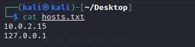
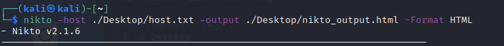

# NIKTO

Nikto is an Open Source (GPL) web server scanner which performs comprehensive tests against web servers.

## Some Features of NIKTO: 

- Full HTTP proxy support
- Checks for outdated server components
- Save reports in plain text, XML, HTML, CSV, JSON, NBE, SQL, etc.
- Scan multiple ports on a server, or multiple servers via input file (including Nmap output)
- Host authentication with Basic and NTLM
- SSL Support
- Identifies installed software via headers, favicons, and files
- Subdomain guessing
- Apache and cgiwrap username enumeration
- Reports “unusual” headers seen
- Auto-pause at a specified time
- Enhanced false positive reduction via multiple methods: headers, content hashing, and page content

 

## Using Nikto tool

- Help menu
  - *nikto -h* for sort help and *nikto -H* for complete help menu
    

 

## Scan services

To scan the web app or website with Nikto scanner, provide *URL* of the website or web service with *-host* flag.
    
- With single hosst and single port(default 80)
  
    

- With single host and multiple ports

    

- With multiple hosts in the same session. To scan for multiple hosts, a text file which contains the list of hosts is provided. Each line should have a separate hosts or URL(a new line for a new URL).

    

    

- Storing Output of the file
    - Nikto results or output can be saved in a variety of formats like text, CSV, HTML, XML, NBE, JSON, SQL, etc.

    

    

