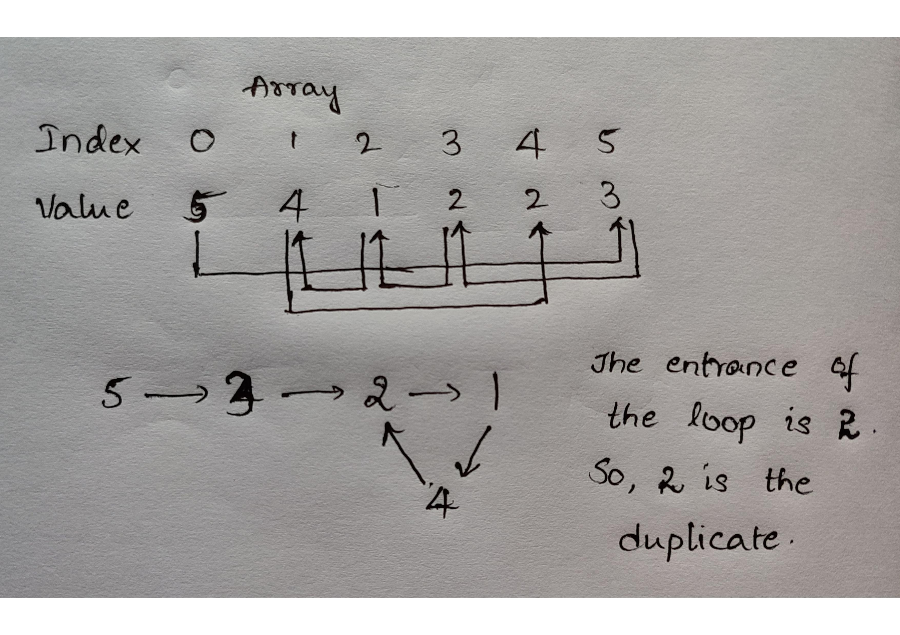

# Duplicate In An Array using Floyd Cycle Detection Algorithm

## Problem Statement
Given an array of size n+1, all the elements are in range of [1,n].It is guaranteed that all the elements appear either once or may not appear at all, but there exists one element that appears more than once.\
Ex: Consider n = 4 , Array= [1,2,3,1,4] \
The ouput must be 1.\
Ex: Consider n = 5, Array = [2,3,4,2,2,1]\
The output must be 2.

## Floyd Cycle Detection Algorithm
This is genrally used to return the first element of the loop present in a linked list.
- Floyd Cycle detection algorithm uses two pointers which moves at different speeds.
- One moves by 2 positions forward everytime(fast pointer or generally called as hare) 
- Other pointer moves exactly 1 position forward(slow pointer or generally called as tortoise).
- We keep on incrementing the pointers by following rules mentioned above. Whenever these pointers point same element, that element is position from which the cycle starts. 


Now that we had an idea of what the algorithm does, let's find out how this is helpful in finding out the duplicate in the array.

## Intuition
 We start from 0th index, we check the  value at index 'array[0]' and then check value at index 'array[array[0]]'. We keep doing this, so the sequence being formed is:\
 0, array[0], array[array[0]], array[array[array[0]]], ...\
 Each new element in the sequence is an element in array at the index of the previous element. \
 This sequence produces a cycle because of the duplicate.

To understand this more clearly, lets consider an array:
|index| 0 | 1 | 2 | 3 | 4 | 5 |
|:---|:---|:---|:---|:---|:---|:---|
|value|5|4|1|2|2|3|

We traverse in the following way, starting from 3(element at index 0)\
5 ---> 3 ( array[array[0]] , array[0]=5 => array[5]= 3) ---> 2 ( array[3] ) ---> 1 ( array[2] ) ---> 4 (array[1]) ---> 2 (array[4]) ---> 1 ( array[2] ) ---> 4 (array[1])\
[This goes on because of the loop, the loop began when pointer pointed 2 at index 3. Hence 2 is the duplicate]

The image below gives a clear idea:



## Algorithm
- Initialise both tortise(slow-pointer) and hare(fast-pointer) to array[0].
- We've already discussed that tortoise moves 1 position ahead and hare moves to 2 positions ahead. So,\
*hare = array[array[hare]]\
tortoise = array[tortoise]*\
Since the hare goes fast, it would be the first to enter the cycle and run around the cycle. At some point, the tortoise enters the cycle as well, and since it's moving slower the hare catches up to the tortoise at some intersection point.(however, we're interested only in finding entrance element, not intersection element)
> !!! The intersection point need not be the entrance element.
- To find entrance element, we make hare to start moving from array[0] and also allow it to move slowly, the position where hare and tortoise meet is the entrance of the loop.

Now, that we have understood how this works, let's code it up!
```
#include <bits/stdc++.h>

using namespace std;
int FindDuplicate(vector<int> array)
{
    int tortoise = array[0];            //slow-pointer
    int hare = array[0];                //fast-pointer

    
    do {
        tortoise = array[tortoise];
        hare = array[array[hare]];
    } while (tortoise != hare);         //Finding intersection point

    // Find the "entrance" to the cycle.
    tortoise = array[0];
    while (tortoise != hare) {
        tortoise = array[tortoise];
        hare = array[hare];
    }

    return hare;
}
int main()
{
    vector<int> array{5,4,1,2,2,3};
    cout <<"The duplicate element is:" <<FindDuplicate(array);

    return 0;
}

```
Output:
```
The duplicate element is:2
```

### Space Complexity
Since, we're not taking any extra space, space complexity is contant. So, space complexity = O(1)

### Time Complexity 
Time Complexity is O(n).
The reason is ,within < n steps, the tortoise and hare pointers will be in the loop O(n). If number of elements in the loop are m(<=n), time taken to find intersection point is O(m).
So, time taken to find the entrance of loop is also O(m).
Total time complexity is O(n)+O(m)+O(m) = O(n+2m) = O(n) [because n>=m]

In this way, we could use Floyd's Cycle Detection algorithm to findout a duplicate element in an array of size n+1 containing elements in the range of [1,n].

### References
[Geeks for Geeks](https://www.geeksforgeeks.org/detect-loop-in-a-linked-list/)\
[Stack Overflow](https://stackoverflow.com/questions/47193225/runtime-complexity-of-floyds-cycle-detection)

