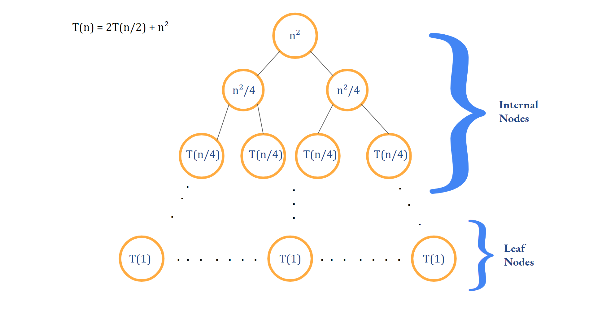
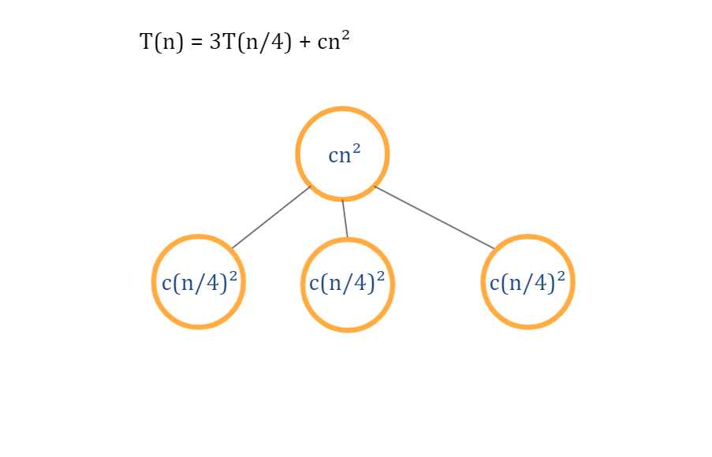
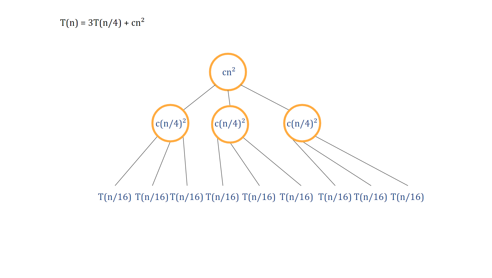
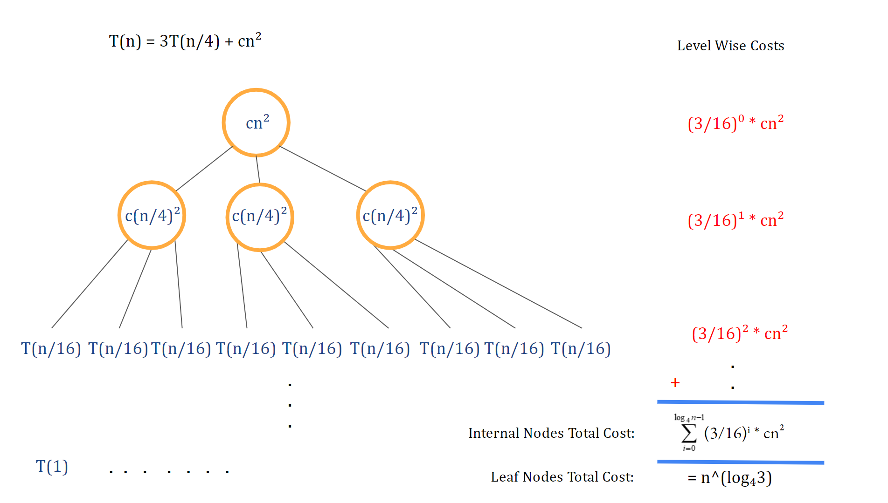
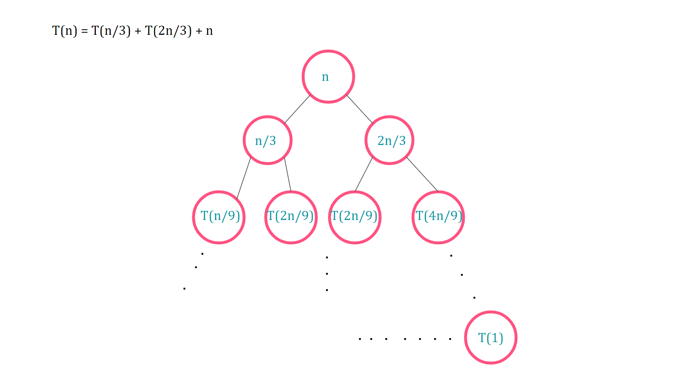
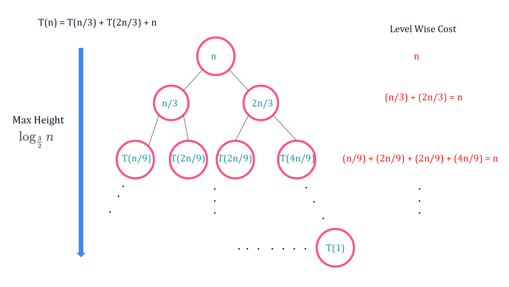

# Recursion Tree Method

While the substitution method is a popular technique to find time complexity of recursive algorithms, recursion tree method is a useful technique to solve divide and conquer based recursive algorithms.

## Generic Process

We break down a recurrence T(n) into subproblems until we reach T(1). Here, each node represents the cost of a subproblem. We sum up the cost of each node to find out the total cost of the algorithm.

The following steps are involved:

1. The Recursion Tree for a given recurrence relation is drawn. At every level, the parent problem is divided into multiple subproblems, until cost of the subproblem becomes 1.

2. We find the total number of leaf nodes and the **total cost of the last level.**

3. We find a relation to determine the total cost of the kth level. **Total cost of level 1 to k-1 is calculated.**

4. **Total cost of algorithm = Total cost of leaf nodes + Total cost of internal nodes.**

## Demonstration

### Example 1:

### Solution:

- Draw the Recursion Tree
  - Determine the non-recursive part. It becomes the root node of the tree.
  - If recursive part is aT(n/b), divide root node into ‘a’ separate subproblems of size n/b and so on.

- Here, cn² is the non recursive part, hence becomes the root of the tree.

-  At level i : sub-problem size =  [by analysis]
     When sub-problem size = 1 [last level],
      Or 

- At level i: cost of node =  [by analysis]
    At level i: no. of nodes = 

- We know, for last level, ,
Hence, total  cost of last level,  OR 

- 

- 

- 

- 

### Example 2:

### Solution:

- Draw the Recursion Tree
  - Determine the non recursive part and make it the root node

- Find the maximum height of the tree

  - By analysis, right-most branch will be the longest.
  - Let, level i be the last level.
  Then 
  - 
   or  [Maximum Depth]

- Find total cost of each level.

  - By analysis,
  sum of costs of all nodes at any level is n.
  

- Total Cost of Algorithm = Total Height * Cost of each level = 

- T(n) = 