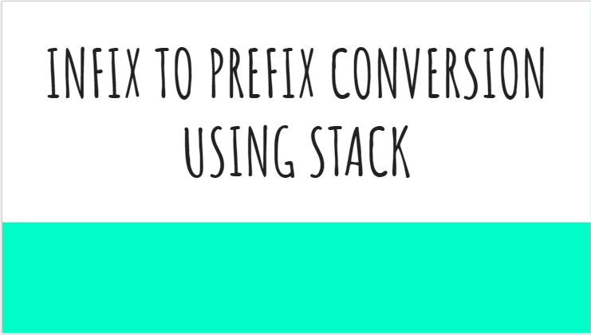

# Infix to prefix Conversion
This is the video explanation about Infix to prefix Conversion .
## Topics Covered:
- What is infix and prefix notation?
- Precedence and Associativity rules
- Infix to prefix conversion using stack algorithm with example

    

### Click Image for Video!!

 
Hope my video helps!!! Thankyou!