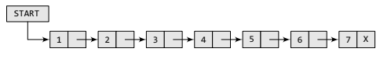
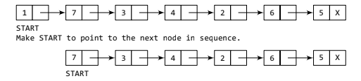
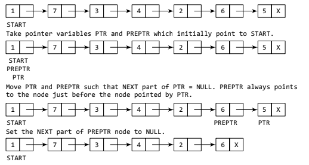
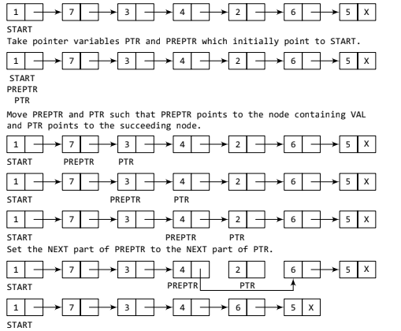

# Operations on Linked List - Deletion

A linked list, in simple terms, is a linear collection of data elements. These data elements are
called nodes.



Fig1. Simple Linked List

We will discuss how a node is deleted from an already existing linked list. We will consider three cases and then see how the deletion is done in each case.

Case 1: The first node is deleted.

Case 2: The last node is deleted.

Case 3: The node after a given node is deleted.
## Case 1:Deleting the First Node from a Linked List

Consider the linked list in Fig.2. When we want to delete a node from the beginning of the
list, then the following changes will be done in the linked list.



Fig.2: Deleting the first node of a linked list


- Algorithm
```algorithm
Step 1: IF START = NULL
Write UNDERFLOW
Go to Step 5
[END OF IF]
Step 2: SET PTR = START
Step 3: SET START = START NEXT
Step 4: FREE PTR
Step 5: EXIT
```

- Function Code in C Language

```c
struct node *delete_beg(struct node *start)
{
struct node *ptr;
ptr = start;
start = start -> next;
free(ptr);
return start;
}
```
## Deleting the Last Node from a Linked List

Consider the linked list in Fig.3. When we want to delete a node from the end part of the
list, then the following changes will be done in the linked list.



Fig3. Deleting the last node of a linked list

- Algorithm
```algorithm
Step 1: IF START = NULL
Write UNDERFLOW
Go to Step 8
[END OF IF]
Step 2: SET PTR = START
Step 3: Repeat Steps 4 and 5 while PTR NEXT != NULL
Step 4: SET PREPTR = PTR
Step 5: SET PTR = PTR NEXT
[END OF LOOP]
Step 6: SET PREPTR NEXT = NULL
Step 7: FREE PTR
Step 8: EXIT
```

- Code in C Language

```c
struct node *delete_end(struct node *start)
{
struct node *ptr, *preptr;
ptr = start;
while(ptr -> next != NULL)
{
preptr = ptr;
ptr = ptr -> next;
}
preptr -> next = NULL;
free(ptr);
return start;
}
```

## Deleting the Node After a Given Node in a Linked List

Consider the linked list in Fig.4. Suppose we want to delete a node from any given place or after/before any node of the
list, then the following changes will be done in the linked list.



Fig 4. Deleting the node after a given node in a linked list

- Algorithm
```algorithm
Step 1: IF START = NULL
Write UNDERFLOW
Go to Step 1
[END OF IF]
Step 2: SET PTR = START
Step 3: SET PREPTR = PTR
Step 4: Repeat Steps 5 and 6 while PREPTR DATA != NUM
Step 5: SET PREPTR = PTR
Step 6: SET PTR = PTR NEXT
[END OF LOOP]
Step 7: SET TEMP = PTR
Step 8: SET PREPTR NEXT = PTR NEXT
Step 9: FREE TEMP
Step 10: EXIT
```

- Code in C Language

```c
struct node *delete_after(struct node *start)
{
struct node *ptr, *preptr;
int val;
printf(“\n Enter the value after which the node has to deleted : “);
scanf(“%d”, &val);
ptr = start;
preptr = ptr;
while(preptr -> data != val)
{
preptr = ptr;
ptr = ptr -> next;
}
preptr -> next=ptr -> next;
free(ptr);
return start;
}
```


  
## References 
 
 For more details please go through:
 
 - [Geeks for Geeks](https://www.geeksforgeeks.org/data-structures/)
 - [W3 School](https://www.w3schools.in/data-structures-tutorial/linked-list/)
 
  