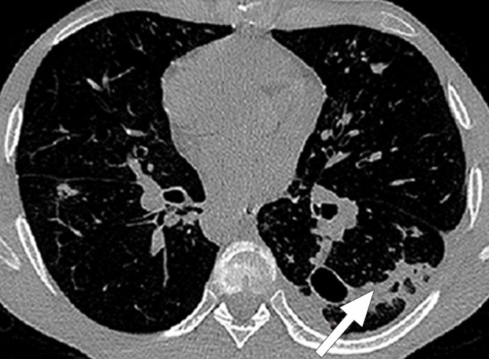
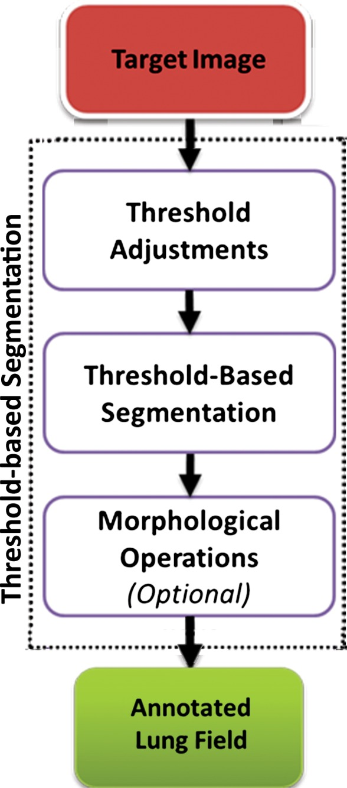
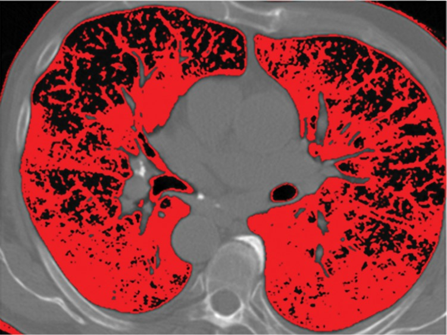

# Lung segmentation using Computer Vision:

## Abstract:

The computer-based process of identifying the boundaries of lung from surrounding thoracic tissue on computed tomographic (CT) images, which is called segmentation, is a vital first step in radiologic pulmonary image analysis. Many algorithms and software platforms provide image segmentation routines for quantification of lung abnormalities; however, nearly all of the current image segmentation approaches apply well only if the lungs exhibit minimal or no pathologic conditions. When moderate to high amounts of disease or abnormalities with a challenging shape or appearance exist in the lungs, computer-aided detection systems may be highly likely to fail to depict those abnormal regions because of inaccurate segmentation methods. In particular, abnormalities such as pleural effusions, consolidations, and masses often cause inaccurate lung segmentation, which greatly limits the use of image processing methods in clinical and research contexts. In this review, a critical summary of the current methods for lung segmentation on CT images is provided, with special emphasis on the accuracy and performance of the methods in cases with abnormalities and cases with exemplary pathologic findings. The currently available segmentation methods can be divided into five major classes: (a) thresholding-based, (b) region-based, (c) shape-based, (d) neighboring anatomy–guided, and (e) machine learning–based methods. The feasibility of each class and its shortcomings are explained and illustrated with the most common lung abnormalities observed on CT images. In an overview, practical applications and evolving technologies combining the presented approaches for the practicing radiologist are detailed.

## Introduction:

Computed tomography (CT) is a vital diagnostic modality widely used across a broad spectrum of clinical indications for diagnosis and image-guided procedures. Nearly all CT images are now digital, thus allowing increasingly sophisticated image reconstruction techniques as well as image analysis methods within or as a supplement to picture archiving and communication systems (1). The first and fundamental step for pulmonary image analysis is the segmentation of the organ of interest (lungs); in this step, the organ is detected, and its anatomic boundaries are delineated, either automatically or manually (2). Errors in organ segmentation would generate false information with regard to subsequent identification of diseased areas and various other clinical quantifications, so accurate segmentation is a necessity.

The purpose of this article is to review and explain the capabilities and performance of currently available approaches for segmenting lungs with pathologic conditions on chest CT images, with illustrations to provide radiologists with a better understanding of potential choices for decision support in everyday practice. First, object segmentation is defined and explained, followed by summaries of the five major classes of lung segmentation: (a) thresholding-based, (b) region-based, (c) shape-based, (d) neighboring anatomy–guided, and (e) machine learning–based methods. Then hybrid approaches for generic lung segmentation in clinical practice are covered, as well as methods for evaluating the efficacy of segmentation. Finally, the current and future use of segmentation software for clinical diagnosis is discussed

### What Is Object Segmentation?

The aim of medical image segmentation is to extract quantitative information (eg, volumetric data, morphometric data, textural patterns–related information) with regard to an organ of interest or a lesion within the organ. In general, a segmentation problem can be considered as consisting of two related tasks: object recognition and object delineation. Object recognition is the determination of the target object’s whereabouts on the image or its location, whereas object delineation draws the object’s spatial extent and composition. Although object recognition is known as a high-level process, object delineation refers to a low-level process; and it is well known that humans are superior to computers at performing high-level vision tasks (3–6) such as object recognition. On the other hand, computational methods are better for low-level tasks such as object delineation and finding the exact spatial extent of the object (3,4,7). Image segmentation in this high- to low-level hierarchy is a combination of recognition and delineation steps (8). This hierarchical relation between the object recognition and object delineation steps is illustrated with an example of a pulmonary CT image and its segmentation (Fig 1). Note that in the object recognition step (Fig 1a), the left and right lung fields are identified through user interaction (ie, a high-level task); and in the object delineation step (Fig 1b), user-provided information is processed to find the exact boundary of the lung fields (ie, a low-level task).

 

Figure 1a

Example of the tasks of object recognition (a) and object delineation (b) for the left lung (green) and right lung (red) on a coronal CT image.

 

Figure 1b

Example of the tasks of object recognition (a) and object delineation (b) for the left lung (green) and right lung (red) on a coronal CT image

Example of the tasks of object recognition (a) and object delineation (b) for the left lung (green) and right lung (red) on a coronal CT image.

Because in vivo image analysis of lung diseases has become a necessity for clinical and research applications, it is important for radiologists to become familiar with the opportunities and challenges involved in automated segmentation of lungs on CT images. Because of recent technical advances in radiology and informatics, it may even be possible in the near future for radiologists to quantitatively assess disease severity as a percentage of total lung volume, which may influence how radiologists characterize the extent, severity, and morphologic evolution of the disease with longitudinal CT examinations.

Segmentation of lung fields is particularly challenging because differences in pulmonary inflation with an elastic chest wall can create large variability in volumes and margins when attempting to automate the segmentation of lungs. Moreover, the presence of disease in the lungs can interfere with software attempting to locate lung margins. For example, a consolidation along the pleural margin of the lungs may generate an erroneous delineation in which the consolidation is treated as outside the lungs because its attenuation characteristics are similar to other aspects of the soft tissue of nearby anatomic structures.

Historically, nearly all image segmentation approaches for lungs functioned well only with absent or minimal lung pathologic conditions. Those segmentation methods have been shown to be effective in the calculation of lung volume and the initiation of computer-aided detection systems , which is considered in a wide range of clinical applications (10–21). However, those segmentation methods fail to perform efficiently when a pathologic condition or abnormality is present in moderate to marked lung volumes or demonstrates complex patterns of attenuation (11–13,16–18). For example, cavities and consolidation can lead to inaccurate boundary identification. Similarly, the presence of pneumothorax or pleural effusion on a CT image can greatly distort the results of automated segmentation, hence leading to incorrect quantification (Fig 3).

 

Figure 2a

Inaccurate boundary identification. Axial (a, b) and coronal (c, d) CT images show that cavities and consolidation (arrow in a, c) can lead to inaccurate segmentation (red contours in b, d).

 

Figure 2b

Inaccurate boundary identification. Axial (a, b) and coronal (c, d) CT images show that cavities and consolidation (arrow in a, c) can lead to inaccurate segmentation (red contours in b, d).

 

Figure 2c

Inaccurate boundary identification. Axial (a, b) and coronal (c, d) CT images show that cavities and consolidation (arrow in a, c) can lead to inaccurate segmentation (red contours in b, d).

 

Figure 2d

Inaccurate boundary identification. Axial (a, b) and coronal (c, d) CT images show that cavities and consolidation (arrow in a, c) can lead to inaccurate segmentation (red contours in b, d).

 

Figure 3a

Distorted automated segmentation. Axial (a, b) and coronal (c, d) CT images show that pleural effusions (arrow in a, c) can lead to inaccurate segmentation (red contours in b, d).

 

Figure 3b

Distorted automated segmentation. Axial (a, b) and coronal (c, d) CT images show that pleural effusions (arrow in a, c) can lead to inaccurate segmentation (red contours in b, d).

 

Figure 3c

Distorted automated segmentation. Axial (a, b) and coronal (c, d) CT images show that pleural effusions (arrow in a, c) can lead to inaccurate segmentation (red contours in b, d).

Currently, no single segmentation method achieves a globally optimal performance for all cases. Although specialized methods (22–24) that are designed for a particular subset of abnormalities have been shown to be successful, only a few attempts at generic segmentation methods have been made so far (20,25,26). This fragmentation of available solutions contributes to the gap between clinical practitioners, who are the end users of radiologic image analysis techniques, and the informatics experts.

Herein, we intend to bridge this gap between practicing radiologists and informatics experts by first briefly providing an overview of the current lung segmentation methods on CT images. Then, after providing a description and the background of object segmentation and the Fleischner terminology for lung pathologic conditions, we present five major classes of lung segmentation methods: (a) thresholding-based, (b) region-based, (c) shape-based, (d) neighboring anatomy–guided, and (e) machine learning–based methods. Our focus in this review is to succinctly present the advantages and disadvantages of these approaches in terms of segmentation accuracy, ease of use, and computational cost (ie, memory or processor requirements, time needed for producing outputs). Therefore, a full-length description of each method is beyond the scope of this article, and interested readers are referred to relevant literature with the reference citations. Furthermore, we limit our review to the lung segmentation methods, not the quantification and detection of lung abnormalities, which can be a topic of review of computer-aided detection systems in lung diseases. However, the relationship between these two tasks of segmentation and quantification and also the necessary background on quantification and detection of lung abnormalities are provided in the article.

Drawings and diagrams are used throughout the article to illustrate a wide range of pulmonary abnormalities. It is important to mention that to achieve the best segmentation results, most techniques are used in combination with one another and may also include some primitive pre- or postprocessing steps to remove noise and other artifacts; the discussion of such combinations, however, is outside the scope of this article. The intent here is to help clinicians make the right choice when selecting image segmentation methods for pulmonary image analysis, without delving into algorithmic details about the methods’ functionality. Manual delineation techniques and assistive-manual methods are not discussed; instead, we focus only on fully automated methods, with a particular emphasis on the segmentation of lungs with pathologic conditions. However, it should be kept in mind that automated segmentation techniques should complement the radiologist’s work flow by saving time in measuring (27), selecting, and classifying various findings. Automated segmentation techniques are not a substitute for the radiologist’s clinical interpretations.

### Image Segmentation Method for Abnormal Lungs:

### Thresholding-based Method:

Thresholding-based methods are the most basic and well-understood class of the segmentation techniques and are commonly used in most picture archiving and communication systems and third-party viewing applications because of their simplicity (29). Thresholding-based methods (2,30,31) segment the image by creating binary partitions that are based on image attenuation values, as determined by the relative attenuation of structures on CT images. A thresholding procedure attempts to determine attenuation values, termed threshold(s), that create the partitions by grouping together all image elements with attenuation values that satisfy the thresholding interval. The thresholding-based process is shown in a flowchart (Fig 4).

 

Flowchart of a thresholding-based method of lung segmentation. The attenuation numbers (in Hounsfield units) of the pixels are used to segment the lungs. False-positive findings and artifacts may still occur with this approach; therefore, morphologic operations can be conducted afterward.

Thresholding-based methods are simple and effective for obtaining segmentations from images with a well-defined contrast difference among the regions. Indeed, these methods usually perform better on CT images (10,11,26,32–39), compared with images obtained with other imaging modalities, because of the fact that the attenuation values, measured in Hounsfield units, have well-defined ranges for different tissue components on CT images. However, thresholding-based techniques do not typically take into account the spatial characteristics of the target objects (lungs). Moreover, these techniques are generally sensitive to noise and imaging artifacts, compared with the other classes of lung segmentation methods. The presence of abnormal imaging patterns affects this class of thresholding-based segmentation methods more than other methods because no spatial information and variability are considered during the segmentation process.

An overview of the thresholding-based segmentation method is shown in Figure 5, in which the upper and lower limits of the thresholding interval allow the selection of lung regions. Note that appropriate selection of the threshold parameters may be enough for segmenting lungs with minimal or no pathologic conditions because of the stable attenuation values of the air and lung fields. On the other hand, it may be difficult to include pathologic areas within the lung regions with thresholding-based approaches because the thresholding interval is often set to exclude adjacent tissues from lung fields, but pathologic regions (ie, consolidation) may share similar attenuation values to those of soft tissues. Figure 6 shows two examples in which pleural effusions and consolidations exist in the lung, and thresholding-based segmentation failed to delineate the lung boundaries correctly because of these abnormal imaging markers. Often, various morphologic operations or a manual false-positive removal process may be needed to correct the resulting segmentation. In terms of efficiency, thresholding-based methods are the fastest image segmentation methods, often taking only a few seconds, and yield completely reproducible segmentation.

 

Schematic diagram providing an overview of the thresholding-based approach to lung segmentation. Graphs (a, b) show how the upper and lower threshold values (shown with red vertical lines in a, b) in Hounsfield units are adjusted to annotate the lungs on CT images (c, d). The suboptimal interval of attenuation in a results in excluded lung parenchyma (black regions in c) from the segmented lung regions (red), in comparison with the better attenuation interval in b, which results in better lung segmentation in d.

 

Inaccurate boundary identification. Blue contours are segmentation results for estimated lung boundaries. CT images show two examples of suboptimal results of thresholding-based delineation that are due to pleural effusions (a) and consolidations (b).

 

Schematic diagram providing an overview of the thresholding-based approach to lung segmentation. Graphs (a, b) show how the upper and lower threshold values (shown with red vertical lines in a, b) in Hounsfield units are adjusted to annotate the lungs on CT images (c, d). The suboptimal interval of attenuation in a results in excluded lung parenchyma (black regions in c) from the segmented lung regions (red), in comparison with the better attenuation interval in b, which results in better lung segmentation in d.

 

Schematic diagram providing an overview of the thresholding-based approach to lung segmentation. Graphs (a, b) show how the upper and lower threshold values (shown with red vertical lines in a, b) in Hounsfield units are adjusted to annotate the lungs on CT images (c, d). The suboptimal interval of attenuation in a results in excluded lung parenchyma (black regions in c) from the segmented lung regions (red), in comparison with the better attenuation interval in b, which results in better lung segmentation in d.

 

Schematic diagram providing an overview of the thresholding-based approach to lung segmentation. Graphs (a, b) show how the upper and lower threshold values (shown with red vertical lines in a, b) in Hounsfield units are adjusted to annotate the lungs on CT images (c, d). The suboptimal interval of attenuation in a results in excluded lung parenchyma (black regions in c) from the segmented lung regions (red), in comparison with the better attenuation interval in b, which results in better lung segmentation in d.

 

Inaccurate boundary identification. Blue contours are segmentation results for estimated lung boundaries. CT images show two examples of suboptimal results of thresholding-based delineation that are due to pleural effusions (a) and consolidations (b).

### Conclusion:

We provide a critical appraisal of the current approaches to lung segmentation on CT images to assist clinicians in making better decisions when selecting the tools for lung field segmentation.Lung cancer is one of the causes of cancer deaths. It is difficult to detect because it arises and shows symptoms in final stage. However, mortality rate and probability can be reduced by early detection and treatment of the disease. Best imaging technique CT imaging are reliable for lung cancer diagnosis because it can disclose every suspected and unsuspected lung cancer nodules. However, variance of intensity in CT scan images and anatomical structure misjudgment by doctors and radiologists might cause difficulty in marking the cancerous cell.There has been many system developed and research going on detection of lungcancer. However, some systems do not have satisfactory accuracy of detection and some systems still has to beimproved to achieve highest accuracy tending to 100%. Image processing techniques and machine learning techniques has been implemented to detect and classify the lung cancer. We studied recent systems developed for cancer detection based on CT scan images of lungs to choose the recent best systems and analysis was conducted on them.
