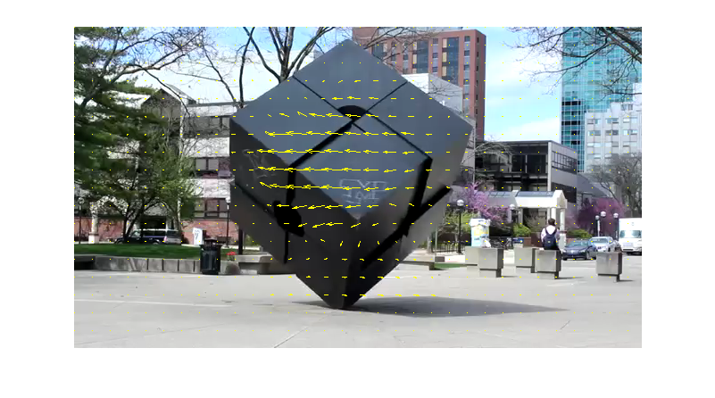

## **Optical Flow with python using OpenCV**

>### **What is Optical Flow?**

Optical flow is the process of estimating per-pixel motion between two successive frames in a movie. Essentially, the Optical Flow task is calculating the shift vector for each pixel as the difference in object displacement between two contiguous images. The basic goal of Optical Flow is to calculate the displacement vector of an object as a result of its motion or camera motions. The relative motion of objects and the spectator can cause optical flow. It can be used for a wide range of purposes. Segmentation, for example, or object detection and tracking. Optical flow provides a concise description of both the regions of the image undergoing motion and the velocity of motion. In a time lapse of photographs, optical flow is a measure of sub-pixel dislocations of objects. Optical flow is velocity expressed as a vector or absolute value for each pixel in an image, indicating how fast and in which direction the underlying objects are moving.



---

>### **Sparse Optical Flow**

To calculate the Optical Flow for a sparse feature collection, the Lucas-Kanade approach is widely utilised. This method's primary premise is based on the assumption of local motion constancy, in which neighbouring pixels have the same displacement direction. This assumption aids in the approximate solution of the two-variable equation. Sparse optical flow tracks its velocity vectors using a sparse feature set of pixels (e.g. intriguing features like edges and corners) (motion). The retrieved features are transmitted from frame to frame in the optical flow function to ensure that the same points are tracked. The Lucas–Kanade approach, the Horn–Schunck method, the Buxton–Buxton method, and others are examples of sparse optical flow implementations. For implementation, we'll use the Lucas-Kanade approach in conjunction with OpenCV, an open source library of computer vision algorithms.

---

>### **Applications of Optical Flow**

- Optical Flow can be employed in a variety of situations where object motion information is important. Compression, stabilisation, and slow-motion are all frequent uses of Optical Flow in video editors. 
- Optical Flow is also used in jobs like Action Recognition and real-time tracking systems.
- Organelle transport can be measured using optical flow in fluorescence microscopy. Because Optical Flow is estimated from the dislocation of edges or corners rather than object detection or tracking, it can be used to measure motion to any fluorescently labelled organelle, such as synaptic vesicles, mitochondria, Golgi, and endoplasmic reticulum. Because the velocity measurement is immediate (or "snap shot"), organelle fusion, fission, and overlap have no bearing on the observed velocities.

---

>### **Implementation of Sparse Optical Flow Algorithm**

- Let's try out the Lucas-Kanade optical flow algorithm on a single scale. Finding the motion (u, v) that minimises the sum-squared error of the brightness constancy equations for each pixel in a window is part of this process.

```
def optical_flow(I1, I2, window_size) 
# returns (u, v)
```

- Here, u and v are the optical flow's x and y components, I1 and I2 are two images collected at times t = 1 and t = 2, respectively, and window size is a 1 2 vector recording the window's width and height throughout flow computation.

- In addition to these inputs, a theshold τ should be added, such that if τ is larger than the smallest eigenvalue of A’A, then the the optical flow at that position should not be computed. Recall that the optical flow is only valid in regions where

 


This matrix has rank 2, which is what the threshold is checking. A typical value for τ is 0.01.

- And finally from the results we can see, the algorithm performs best if the motion of the moving object(s) in between consecutive frames is slow. To the contrary, if the motion is large, the algorithm fails and we should use multiple-scale version Lucas-Kanade with image pyramids.

--- 

### Summary


>### **Conclusion**

In this article, we looked at the Optical Flow job, which is useful when we need to know how objects move. We looked at various famous algorithms, their theoretical concepts, and their practical applications using the OpenCV library. Actually, the computational approach isn't the only way to estimate optical flow. The quality of Optical Flow estimate has improved thanks to new Deep Learning-based techniques.


---

>### **References**

- [Object Tracking - OpenCV](https://docs.opencv.org/4.5.3/dc/d6b/group__video__track.html)
- [Lucas-Kanade Optical Flow in OpenCV](https://opencv24-python-tutorials.readthedocs.io/en/latest/py_tutorials/py_video/py_lucas_kanade/py_lucas_kanade.html)
- [Optical Flow in OpenCV](https://learnopencv.com/optical-flow-in-opencv/#what-is-optical-flow)
- [Introduction to Motion Estimation with Optical Flow](https://nanonets.com/blog/optical-flow/)

---