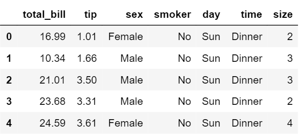
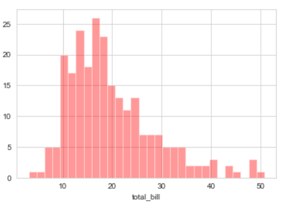
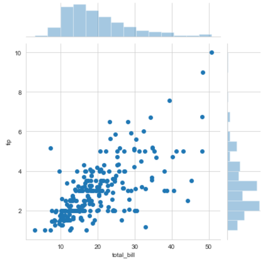
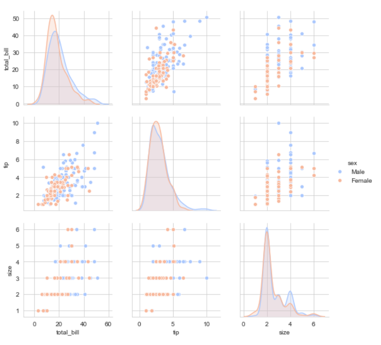
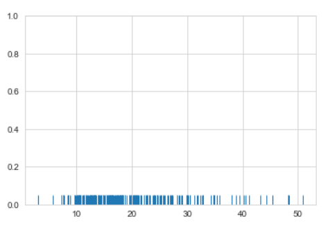
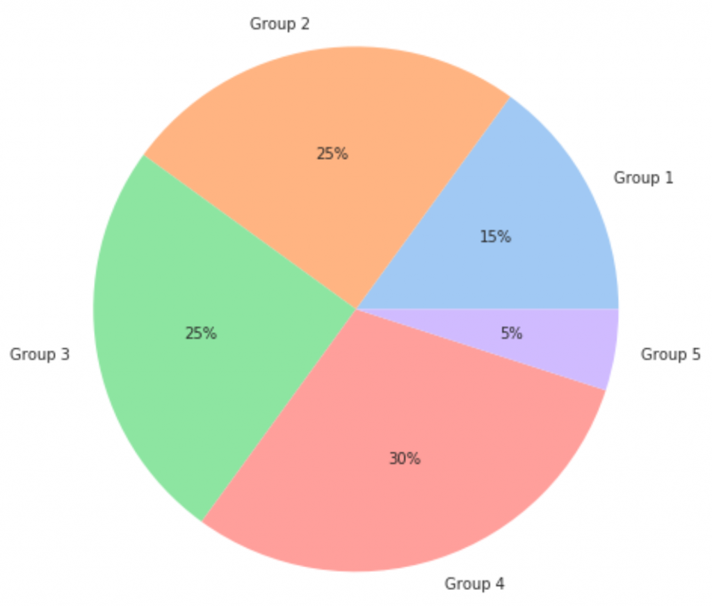
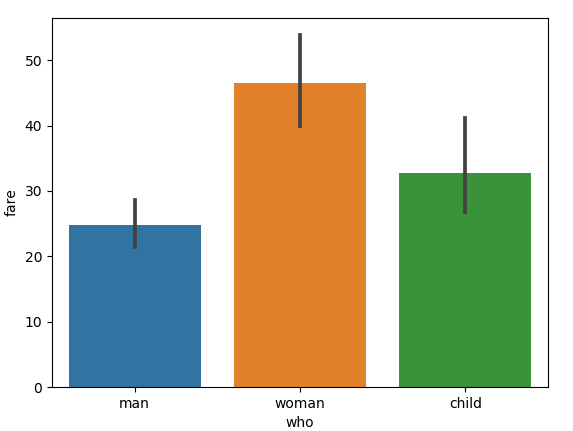
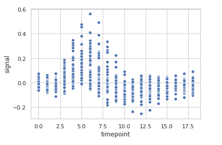
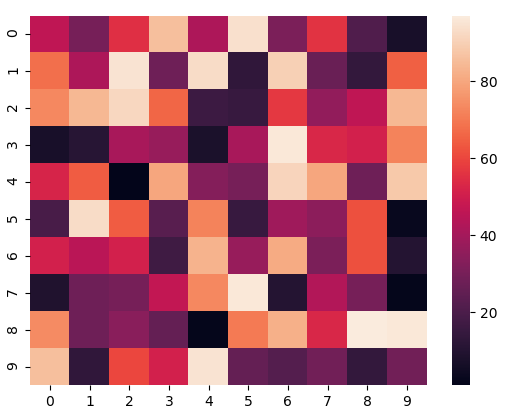

# Data Visualizations with Seaborn

Data Visualization is a critical though undermined skill required in pursuit of a Data Science career. This is an attempt to help Data Science aspirants gain necessary Data Visualization skills required to progress in their career. It includes all the types of plot offered by Seaborn, applied on random or fabricated datasets. The knowledge gained for inference shall in no way be limited to just Seaborn.


## Installation
Open command line and enter the following command : 

``` 
pip install seaborn
```


## Dependencies
#### Supported Python versions
* Python 3.6 +

#### Required dependencies
If not already present, these libraries will be downloaded when you install seaborn.

* numpy
* scipy
* pandas
* matplotlib

## Application of Seaborn
We always have a large amount of data, or we may have some applications which deal with the large data, so in order to represent our data in a good way, we may require some library which can be able to represent our data that is begin stored in a table, array, list, and other data structure efficiently. So seaborn is the library which can represent our data stored in an array, list o any other data structure in a graphical form, which helps users and developers to get more clarity of data if we need to handle large data in our application. So in order to visualize our data, we can use the seaborn library from python; it is based on matplotlib only. This can be used for model fitting and data representation etc. This library is data-oriented, but we need to install it before using it. 

## Getting started with Seaborn
To test your first plotting program write this python script and execute it.
```
import seaborn as sns
df = sns.load_dataset("penguins")
sns.pairplot(df, hue="species")
```
## Using Seaborn we can plot wide varieties of plots like:
* Distribution Plots
* Pie Chart & Bar Chart
* Scatter Plots
* Pair Plots
* Heat maps

You can see the elaborated implementation of the following Seaborn plots in the [notebook given in the repository](./Data%20Visualizations%20with%20Seaborn.ipynb)


#### 1. Distribution Plots
We can compare the distribution plot in Seaborn to histograms in Matplotlib. They both offer pretty similar functionalities. Instead of frequency plots in the histogram, here we’ll plot an approximate probability density across the y-axis.
We will be using sns.distplot() in the code to plot distribution graphs.
Besides providing different kinds of visualization plots, seaborn also contains some built-in datasets. We will be using the tips dataset. The “tips” dataset contains information about people who probably had food at a restaurant and whether or not they left a tip, their age, gender and so on. Lets have a look at it.
```
# import the necessary libraries
import seaborn as sns
import matplotlib.pyplot as plt 
  
# to ignore the warnings 
from warnings import filterwarnings
  
# load the dataset
df = sns.load_dataset('tips')
  
# the first five entries of the dataset
df.head()
```

* Displot - It is used basically for univariant set of observations and visualizes it through a histogram i.e. only one observation and hence we choose one particular column of the dataset.
    ```
    sns.set_style('whitegrid')
    sns.distplot(df['total_bill'], kde = False, color ='red', bins = 30)
    ```
    


* Joinplot - It is used to draw a plot of two variables with bivariate and univariate graphs. It basically combines two different plots.
    ```
    sns.jointplot(x ='total_bill', y ='tip', data = df) 
    ```
    


* Pairplot - It represents pairwise relation across the entire dataframe and supports an additional argument called hue for categorical separation. What it does basically is create a jointplot between every possible numerical column and takes a while if the dataframe is really huge.
    ```
    sns.pairplot(df, hue ="sex", palette ='coolwarm')
    ```
    


* Rugplot - It plots datapoints in an array as sticks on an axis.Just like a distplot it takes a single column. Instead of drawing a histogram it creates dashes all across the plot. If you compare it with the joinplot you can see that what a jointplot does is that it counts the dashes and shows it as bins.
    ```
    sns.rugplot(df['total_bill'])
    ```
    

#### 2. Pie Chart & Bar Chart
Pie Chart is generally used to analyze the data on how a numeric variable changes across different categories.

The following code shows how to create a pie chart using the ‘pastel‘ Seaborn color palette:
```
import matplotlib.pyplot as plt
import seaborn as sns

#define data
data = [15, 25, 25, 30, 5]
labels = ['Group 1', 'Group 2', 'Group 3', 'Group 4', 'Group 5']

#define Seaborn color palette to use
colors = sns.color_palette('pastel')[0:5]

#create pie chart
plt.pie(data, labels = labels, colors = colors, autopct='%.0f%%')
plt.show()
```



The following code shows how to create a bar chart using 'titanic' dataset:
```
# importing the required library
import seaborn as sns
import matplotlib.pyplot as plt
 
# read a titanic.csv file
# from seaborn library
df = sns.load_dataset('titanic')
 
# who v/s fare barplot
sns.barplot(x = 'who',
            y = 'fare',
            data = df)
 
# Show the plot
plt.show()
```



#### 3. Scatter Plots
Scatter Plot is used when we want to plot the relationship between any two numeric columns from a dataset. These plots are the most powerful visualization tools that are being used in the field of machine learning.

Let’s visualize of “fmri” dataset using seaborn.scatterplot() function. We will only use the x, y parameters of the function.
```
import seaborn
 
 
seaborn.set(style='whitegrid')
fmri = seaborn.load_dataset("fmri")
 
seaborn.scatterplot(x="timepoint",
                    y="signal",
                    data=fmri)
```



#### 4. Heatmaps
The heatmap represents the data in a 2-dimensional form. The ultimate goal of the heatmap is to show the summary of information in a colored graph. It utilizes the concept of using colors and color intensities to visualize a range of values.

Making a heatmap with the default parameters. We will be creating a 10×10 2-D data using the randint() function of the NumPy module.
```
# importing the modules
import numpy as np
import seaborn as sn
import matplotlib.pyplot as plt

# generating 2-D 10x10 matrix of random numbers
# from 1 to 100
data = np.random.randint(low = 1,
						high = 100,
						size = (10, 10))
print("The data to be plotted:\n")
print(data)

# plotting the heatmap
hm = sn.heatmap(data = data)

# displaying the plotted heatmap
plt.show()
```


## Advantages of using Seaborn


* By using the seaborn library, we can easily represent our data on a plot.
* This library is used to visualize our data; we do not need to take care of the internal details; we just have to pass our data set or data inside the relplot() function, and it will calculate and place the value accordingly.
* Inside this, we can switch to any other representation of data using the ‘kind’ property inside it.
* It creates an interactive and informative plot to representation our data; also, this is easy for the user to understand and visualize the records on the application.
* It uses static aggregation for plot generation in python.
* As it is based on the matplotlib so while installing seaborn, we also have other libraries installed, out of which we have matplotlib, which also provides several features and functions to create more interactive plots in python.

## Conclusion
By we have already discussed that it is basically used for data visualization because, in our application, we have a large amount of data that needs to be represented to the user in some readable and undertakable format, so seaborn helps the user to visualize data in the form of graphics. which makes it attractive and efficient.

*To know more about seaborn [click here](https://seaborn.pydata.org/index.html)*
