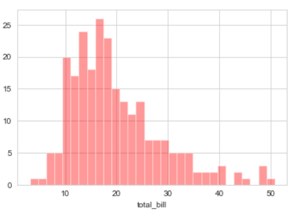
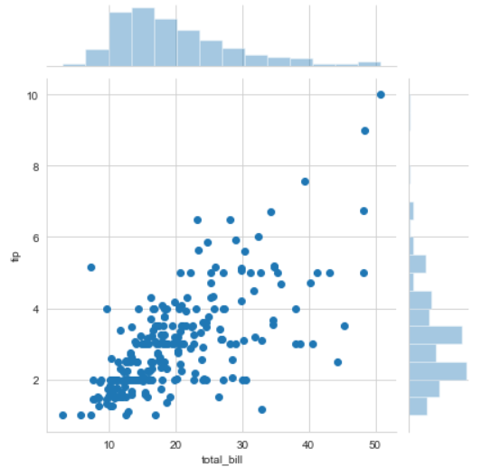
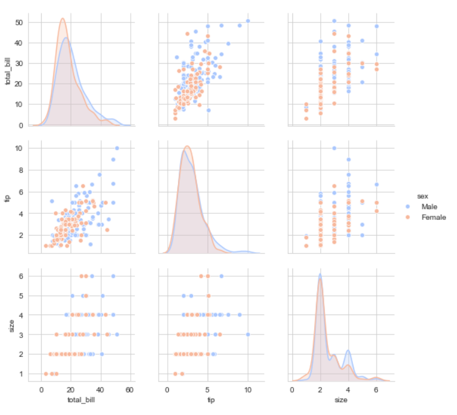
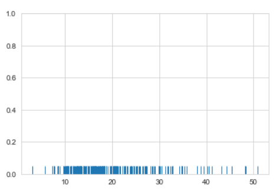
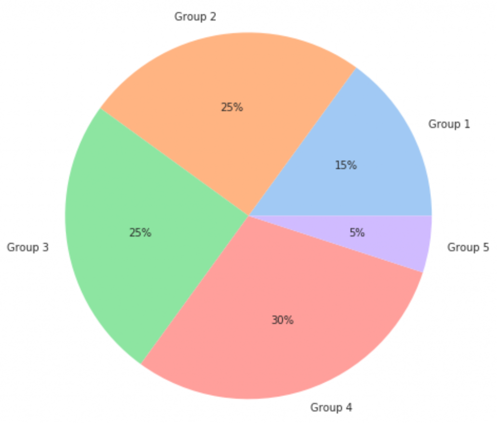
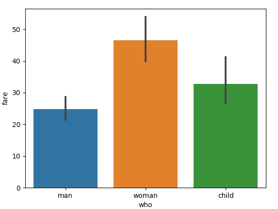
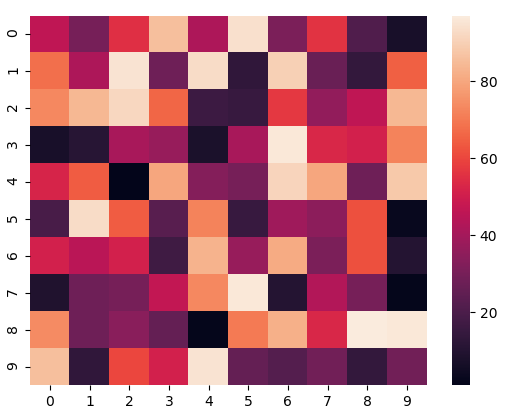

# Getting Started with Seaborn

Hello all 👋,
In this topic I have tried to cover everything related to Data Visualization and Seaborn along with the Code Sample & Examples, but before starting this make sure you know Python Programming Language along with that you are clear with the basic Data Science libraries like Numpy, Pandas etc.

So let's start the learning and below is the Index for Topic Contents we are going to cover also you can directly navigate to the specific topic by clicking on the URL.

| Index                                                                              |
| ---------------------------------------------------------------------------------- |
| [What is Data Visualiation?](#what-is-data-visualization)                          |
| [Introduction to Seaborn library](#introduction-to-seaborn-library)                |
| [Seaborn vs Matplotlib](#seaborn-vs-matplotlib)                                    |
| [Types of plots in Seaborn](#types-of-plots-in-seaborn)                                      |
| [Seaborn Environment Setup](#seaborn-environment-setup)                            |
| [Seaborn Code Example](#seaborn-code-example)                                      |
| [Advantages of using Seaborn](#advantages-of-using-seaborn)                        |
| [Conclusion](#conclusion)                                                          |

## What is Data Visualization?

Data plays an important role in the field of Data Analysis and so in order to get the deeper knowledge about the data, the concept of Data Viualization was Introduced.

Data Visualization is nothing but the graphical representation of our data which is used to get the deep and better understanding of our data, which is then used by the data-driven companies,clients or stakeholders for taking informed bussiness decisions.

Data Visualizzation converts the data into charts, graphs, maps, plots etc. By looking into the visual representtion of our data, we can convey the insights of our data, future trends, outliers etc in the form of a story.

### Data Visualization Techniques

There are various Data Visualization techniques that data scientists uses for getting the graphical representation of our data.

Here are few of the Data visualization techniques. <br/>
● Box plots <br/>
● Histograms <br/>
● Heat maps <br/>
● Charts <br/>
● Tree maps <br/>
● Word Cloud/Network diagram

### Data Visualization Tools

There are various data visualization tools available in the market which automates the work of Data Visualiation. These are nothing but a software that are designed to visualize data.

Here are few of the most used data visualization tools. <br/>
● Tableau <br/>
● Looker <br/>
● Zoho Analytics <br/>
● Sisense <br/>
● IBM Cognos Analytics <br/>
● Qlik Sense <br/>
● Domo <br/>
● Microsoft Power BI

## Introduction to Seaborn library

In the world of Analytics, the best way to get insights is by visualizing the data. Data can be visualized by representing it as plots which is easy to understand, explore and grasp. Such data helps in drawing the attention of key elements. To analyse a set of data using Python, we make use of Matplotlib, a widely implemented 2D plotting library. Likewise, Seaborn is a Python visualization library based on matplotlib. It provides a high-level interface for drawing attractive statistical graphics.

### Important Features of Seaborn

Seaborn is built on top of Python’s core visualization library Matplotlib. It is meant to serve as a complement, and not a replacement. However, Seaborn comes with some very important features.

Let us see a few of them here. The features help in - <br/>
● Built in themes for styling matplotlib graphics <br/>
● Visualizing univariate and bivariate data <br/>
● Fitting in and visualizing linear regression models <br/>
● Plotting statistical time series data <br/>
● Seaborn works well with NumPy and Pandas data structures <br/>
● It comes with built in themes for styling Matplotlib graphics <br/>

In most cases, you will still use Matplotlib for simple plotting. The knowledge of Matplotlib is recommended to tweak Seaborn’s default plots.

## Seaborn vs Matplotlib

To analyse a set of data using Python, we make use of Matplotlib, a widely implemented 2D plotting library. Likewise, Seaborn is a visualization library in Python. It is built on top of Matplotlib. It is summarized that if Matplotlib “tries to make easy things easy and hard things possible”, Seaborn tries to make a well-defined set of hard things easy too.”

Seaborn helps resolve the two major problems faced by Matplotlib; the problems are: <br/>
● Default Matplotlib parameters <br/>
● Working with dataframes

As Seaborn compliments and extends Matplotlib, the learning curve is quite gradual. If you know Matplotlib, you are already half way through Seaborn.

## Seaborn Environment Setup

### Using Pip Installer

To install the latest release of Seaborn, you can use pip:

``` python
pip install seaborn
```

### For Windows, Linux & Mac using Anaconda

Anaconda (from <a href="https://www.continuum.io">https://www.continuum.io</a>) is a free Python distribution for SciPy stack. It is also available for Linux and Mac.
It is also possible to install the released version using conda:

``` python
conda install seaborn
```

### To install the development version of Seaborn directly from github

``` python
pip install git+https://github.com/mwaskom/seaborn.git
```

### Dependencies

Seaborn supports Python 3.7+ and no longer supports Python 2.

Installation requires [numpy](https://numpy.org/), [pandas](https://pandas.pydata.org/), and [matplotlib](https://matplotlib.org/). Some functions will optionally use [scipy](https://www.scipy.org/) and/or [statsmodels](https://www.statsmodels.org/) if they are available.

## Types of plots in Seaborn

● Distribution Plots <br />
● Pie Chart & Bar Chart <br />
● Scatter Plots <br />
● Heat maps <br />
● Pair Plots

### 1. Distribution Plots

We can compare the distribution plot in Seaborn to histograms in Matplotlib. They both offer pretty similar functionalities. Instead of frequency plots in the histogram, here we’ll plot an approximate probability density across the y-axis. We will be using sns.distplot() in the code to plot distribution graphs

Displot - It is used basically for univariant set of observations and visualizes it through a histogram i.e. only one observation and hence we choose one particular column of the dataset.



Joinplot - It is used to draw a plot of two variables with bivariate and univariate graphs. It basically combines two different plots.



Pairplot - It represents pairwise relation across the entire dataframe and supports an additional argument called hue for categorical separation. What it does basically is create a jointplot between every possible numerical column and takes a while if the dataframe is really huge.



Rugplot - It plots datapoints in an array as sticks on an axis.Just like a distplot it takes a single column. Instead of drawing a histogram it creates dashes all across the plot. If you compare it with the joinplot you can see that what a jointplot does is that it counts the dashes and shows it as bins.



### 2. Pie Chart & Bar Chart

Pie Chart is generally used to analyze the data on how a numeric variable changes across different categories.




### 3. Scatter Plots

Scatter Plot is used when we want to plot the relationship between any two numeric columns from a dataset. These plots are the most powerful visualization tools that are being used in the field of machine learning.


### 4. Heatmaps

The heatmap represents the data in a 2-dimensional form. The ultimate goal of the heatmap is to show the summary of information in a colored graph. It utilizes the concept of using colors and color intensities to visualize a range of values.



## Seaborn Code Example

Check the notebook [notebook given in the repository](./getting_started_with_seaborn.ipynb) for Getting started with seaborn in python.

## Advantages of using seaborn

● By using the seaborn library, we can easily represent our data on a plot. <br />
● This library is used to visualize our data; we do not need to take care of the internal details; we just have to pass our data set or data inside the relplot() function, and it will calculate and place the value accordingly. <br />
● Inside this, we can switch to any other representation of data using the ‘kind’ property inside it. <br />
● It creates an interactive and informative plot to representation our data; also, this is easy for the user to understand and visualize the records on the application. <br />
● It uses static aggregation for plot generation in python. <br />
● As it is based on the matplotlib so while installing seaborn, we also have other libraries installed, out of which we have matplotlib, which also provides several features and functions to create more interactive plots in python.

## Conclusion

So from this tutorial we have understood what is Data Visualization, Seaborn library & how to use seaborn library in real world projects. Also how important is the role of data visualiation in getting insghts about our data using various data visualization libraries. I hope you enjoyed this tutorial and got your concepts clear.Thank you for reading, have a nice day 😊.
