# Data Visualizations with Matplotlib

**Video link:** [Data Visualizations with Matplotlib](https://vimeo.com/612732219)

Data visualization refers to the representation of data or information in charts, graphs, maps or other visual formats. The resulting visual representation of data makes it easier to identify and share real-time trends, outliers, and new insights about the information represented in the data.  Here, I am attempting to make sure that you understand the most basic and simple library used for data visualization - Matplotlib. 

## What is Matplotlib
- Matplotlib is a low level graph plotting library in python that serves as a visualization utility.
- Matplotlib was created by John D. Hunter.
- Matplotlib is open source and we can use it freely.
- To see source code: visit https://github.com/matplotlib/matplotlib
- Matplotlib is mostly written in python, a few segments are written in C, Objective-C and Javascript for Platform compatibility.
- For Matplotlib documentation : visit https://matplotlib.org/

## Installation and Importing Matplotlib
To install matplotlib
```
pip install matplotlib
```
To Import matplotlib
```
from matplotlib import pyplot as plt
```
## Application of Matplotlib
In today's world, data is present everywhere. Now, to extract useful information from data is not an easy task and the world is spending a lot of time and money to extract this information. Here, one key method to extract data is usage of graphs, plots and chart which are very useful to gain insight from the data. Here come **Matplotlib** in picture. Matplotlib helps in making several graphs and plots which are used in data visualization techniques to gain knowledge and get optimal solution for any problem in real life. Whether it is regarding analysis on covid 19 or to get knowledge about prospective clients for a small business or big companies getting knowldege about market predcition, matplotlib helps everyehere.

## A Matplotlib Figure
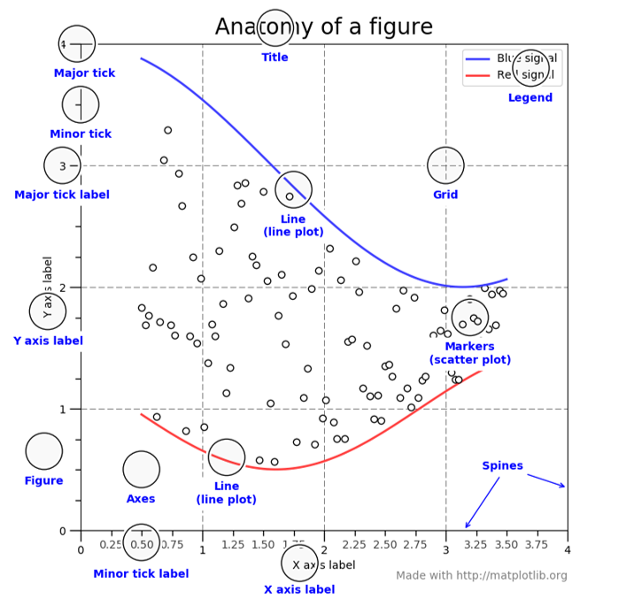
- Figure – The whole figure or complete image which is shown is called Figure. It keeps track of axes, special artists(labels, legends, ticks, etc)
- Axes – This is what you think as a single plot. There can be many axes in 1 figure, but a given axes can be present in only 1 figure. The Axes contains two (or three in the case of 3D) Axis objects which take care of the data limits.
- Artist - Basically, everything you can see on the figure is an artist. This includes text object, collection object, patch objects, everything.

## Several Plots/Graphs which can be drawn using Matplotlib
1.   Line plot
2.   Bar Graph
3.   Scatter Plot
4.   Area Plot
5.   Pie Chart
6.   Histogram
7.   Bubble Plot
8.   Box Plot
9.   Violin Plot
10.  Plotting Subplots(Not Exactly a graph, but important thing)

#### Line Plot
A line chart or line plot or line graph or curve chart is a type of chart which displays information as a series of data points called 'markers' connected by straight lines. It is a basic type of chart common in many fields.
```
x=np.arange(0,np.pi*4,0.1)
y1=np.sin(x)
y2=np.cos(x)
plt.plot(x,y1,label="sin(X)")
plt.plot(x,y2,color="red",linestyle="--",label="cos(X)")
plt.xlabel("X")
plt.ylabel("F(X)")
plt.title("Sin and Cos functions")
plt.legend()
plt.show()
```
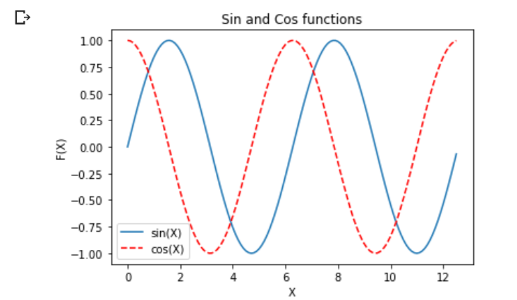
#### Bar Chart
A bar chart or bar graph is a chart or graph that presents categorical data with rectangular bars with heights or lengths proportional to the values that they represent. The bars can be plotted vertically or horizontally. A vertical bar chart is sometimes called a column chart.
```
#Bar Graph
months=['Jan','Feb','Mar','April','May','June','July','Aug','Sep','Oct','Nov','Dec']
manufac=[1200,1300,2000,1000,900,1550,1000,2200,1700,850,950,1000]
plt.bar(months, manufac, width=0.5, color='green')
plt.xlabel("Month")
plt.ylabel("Number of Cars Manufactured")
plt.title("Bar Graph for No. of Cars Manufactured for each month")
plt.show()
```
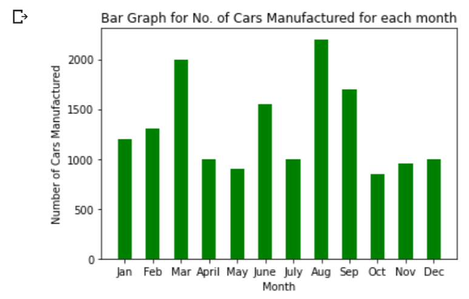
```
#Horizontal bar graph
plt.barh(months, manufac, height=0.5)
plt.ylabel("Month")
plt.xlabel("Number of Cars Manufactured")
plt.title("Horizontal Bar Graph for No. of Cars Manufactured for each month")
plt.show()
```
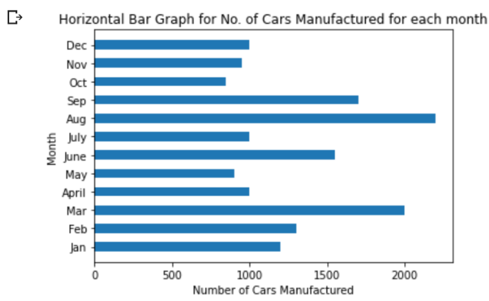
#### Scatter Plot
A scatter plot is a type of plot or mathematical diagram using Cartesian coordinates to display values for typically two variables for a set of data.
```
#Scatter Plot
x = np.array([5,7,8,7,2,17,2,9,4,11,12,9,6])
y = np.array([99,86,87,88,111,86,103,87,94,78,77,85,86])
plt.scatter(x, y)
#day two, the age and speed of 15 cars:
x = np.array([2,2,8,1,15,8,12,9,7,3,11,4,7,14,12])
y = np.array([100,105,84,105,90,99,90,95,94,100,79,112,91,80,85])
plt.scatter(x, y, marker="s")
plt.xlabel("X")
plt.ylabel("Y")
plt.title("Scatter Plot")
plt.show()
```
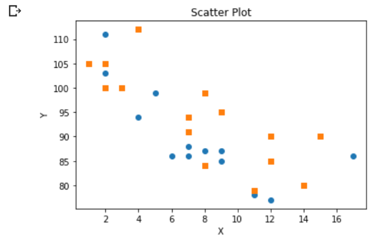
```
#Scatter Plot with Colorbar
x = np.array([5,7,8,7,2,17,2,9,4,11,12,9,6])
y = np.array([99,86,87,88,111,86,103,87,94,78,77,85,86])
colors = np.array([0, 10, 20, 30, 40, 45, 50, 55, 60, 70, 80, 90, 100])
plt.scatter(x, y, c=colors, cmap='cool')
plt.colorbar()
plt.xlabel("X")
plt.ylabel("Y")
plt.title("Scatter Plot with Colorbar")
plt.show()
```
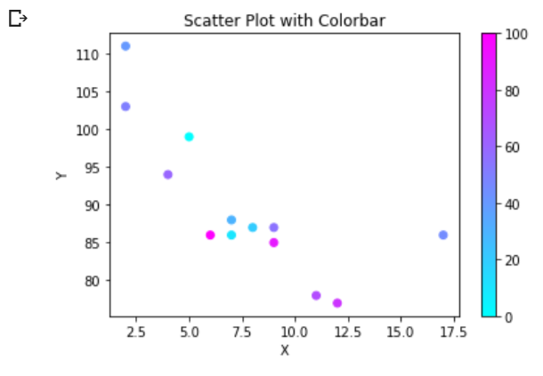

#### Area Plot
An area chart or area graph displays graphically quantitative data. It is based on the line chart. The area between axis and line are commonly emphasized with colors, textures and hatchings. Commonly one compares two or more quantities with an area chart. 
```
#Area Plot
months=['Jan','Feb','Mar','April','May','June','July','Aug','Sep','Oct','Nov','Dec']
manufac21=[1200,1300,2000,1000,900,1550,1000,2200,1700,850,950,1000]
manufac20=[1000,1500,1800,1000,700,1300,1150,1900,1900,1000,800,800]
plt.stackplot(months,manufac21,manufac20,labels=['Cars in 2021','Cars in 2020'],alpha=0.5)
plt.title("2020 vs 2021 sales")
plt.legend()
plt.show()
```
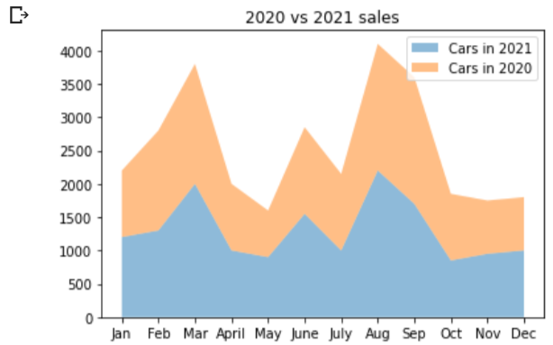

#### Pie Chart
A pie chart is a circular statistical graphic, which is divided into slices to illustrate numerical proportion. In a pie chart, the arc length of each slice, is proportional to the quantity it represents.
```
#Pie chart
months=['Jan','Feb','Mar','April','May','June']
manufac=[1200,1300,2000,1000,900,1550]
plt.pie(manufac,labels=months)
plt.title("Basic pie chart")
plt.show()
```
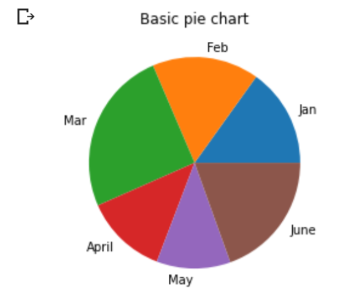
```
#Advanced pie chart
months=['Jan','Feb','Mar','April','May','June']
manufac=[1200,1300,2000,1000,900,1550]
plt.pie(manufac,labels=months,wedgeprops={'edgecolor':'red','linewidth':1}\
        ,explode=[0,0.1,0,0,0.2,0],autopct="%1.1f%%")
plt.show()
```
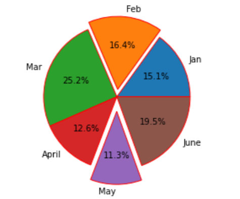
#### Histogram
A histogram is a graphical display of data with bars of different heights, where each bar groups numbers into ranges. The taller the bars, the more the data falls in that range. It displays the shape as well as the spread of continuous sample data.
```
#Histogram using bins
x = np.random.normal(170, 10, 250)
bin=np.arange(140,200,10)
plt.hist(x,bins=bin,color='red',edgecolor='black',linewidth=1.5,rwidth=0.95)
plt.show() 
```
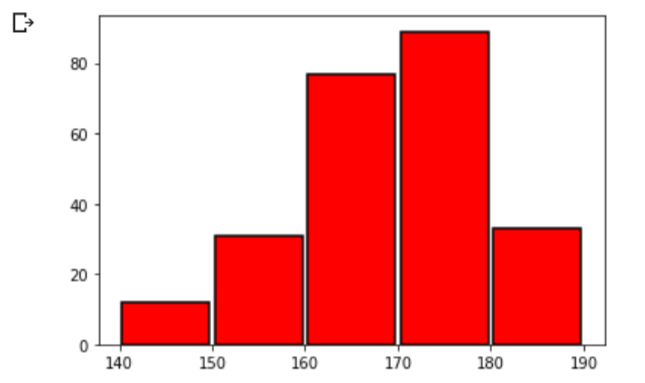
#### Bubble Plot
A bubble chart (aka bubble plot) is an extension of the scatter plot used to look at relationships between three numeric variables. Each dot in a bubble chart corresponds with a single data point, and the variables’ values for each point are indicated by horizontal position, vertical position, and dot size.
```
#Bubble Plot
x = np.array([5,7,8,7,2,17,2,9,4,11,12,9,6])
y = np.array([9,86,67,88,211,86,103,87,504,78,77,85,86])
colors = np.array([0, 10, 20, 30, 40, 45, 50, 55, 60, 70, 80, 90, 100])
plt.scatter(x, y, c=colors, cmap='cool',s=y*1.5,alpha=0.5)
plt.colorbar()
plt.xlabel("X")
plt.ylabel("Y")
plt.title("Bubble Plot with Colorbar")
plt.show()
```
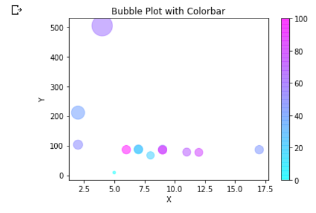
#### Box Plot
A box plot (or box-and-whisker plot) shows the distribution of quantitative data in a way that facilitates comparisons between variables or across levels of a categorical variable. The box shows the quartiles of the dataset while the whiskers extend to show the rest of the distribution, except for points that are determined to be “outliers” using a method that is a function of the inter-quartile range.
```
#Box plot
manufac21=[20,1300,2000,1000,900,1550,1000,2200,1700,850,950,5000]
manufac20=[100,1500,1800,1000,700,1300,4150,1900,1900,1000,800,800]
data=[manufac21,manufac20]
plt.boxplot(data,labels=['2021','2020'],showmeans=True)
plt.show()
```

```
#Horizontal boxplot
data=[manufac21,manufac20]
plt.boxplot(data,labels=['2021','2020'],showmeans=True,vert=0)
plt.show()
```
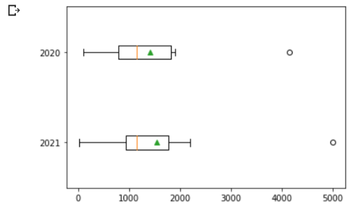
#### Violin Plot
A violin plot plays a similar role as a box and whisker plot. It shows the distribution of quantitative data across several levels of one (or more) categorical variables such that those distributions can be compared. Unlike a box plot, in which all of the plot components correspond to actual datapoints, the violin plot features a kernel density estimation of the underlying distribution.
```
#Violin plot
manufac21=[20,1300,2000,1000,900,1550,1000,2200,1700,850,950,9000]
manufac20=[100,1500,1800,1000,700,1300,4150,1900,1900,1000,800,800]
data=[manufac21,manufac20]
fig=plt.figure()
ax=fig.add_axes([0,0,1,1])
ax.violinplot(data)
ax.set_xticks([1,2])
ax.set_xticklabels(['2021','2020'])
plt.show()
```
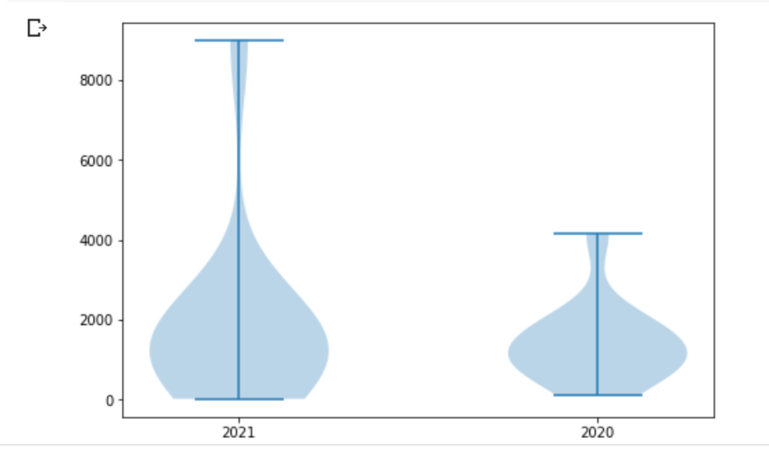
#### Plotting Subplots
Mupltiple plots under a single plot. This means that mutiple images can be shown together using subplots.
```
#Plotting Subplots
months=['Jan','Feb','Mar','April','May','June','July','Aug','Sep','Oct','Nov','Dec']
manufac21=[1200,1300,2000,1000,900,1550,1000,2200,1700,850,950,1000]
manufac20=[1000,1500,1800,1000,700,1300,1150,1900,1900,1000,800,800]
fig=plt.figure(figsize=(20,8))
plt.subplot(1,2,1)
plt.stackplot(months,manufac21,manufac20,labels=['Cars in 2021','Cars in 2020'],alpha=0.5)
plt.title("2020 vs 2021 sales")
plt.legend()

plt.subplot(1,2,2)
plt.barh(months, manufac21, height=0.5)
plt.ylabel("Month")
plt.xlabel("Number of Cars Manufactured")
plt.title("Horizontal Bar Graph for No. of Cars Manufactured for each month")
plt.show()
```
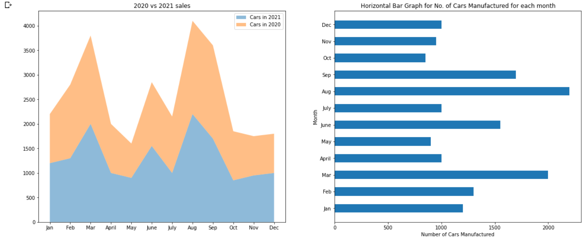
## Advantages of using Matplotlib
- It is very simple to use and easy to understand.
- Easy to use for people who have had prior experience with Matlab or other graph plotting tools.
- It provides high-quality images and plots
- Provides control to various elements of a figure such as figure colour, figure size, etc

## Disadvantages of using Matplotlib
- Matplotlib is very low-level, which means that one needs to write more code to get the visualisation.
- Matplotlib may not be the best fit for time series data, where ggplot is better for defining parameters.
- Several libraries like seaborn has default styles and color palettes, which are designed to be more aesthetically pleasing and modern.

## Several other libaries for Data Visualization
- Seaborn – This is built on top of Matplotlib. Seaborn harnesses the power of matplotlib to create beautiful charts in a few lines of code. The key difference is Seaborn's default styles and color palettes, which are designed to be more aesthetically pleasing and modern.
- Plotly - Plotly Library is an open-source library that can be used for data visualization and understanding data simply and easily Plotly has hover tool capabilities that allow us to detect any outliers or anomalies in a large number of data points. Also, it is visually attractive.
- ggplot - ggplot is based on ggplot2, an R plotting system. ggplot operates differently than matplotlib: it lets you layer components to create a complete plot. For instance, you can start with axes, then add points, then a line, a trendline, etc. This concept is referred to as Grammar of Library.
- Bokeh - Bokeh is a Python library for interactive visualization that targets web browsers for representation. This is the core difference between Bokeh and other visualization libraries. This is also based on concept of Grammar of Library.

*To Learn more, you can always check matplotlib’s original documentation for more knowledge [here](https://matplotlib.org/)*
